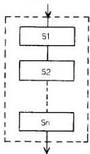
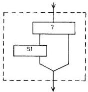
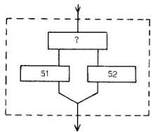
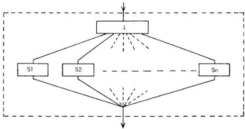
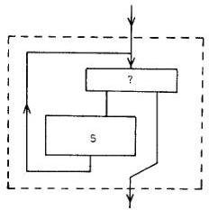
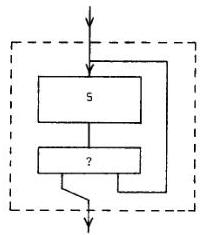

TECHNISCHE HOGESCHOOL EINDHOVEN
NEDERLAND
ONDERAFDELING DER WISKUNDE
TECHNOLOGICAL UNIVERSITY EINDHOVEN
THE NETHERLANDS
DEPARTMENT OF MATHEMATICS

NOTES ON STRUCTURED PROGRAMMING

by

Prof.dr. Edsger W. Dijkstra

T.H.-Report 70-WSK-03

Second edition April 1970

---

EWD249

NOTES ON STRUCTURED PROGRAMMING

by

prof.dr.Edsger W.Dijkstra

August 1969

---

EWD249

# Table of contents.

0 To my reader.
1 On our inability to do much.
4 On the reliability of mechanisms.
8 On our mental aids.
15 An example of a correctness proof.
19 On the validity of proofs versus the validity of implementations.
21 On understanding programs.
30 On comparing programs.
35 A first example of step-wise program composition.
50 On program families.
53 On trading storage space for computation speed.
57 On a program model.
64 A second example of step-wise program composition.
75 On what we have achieved.
80 On grouping and sequencing.

---

EWD249 - 0

To my reader.

These notes have the status of "Letters written to myself": I wrote them down because, without doing so, I found myself repeating the same arguments over and over again. When reading what I had written, I was not always too satisfied.

For one thing, I felt that they suffered from a marked verbosity. Yet I do not try to condense them (now), firstly because that would introduce another delay and I would like to "think on", secondly because earlier experiences have made me afraid of being misunderstood: many a programmer tends to see his (sometimes rather specific) difficulties as the core of the subject and as a result there are widely divergent opinions as to what programming is really about.

For another thing, as a document this is very incomplete: I am only too aware of the fact that it ends in mid-air. Yet I have decided to have these notes duplicated, besides some practical considerations mainly to show what I have thought to those who expressed interest in it or to those whose comments I would welcome.

I hope that, despite its defects, you will enjoy at least parts of it. If these notes prove to be a source of inspiration or to give you a new appreciation of the programmer's trade, some of my goals will have been reached.

Edsger W. Dijkstra

---

EWD249 - 1

On our inability to do much.

I am faced with a basic problem of presentation. What I am really concerned about is the composition of large programs, the text of which may be, say, of the same size as the whole text of this booklet. Also I have to include examples to illustrate the various techniques. For practical reasons, the demonstration programs must be small, many times smaller than the "life-size programs" I have in mind. My basic problem is that precisely this difference in scale is one of the major sources of our difficulties in programming!

It would be very nice if I could illustrate the various techniques with small demonstration programs and could conclude with "... and when faced with a program a thousand times as large, you compose it in the same way." This common educational device, however, would be self-defeating as one of my central themes will be that any two things that differ in some respect by a factor of already a hundred or more, are utterly incomparable.

History has shown that this truth is very hard to believe. Apparently we are too much trained to disregard differences in scale, to treat them as "gradual differences that are not essential". We tell ourselves that what we can do once, we can also do twice and by induction we fool ourselves into believing that we can do it as many times as needed, but this is just not true! A factor of a thousand is already far beyond our powers of imagination!

Let me give you two examples to rub this in. A one-year old child will crawl on all fours with a speed of, say, one mile per hour. But a speed of a thousand miles per hour is that of a supersonic jet. Considered as objects with moving ability the child and the jet are incomparable, for whatever one can do the other cannot and vice versa. Also: one can close one's eyes and imagine how it feels to be standing in an open place, a prairie or a sea shore, while far away a big, reinless horse is approaching at a gallop, one can "see" it approaching and passing. To do the same with a phalanx of a thousand of these big beasts is mentally impossible: your heart would miss a number of beats by pure panic, if you could!

To complicate matters still further, problems of size do not only cause me problems of presentation, but they lie at the heart of the subject: widespread

---

EWD249 - 2

underestimation of the specific difficulties of size seems one of the major underlying causes of the current software failure. To all this I can see only one answer, viz. to treat problems of size as explicitly as possible. Hence the title of this section.

To start with, we have the "size" of the computation, i.e. the amount of information and the number of operations involved in it. It is essential that this size is large, for if it were really small, it would be easier not to use the computer at all and to do it by hand. The automatic computer owes it right to exist, its usefulness, precisely to its ability to perform large computations where we humans cannot. We want the computer to do what we could never do ourselves and the power of present-day machinery is such that even small computations are by their very size already far beyond the powers of our unaided imagination.

Yet we must organize the computations in such a way that our limited powers are sufficient to guarantee that the computation will establish the desired effect. This organizing includes the composition of the program and here we are faced with the next problem of size, viz. the length of the program text, and we should give this problem also explicit recognition. We should remain aware of the fact that the extent to which we can read or write a text is very much dependent on its size. In my country the entries in the telephone directory are grouped by town or village and within each such group the subscribers are listed by name in alphabetical order. I myself live in a small village and given a telephone number I have only to scan a few columns to find out to whom the telephone number belongs, but to do the same in a large city would be a major data processing task!

It is in the same mood that I should like to draw the reader's attention to the fact that "clarity" has pronounced quantitative aspects, a fact many mathematicians, curiously enough, seem to be unaware of. A theorem stating the validity of a conclusion when ten pages full of conditions are satisfied is hardly a convenient tool, as all conditions have to be verified whenever the theorem is appealed to. In Euclidean geometry, Pythagoras' Theorem holds for any three points A, B and C such that through A and C a straight line can be drawn orthogonal to a straight line through B and C. How many mathematicians appreciate that the theorem remains applicable when some or all of the points A, B and C coincide? Yet this seems largely responsible for the convenience with which Pythagoras Theorem can be

---

EWD249 - 3

used.

Summarizing: as a slow-witted human being I have a very small head and I had better learn to live with it and to respect my limitations and give them full credit, rather than to try to ignore them, for the latter vain effort will be punished by failure.

---

EWD249 - 4

# On the reliability of mechanisms.

Being a programmer by trade, programs are what I am talking about and the true subject of this section really is the reliability of programs. That, nevertheless, I have mentioned "mechanisms" in its title is because I regard programs as specific instances of mechanisms, and that I wanted to express, at least once, my strong feeling that many of my considerations concerning software are, mutatis mutandis, just as relevant for hardware design.

Present-day computers are amazing pieces of equipment, but most amazing of all are the uncertain grounds on account of which we attach any validity to their output. It starts already with our belief that the hardware functions properly.

Let us restrict, for a moment, our attention to the hardware and let us wonder to what extent one can convince oneself of its being properly constructed. Some years ago a machine was installed on the premises of my University; in its documentation it was stated that it contained, among many other things, circuitry for the fixed-point multiplication of two 27-bit integers. A legitimate question seems to be: "Is this multiplier correct, is it performing according to the specifications?".

The naive answer to this is: "Well, the number of different multiplications this multiplier is claimed to perform correctly is finite, viz. $2^{54}$, so let us try them all." But, reasonable as this answer may seem, it is not, for although a single multiplication took only some tens of microseconds, the total time needed for this finite set of multiplications would add up to more than 10 000 years! We must conclude that exhaustive testing, even of a single component such as a multiplier, is entirely out of the question. (Testing a complete computer on the same basis would imply the established correct processing of all possible programs!)

A first consequence of the 10 000 years is that during its life-time the multiplier will be asked to perform only a negligible fraction of the vast number of all possible multiplications it could do: practically none of them! Funnily enough, we still require that it would do any multiplication correctly when ordered to do so. The reason underlying this fantastic quality requirement is that we do

---

EWD249 - 5

not know in advance, which are the negligeably few multiplications it will be asked to perform. In our reasoning about our programs we talk about "the product" and have abstracted from the specific values of the factors: we do not know them, we do not wish to know them, it is not our business to know them, it is our business not to know them! Our wish to think in terms of the concept "the product", abstracted from the specific instances occurring in a computation is granted, but the price paid for this is precisely the reliability requirement that any multiplication of the vast set will be performed correctly. So much for the justification of our desire for a correct multiplier.

But how is the correctness established in a convincing manner? As long as the multiplier is considered as a black box, the only thing we can do is "testing by sampling", i.e. offering to the multiplier a feasible amount of factor pairs and checking the result. But in view of the 10 000 years, it is clear that we can only test a negligible fraction of the possible multiplications. Whole classes of in some sense "critical" multiplications may remain untested and in view of the reliability justly desired, our quality control is still most unsatisfactory. Therefore it is not done that way.

The straightforward conclusion is the following: a convincing demonstration of correctness being impossible as long as the mechanism is regarded as a black box, our only hope lies in not regarding the mechanism as a black box. I shall call this "taking the structure of the mechanism into account".

From now onwards the type of mechanisms we are going to deal with are programs. (In many respects, programs are mechanisms much easier to deal with than circuitry. which is really an analogue device and subject to wear and tear.) And also with programs it is fairly hopeless to establish the correctness beyond even the mildest doubt by testing without taking their structure into account. In other words, we remark that the extent to which the program correctness can be established is not purely a function of the program's external specifications and behaviour but depends critically upon its internal structure.

Recalling that our true concern is with really large programs, we observe as an aside that the size itself requires a high confidence level for the individual program components. If the chance of correctness of an individual component equals

---

EWD249 - 6

p, the chance of correctness of a whole program, composed of N such components, is something like

$$
P = p ^ {N}.
$$

As N will be very large, p should be very, very close to 1 if we desire P to differ significantly from zero!

When we now take the position that it is not only the programmer's task to produce a correct program but also to demonstrate its correctness in a convincing manner, then the above remarks have a profound influence on the programmer's activity: the object he has to produce must be usefully structured.

The remaining part of this monograph will mainly be an exploration of what program structure can be used to good advantage. In what follows it will become apparent that program correctness is not my only concern, program adaptability or manageability will be another. This stress on program manageability is my deliberate choice, a choice that, therefore, I should like to justify.

While in the past the growth in power of the generally available equipment has mitigated the urgency of the efficiency requirements, this very same growth has created its new difficulties. Once one has a powerful machine at one's disposal one tries to use it and the size of the problems one tackles adjusts itself to the scope of the quipment: no one thinks about programming an algorithm that would take twenty years to execute. With processing power increased by a factor of a thousand over the last ten to fifteen years, Man has become considerably more ambitious in selecting problems that now should be "technically feasible". Size, complexity and sophistication of programs one should like to make have exploded and over the past years it has become patently clear that on the whole our programming ability has not kept pace with these exploding demands made on it.

The power of available equipment will continue to grow: we can expect manufacturers to develop still faster machines and even without that development we shall witness that the type of machine that is presently considered as exceptionally fast will become more and more common. The things we should like to do with these machines will grow in proportion and it is on this extrapolation that I have formed my picture of the programmer's task.

---

EWD249 - 7

My conclusion is that it is becoming most urgent to stop to consider programming primarily as the minimization of a cost/performance ratio. We should recognize that already now programming is much more an intellectual challenge: the art of programming is the art of organizing complexity, of mastering multitude and avoiding its bastard chaos as effectively as possible.

My refusal to regard efficiency considerations as the programmer's prime concern is not meant to imply that I disregard them. On the contrary, efficiency considerations are recognized as one of the main incentives to modifying a logically correct program. My point, however, is that we can only afford to optimize (whatever that may be) provided that the program remains sufficiently manageable.

Let me end this section with a final aside on the significance of computers. Computers are extremely flexible and powerful tools and many feel that their application is changing the face of the earth. I would venture the opinion that as long as we regard them primarily as tools, we might grossly underestimate their significance. Their influence as tools might turn out to be but a ripple on the surface of our culture, whereas I expect them to have a much more profound influence in their capacity of intellectual challenge!

Corollary of the first part of this section:
Program testing can be used to show the presence of bugs, but never to show their absence!

---

EWD249 - 8

## On our mental aids.

In the previous section we have stated that the programmer's duty is to make his product "usefully structured" and we mentioned the program structure in connection with a convincing demonstration of the correctness of the program.

But how do we convince? And how do we convince ourselves? What are the typical patterns of thought enabling ourselves to understand? It is to a broad survey of such questions that the current section is devoted. It is written with my sincerest apologies to the professional psychologist, because it will be amateurishly superficial. Yet I hope (and trust) that it will be sufficient to give us a yardstick by which to measure the usefulness of a proposed structuring.

Among the mental aids available to understand a program (or a proof of its correctness) there are three that I should like to mention explicitly:

1) Enumeration
2) Mathematical induction
3) Abstraction.

## On enumeration.

I regard as an appeal to enumeration the effort to verify a property of the computations that can be evoked by an enumerated set of statements performed in sequence, including conditional clauses distinguishing between two or more cases. Let me give a simple example of what I call "enumerative reasoning".

It is asked to establish that the successive execution of the following two statements

$$
\begin{array}{l}
"dd := dd / 2; \\
\text{if } dd \leq r \text{ do } r := r - dd"
\end{array}
$$

operating on the variables "r" and "dd" leaves the relations

$$
0 \leq r < dd \tag{1}
$$

invariant. One just "follows" the little piece of program assuming that (1) is satisfied to start with. After the execution of the first statement, which halves

---

EWD249 - 9

the value of dd, but leaves r unchanged, the relations

$$
0 \leq r < 2 * d d \tag{2}
$$

will hold. Now we distinguish two mutually exclusive cases.

1)  $\mathrm{dd} \leq \mathrm{r}$ . Together with (2) this leads to the relations

$$
\mathrm{dd} \leq \mathrm{r} < 2 * \mathrm{dd}; \tag{3}
$$

In this case the statement following do will be executed, ordering a decrease of  $r$  by dd, so that from (3) it follows that eventually

$$
0 \leq r < \mathrm{dd}
$$

i.e. (1) will be satisfied.

2)  $\underline{\text{non}} \, \mathrm{dd} \leq r$  (i.e.  $\mathrm{dd} > r$ ). In this case the statement following do will be skipped and therefore also  $r$  has its final value. In this case "dd > r" together with (2), which is valid after the execution of the first statement leads immediately to

$$
0 \leq r < \mathrm{dd}
$$

so that also in the second case (1) will be satisfied.

Thus we have completed our proof of the invariance of relations (1), we have also completed our example of enumerative reasoning, conditional clauses included.

## On mathematical induction.

I have mentioned mathematical induction explicitly because it is the only pattern of reasoning that I am aware of that eventually enables us to cope with loops (such as can be expressed by repetition clauses) and recursive procedures. I should like to give an example.

Let us consider the sequence of values

$$
d_0, d_1, d_2, d_3, \dots \tag{1}
$$

given by

$$
\text{for } i = 0 \quad d_i = D \tag{2a}
$$

$$
\text{for } i > 0 \quad d_i = f(d_{i-1}) \tag{2b}
$$

---

EWD249 - 10

where $D$ is a given value and $f$ a given (computable) function. It is asked to make the value of the variable "d" equal to the first value $d_k$ in the sequence that satisfies a given (computable) condition "prop". It is given that such a value exists for finite $k$. A more formal definition of the requirement is to establish the relation

$$
d = d_k \tag{3}
$$

where $k$ is given by the (truth of the) expressions

$$
\operatorname{prop}(d_k) \tag{4}
$$

and

$$
\operatorname{non} \operatorname{prop}(d_i) \quad \text{for all } i \text{ satisfying } 0 \leq i < k \tag{5}.
$$

We now consider the following program part:

$$
"d := D;
$$

$$
\text{while non prop}(d) \text{ do } d := f(d)" \tag{6}
$$

in which the first line represents the initialization and the second one the loop, controlled by the (hopefully self-explanatory) repetition clause while...do. (In terms of the conditional clause if...do, used in our previous example, a more formal definition of the semantics of the repetition clause is by stating that

$$
\text{"while B do S"}
$$

is semantically equivalent with

$$
\text{"if B do}
$$

$$
\text{begin S; while B do S end"}
$$

expressing that "non B" is the necessary and sufficient condition for the repetition to terminate.)

Calling in the construction "while B do S" the statement S "the repeated statement" we shall prove that in program (6):

after the $n$-th execution of the repeated statement will hold (for $n \geq 0$)

$$
d = d_n \tag{7a}
$$

and

$$
\operatorname{non} \operatorname{prop}(d_i) \quad \text{for all } i \text{ satisfying } 0 \leq i < n \tag{7b}
$$

The above statement holds for $n = 0$ (by enumerative reasoning); we have to prove (by enumerative reasoning) that when it holds for $n = N$ ($N \geq 0$), it will also hold for $n = N + 1$.

---

EWD249 - 11

After the N-th execution of the repeated statement relations (7a) and (7b) are satisfied for $n = N$. For the $N+1$st execution to take place, the necessary and sufficient condition is the truth of

$$
\underline{\text{non prop}} (d)
$$

which, thanks to (7a) for $n = N$ (i.e. $d = d_{N}$) means

$$
\underline{\text{non prop}} (d_{N})
$$

leading to condition (7b) being satisfied for $n = N + 1$. Furthermore, $d = d_{N}$ and (2b) leads to

$$
f (d) = d _ {N + 1}
$$

so that the net effect of the $N+1$st execution of the repeated statement

$$
"d := f (d)"
$$

established the relation

$$
d = d _ {N + 1}
$$

i.e. relation (7a) for $N = N + 1$ and thus the induction step (7) has been proved.

Now we shall show that the repetition terminates after the k-th execution of the repeated statement. The n-th execution cannot take place for $n > k$ for (on account of 7b) this would imply

$$
\underline{\text{non prop}} (d_{k})
$$

thereby violating (4). When the repetition terminates after the n-th execution of the repeated statement, the necessary and sufficient condition for termination, viz.

$$
\underline{\text{non (non prop (d))}}
$$

becomes, thanks to (7a)

$$
\operatorname{prop} \left(d _ {n}\right) \quad . \tag {8}
$$

This excludes termination for $n < k$, as this would violate (5). As a result the repetition will terminate with $n = k$, so that (3) follows from (7a), (4) follows from (8) and (5) follows from (7b). Which terminates our proof.

Before turning our attention away from this example illustrating the use of mathematical induction as a pattern of reasoning, I should like to add some remarks, because I have the uneasy feeling that by now some of my readers -in particular experienced and competent programmers- will be terribly irritated, viz. those

---

EWD249 - 12

readers for whom program (6) is so obviously correct that they wonder what all the fuss is about: "Why his pompous restatement of the problem as in (3), (4) and (5), because anyone knows what is meant by the first value in the sequence, satisfying a condition? Certainly he does not expect us, who have work to do, to supply such lengthy proofs, with all the mathematical dressing, whenever we use such a simple loop as that?" Etc.

To tell the honest truth: the pomp and length of the above proof infuriate me as well! But at present I cannot do much better if I really try to prove the correctness of this program. But it sometimes fills me with the same kind of anger as years ago the crazy proofs of the first simple theorems in plane geometry did, proving things of the same degree of "obviousness" as Euclid's axioms themselves.

Of course I would not dare to suggest (at least at present!) that it is the programmer's duty to supply such a proof whenever he writes a simple loop in his program. If so, he could never write a program of any size at all! It would be as impractical as reducing each proof in plane geometry explicitly and in extenso to Euclid's axioms. (Cf. Section "On our inability to do much.")

My moral is threefold. Firstly, when a programmer considers a construction like (6) as obviously correct, he can do so because he is familiar with the construction. I prefer to regard his behaviour as an unconscious appeal to a theorem he knows, although perhaps he has never bothered to formulate it; and once in his life he has convinced himself of its truth, although he has probably forgotten in which way he did it and although the way was (probably) unfit for print. But we could call our assertions about program (6), say, "The Linear Search Theorem" and knowing such a name it is much easier (and more natural) to appeal to it consciously.

Secondly, to the best of my knowledge, there is no set of theorems of the type illustrated above, whose usefulness has been generally accepted. But we should not be amazed about that, for the absence of such a set of theorems is a direct consequence of the fact that the type of object -i.e. programs- has not settled down. The kind of object the programmer is dealing with, viz. programs, is much less well-established than the kind of object that is dealt with in plane geometry. In the mean time the intuitively competent programmer is probably the one who confines himself, whenever acceptable, to program structures with which he is very

---

EWD249 - 13

familiar, while becoming very alert and careful whenever he constructs something unusual (for him). For an established style of programming, however, it might be a useful activity to look for a body of theorems pertinent to such programs.

Thirdly, the length of the proof we needed in our last example is a warning that should not be ignored. There is of course the possibility that a better mathematician will do a much shorter and more elegant job than I have done. Personally I am inclined to conclude from this length that programming is more difficult than is commonly assumed: let us be honestly humble and interpret the length of the proof as an urgent advice to restrict ourselves to simple structures whenever possible and to avoid in all intellectual modesty "clever constructions" like the plague.

On abstraction.

At this stage I find it hard to be very explicit about the role of abstraction, partly because it permeates the whole subject. Consider an algorithm and all possible computations it can evoke: starting from the computations the algorithm is what remains when one abstracts from the specific values manipulated this time. The concept of "a variable" represents an abstraction from its current value. It has been remarked to me (to my great regret I cannot remember by whom and so I am unable to give credit where it seems due) that once a person has understood the way in which variables are used in programming, he has understood the quintessence of programming. We can find a confirmation for this remark when we return to our use of mathematical induction with regard to the repetition: on the one hand it is by abstraction that the concepts are introduced in terms of which the induction step can be formulated; on the other hand it is the repetition that really calls for the concept of "a variable". (Without repetition one can restrict oneself to "quantities" the value of which has to be defined at most once but never has to be redefined as in the case of a variable.)

There is also an abstraction involved in naming an operation and using it on account of "what it does" while completely disregarding "how it works". (In the same way one should state that a programming manual describes an abstract machine: the specific piece of hardware delivered by the manufacturer is nothing but a

---

EWD249 - 14

-usually imperfect!- mechanical model of this abstract machine.) There is a strong
analogy between using a named operation in a program regardless of "how it works"
and using a theorem regardless of how it has been proved. Even if its proof is
highly intricate, it may be a very convenient theorem to use!

Here, again, I refer to our inability to do much. Enumerative reasoning is
all right as far as it goes, but as we are rather slow-witted it does not go very
far. Enumerative reasoning is only an adequate mental tool under the severe boundary
condition that we use it only very moderately. We should appreciate abstraction
as our main mental technique to reduce the demands made upon enumerative reasoning.

(Here Mike Woodger, National Physical Laboratory, Teddington, England, made
the following remark, which I insert in gratitude: "There is a parallel analogy
between the unanalyzed terms in which an axiom or theorem is expressed and the
unanalyzed operands upon which a named operation is expected to act.")

---

EWD249 - 15

# An example of a correctness proof.

Let us consider the following program section, where the integer constants $a$ and $d$ satisfy the relations

$$
a \geq 0 \quad \text{and} \quad d > 0
$$

```
"integer r, dd;
r:= a; dd:= d;
while dd ≤ r do dd:= 2 * dd;
while dd ≠ d do
begin dd:= dd / 2;
if dd ≤ r do r:= r - dd
end" .
```

To apply the Linear Search Theorem (see Section "On our mental aids", subsection "On mathematical induction") we consider the sequence of values given by

```
for i = 0
dd_i = d
for i > 0
dd_i = 2 * dd_{i-1}
from which
dd_n = d * 2^n
```

(1)

can be derived by normal mathematical techniques, which also tell us that (because $d > 0$) for finite $r$

$$
dd_k > r
$$

will hold for some finite $k$, thus ensuring that the first repetition terminates with

$$
dd = d * 2^k
$$

Solving the relation

$$
d_i = 2 * d_{i-1}
$$

for $d_{i-1}$ gives

$$
d_{i-1} = d_i / 2
$$

and the Linear Search Theorem then tells us, that the second repetition will also terminate. (As a matter of fact the second repeated statement will be executed exactly the same number of times as the first one.)

At the termination of the first repetition,

---

EWD249 - 16

$$
d d = d d _ {k}
$$

and therefore,  $0\leq r <   dd$  (2)

holds. As shown earlier (Section "On our mental aids.", subsection "On enumeration") the repeated statement of the second clause leaves this relation invariant. After termination (on account of "while dd ≠ d do") we can conclude

$$
d d = d
$$

which together with (2) gives

$$
0 \leq r <   d \tag {3}
$$

Furthermore we prove that after the initialisation

$$
d d \equiv 0 \mod (d) \tag {4}
$$

holds; this follows, for instance, from the fact that the possible values of dd are -see (1)-  $d * 2^i$  for  $0 \leq i \leq k$ .

Our next step is to verify, that after the initial assignment to  $r$  the relation  $a \equiv r \mod (d)$  (5)

holds.

1) It holds after the initial assignments.
2) The repeated statement of the first clause ("dd:= 2 * dd") maintains the invariance of (5) and therefore the whole first repetition maintains the validity of (5).
3) The second repeated statement consists of two statements. The first ("dd:= dd/2") leaves (5) invariant, the second one also leaves (5) invariant for either it leaves r untouched or it decreases r by the current value of dd, an operation which on account of (4) also maintains the validity of (5). Therefore the whole second repeated statement leaves (5) invariant and therefore the whole repetition leaves (5) invariant. Combining (3) and (5), the final value therefore satisfies

$$
0 \leq r <   d \quad \text{and} \quad a \equiv r \mod (d)
$$

i.e.  $r$  is the smalles non-negative remainder of the division of  $a$  by  $d$ .

**Remark 1.** The program

---

EWD249 - 17

"integer r, dd, q;
r:= a; dd:= d; q:= 0;
while dd ≤ r do dd:= 2 * dd;
while dd ≠ d do
begin dd:= dd / 2; q:= 2 * q;
if dd ≤ r do begin r:= r - dd; q:= q + 1 end
end

assigns to q the value of the corresponding quotient. The proof can be established by observing the invariance of the relation

$$
a = q * dd + r
$$

(I owe this example to my colleague N.G.de Bruijn.)

**Remark 2.** In the subsection "On mathematical induction," we have proved the Linear Search Theorem. In the previous proof we have used another theorem about repetitions (a theorem that, obviously, can only be proved by mathematical induction, but the proof is so simple that we leave it as an exercise to the reader), viz. that if prior to entry of a repetition a certain relation P holds, whose truth is not destroyed by a single execution of the repeated statement, then relation P will still hold after termination of the repetition. This is a very useful theorem, often allowing us to bypass an explicit appeal to mathematical induction. (We can state the theorem a little bit sharper; in the repetition

"while B do S"

one has to show that S is such that the truth of

P and B

prior to the execution of S implies the truth of

P

after its execution.)

**Remark 3.** As an exercise (for which acknowledgement is due to James King, CMU, Pittsburgh, USA) for the reader, prove that with integer A, B, x, y and z and

$$
A > 0 \quad \text{and} \quad B \geq 0
$$

after the execution of the program section

---

EWD249 - 18

"x:= A; y:= B; z:= 1;

while y ≠ 0 do
begin if odd(y) do begin y:= y - 1; z:= z * x end;
y:= y / 2; x:= x * x
end"

finally  z = A^B  will hold.

The proof has to show that (in spite of "y:= y / 2") all variables keep integer values; the method shows the invariance of

$$
x > 0 \text{ and } y \geq 0 \text{ and } A^B = z * x^y
$$

---

EWD249 - 19

On the validity of proofs versus the validity of implementations.

In the previous section I have assumed "perfect arithmetic" and in my experience the validity of such proofs often gets questioned by people who argue that in practice one never has perfect arithmetic at ones disposal: admissible integer values usually have an absolute upper bound, real numbers are only represented to a finite accuracy etc. So what is the validity of such proofs?

The answer to this question seems to be the following. If one proves the correctness of a program assuming an idealized, perfect world, one should not be amazed if something goes wrong when this ideal program gets executed by an "imperfect" implementation. Obviously! Therefore, if we wish to prove program correctness in a more realistic world, the thing to do is to acknowledge right at the start that all operations appealed to in the program (in particular all arithmetic operations) need not be perfect, provided we state -rather axiomatically- the properties they have to satisfy for the proper execution of the program, i.e. the properties on which the correctness proof relies. (In the example of the previous section this requirement is simply exact integer arithmetic in the range [0, 2a].)

When writing a program operating on real numbers with rounded operations, one must be aware of the assumptions one makes, such as

```
b > 0 implies a + b ≥ a
a * b = b * a
-(a * b) = (-a) * b
0 * x = 0
0 + x = x
1 * x = x  etc.etc.
```

Very often the validity of such relations is essential to the logic of the program. For the sake of compatibility, the programmer would be wise to be as undemanding as possible, whereas a good implementation should satisfy as many reasonable requirements as possible.

This is the place to confess one of my blunders. In implementing ALGOL 60 we decided that "x = y" would deliver the value true not only in the case of exact equality, but also when the two values differed only in the least significant

---

EWD249 - 20

digit represented, because otherwise it was so very improbable that the value true would ever be computed. We were thinking of converging iterations that could oscillate within rounding accuracy. While we had been generous (with the best of intentions!) in regarding real numbers as equal, it quickly turned out that the chosen operation was so weak as to be hardly of any use at all. What it boiled down to was that the established truth of  $a = b$  and  $b = c$  did not allow the programmer to conclude the truth of  $a = c$ . The decision was quickly changed. It is since that experience that I know that the programmer can only use his tool by virtue of (a number of) its properties; conversely, the programmer must be able to state which properties he requires. (Usually programmers don't do so because, for lack of tradition as to what properties can be taken for granted, this would require more explicitness than is otherwise desirable. The proliferation of machines with lousy floating-point hardware -together with the misapprehension that the automatic computer is primarily the tool of the numerical analyst- has done much harm to the profession!)

---

EWD249 - 21

# On understanding programs.

In my life I have seen many programming courses that were essentially like the usual kind of driving lessons, in which one is taught how to handle a car instead of how to use a car to reach one's destination.

My point is that a program is never a goal in itself; the purpose of a program is to evoke computations and the purpose of the computations is to establish a desired effect. Although the program is the final product made by the programmer, the possible computations evoked by it -the "making" of which is left to the machine!- are the true subject matter of his trade. For instance, whenever a programmer states that his program is correct, he really makes an assertion about the computations it may evoke.

The fact that the last stage of the total activity, viz. the transition from the (static) program text to the (dynamic) computation, is essentially left to the machine is an added complication. In a sense the making of a program is therefore more difficult than the making of a mathematical theory: both program and theory are structured, timeless objects. But while the mathematical theory makes sense as it stands, the program only makes sense via its execution.

In the remaining part of this section I shall restrict myself to programs written for a sequential machine and I shall explore some of the consequences of our duty to use our understanding of a program to make assertions about the ensuing computations. It is my (unproven) claim that the ease and reliability with which we can do this depends critically upon the simplicity of the relation between the two, in particular upon the nature of sequencing control. In vague terms we may state the desirability that the structure of the program text reflects the structure of the computation. Or, in other terms, "What can we do to shorten the conceptual gap between the static program text (spread out in "text space") and the corresponding computations (evolving in time)?"

It is the purpose of the computation to establish a certain desired effect. When it starts at a discrete moment $t_0$ it will be completed at a later discrete moment $t_1$ and we assume that its effect can be described by comparing "the state at $t_0$" with "the state at $t_1$". If no intermediate states are taken into consideration

---

EWD249 - 22

the effect is regarded as being established by a primitive action.

When we do take a number of intermediate states into consideration this means that we have parsed the happening in time. We regard it as a sequential computation, i.e. the time-succession of a number of subactions and we have to convince ourselves that the cumulative effect of this time-succession of subactions indeed equals the desired net effect of the total computation.

The simplest case is a parsing, a decomposition, into a fixed number of subactions that can be enumerated. In flowchart form this can be represented as follows.


S1; S2; ...; Sn

The validity of this decomposition has to be established by enumerative reasoning. In this case, shortening of the conceptual gap between program and computation can be achieved by requiring that a linear piece of program text contains names or descriptions of the subactions in the order in which they have to take place. In our earlier example (invariance of  $0 \leq r < dd$ )

```txt
"dd:= dd / 2;
if dd ≤ r do r:= r - dd"
```

this condition is satisfied. The primary decomposition of the computation is into a time-succession of two actions; in the program text we recognize this structure

```txt
"halve dd;
reduce r modulo dd".
```

We are considering all initial states satisfying  $0 \leq r < dd$  and in all computations then considered, the given parsing into two subactions is applicable.

---

EWD249 - 23

So far, so good.

The program, however, is written under the assumption that "reduce r modulo dd" is not a primitive action, while "decrease r by dd" is. Viewing all possible happenings during "reduce r modulo dd" it becomes then relevant to distinguish that in some cases "decrease r by dd" takes place, while in the other cases r remains unchanged. By writing

$$
\text{"if } dd \leq r \text{ do decrease } r \text{ by } dd\text{"}
$$

we have represented that at the given level of detail the action "reduce r modulo dd" can take one of two mutually exclusive forms and we have also given the criterion on account of which the choice between them is made. If we regard "if dd ≤ r do" as a conditional clause attached to "decrease r by dd" it is natural that the conditional clause is placed in front of the conditioned statement. (In this sense the alternative clause

$$
\text{"if condition then statement 1 else statement 2"}
$$

is "over-ordered" with respect to "statement 1" and "statement 2": they are just two alternatives that cannot be expressed simultaneously on a linear medium.)

The alternative clause has been generalized by C.A.R.Hoare whose "case-of" construction provides a choice between more than two possibilities. In flowchart form they can be represented as follows.


if ? do S1


if ? then S1 else S2

---

EWD249 - 24


case i of(51; 52; ...; 5n)

These flowcharts share the property that they have a single entry at the top and a single exit at the bottom: as indicated by the dotte block they can again be interpreted (by disregarding what is inside the dotted lines) as a single action in a sequential computation. To be a little bit more precise: we are dealing with a great number of possible computations, primarily decomposed into the same time-succession of subactions and it is only on closer inspection -i.e. by looking inside the dotted block- that is revealed that over the collection of possible computations such a subaction may take one of an enumerated set of distinguished forms.

The above is sufficient to consider a class of computations that are primarily decomposed into the same set of enumerated subactions; they are insufficient to consider a class of computations that are primarily decomposed into a varying number of subactions (i.e. varying over the class of computations considered). It is here that the usefulness of the repetition clauses becomes apparent. We mention "while condition do statement" and "repeat statement until condition" that may be represented in flowchart form as follows.

---

EWD249 - 25


while ? do 5


repeat 5 until ?

These flowcharts also share the property of a single entry at the top and a single exit at the bottom. They enable us to express that the action represented by the dotted block is on closer inspection a time-succession of "a sufficient number" of subactions of a certain type.

We have now seen three types of decomposition; we could call them "concatenation", "selection" and "repetition" respectively. The first two are understood by enumerative reasoning, the last one by mathematical induction.

The programs that can be written using the selection clauses and the repetition clauses as only means for sequencing control, permit straightforward translation into a programming language that is identical but for the fact that sequencing control has to be expressed by jumps to labelled points. The converse is not true. Alternatively: restricting ourselves to the three mentioned types of decomposition leads to flowcharts of a restricted topology compared with the flowcharts one can make when arrows can be drawn from any block leading into any other. Compared with that greater freedom, to restrict oneself to the clauses presents itself as a sequencing discipline.

Why do I propose to adhere to this sequencing discipline? The justification for this decision can be presented in many ways and let me try a number of them in the hope that at least one of them will appeal to my readers.

Eventually, one of our aims is to make such well-structured programs that the

---

EWD249 - 26

intellectual effort (measured in some loose sense) needed to understand them is proportional to program length (measured in some equally loose sense). In particular we have to guard against an exploding appeal to enumerative reasoning, a task that forces upon us some application of the old adage "Divide and Rule", and that is the reason why we propose the step-wise decompositions of the computations.

We can understand a decomposition by concatenation via enumerative reasoning. (We can do so, provided that the number of subactions into which the computation is primarily parsed, is sufficiently small and that the specification of their net effect is sufficiently concise. I shall return to these requirements at a later stage, at present we assume the conditions met.) It is then feasible to make assertions about the computations on account of the program text, thanks to the triviality of the relation between the progress through the computations and the progress through the program text. In particular: if on closer inspection one of the subactions transpires to be controlled by a selective clause or a repetition clause, this fact does not impose any burden on the understandability of the primary decomposition, because there only the subaction's net effect plays a role.

As a corollary: if on closer inspection a subaction is controlled by a selective clause the specific path taken is always irrelevant at the primary level (the only thing that matters is that the correct path has been taken). And also: if on closer inspection a subaction is controlled by a repetitive clause, the number of times the repeated statement has been executed is, as such, irrelevant (the only thing that matters is that it has been repeated the correct number of times).

We can also understand the selective clauses as such, viz. by enumerative reasoning; we can also understand the repetition clause, viz. by mathematical induction. For all three types of decomposition -and this seems to me a great help- we know the appropriate pattern of reasoning.

There is a further benefit to be derived from the proposed sequencing discipline. In understanding programs we establish relations. In our example on enumerative reasoning we established that the program part

$$
\begin{array}{l}
"dd := dd / 2; \\
\text{if } dd \leq r \text{ do } r := r - dd"
\end{array}
$$

---

EWD249 - 27

leaves the relation

$$
0 \leq r < dd
$$

invariant. Yet, even if we can ensure that these relations hold before execution of the quoted program part, we cannot conclude that they always hold, viz. not necessarily between the execution of the two quoted statements. In other words: the validity of such relations is dependent on the progress of the computation, and this seems typical for a sequential process.

Similarly, we attach meanings to variables: a variable may count the number of times an event of a given type has occurred, say the number of lines that has been printed on the current page. Transition to the next page will be followed immediately by a reset to zero, printing a line will be followed immediately by an increase by 1. Again, just before resetting or increasing this count, the interpretation "number of lines printed on the current page" is non-valid. To assign such a meaning to a variable, again, can only be done relative to the progress of the computation. This observation raises the following question: "How do we characterize the progress of a computation?"

In short, we are looking for a co-ordinate system in terms of which the discrete points of computation progress can be identified, and we want this coordinate system to be independent of the variables operated upon under program control: if we need values of such variables to describe progress of the computation we are begging the question, for it is precisely in relation to this progress that we want to interpret the meaning of these variables.

(A still more stringent reason not to rely upon the values of variables is presented by a program containing a non-ending loop, cycling through a finite number of different states. Eternal cycling follows from the fact that at different points of progress the same state prevails. But then the state is clearly incapable of distinguishing between these two different points of progress!)

We can state our problem in another way. Given a program in action and suppose that before completion of the computation the latter is stopped at one of the discrete points of progress. How can we identify the point of interruption, for instance if we want to redo the computation up to the very same point? Or also:

---

EWD249 - 28

if stopping was due to some kind of dynamic error, how can we identify the point of progress short of a complete memory dump?

For the sake of simplicity we assume our program text spread out in (linear) text space and assume an identifying mechanism for the program points corresponding to the discrete points of computation progress; let us call this identifying mechanism "the textual index". (If the discrete points of computation progress are situated in between successive statement executions, the textual index identifies, say, semicolons.) The textual index is a kind of generalized order counter, its value points to a place in the text.

If we restrict ourselves to decomposition by concatenation and selection, a single textual index is sufficient to identify the progress of the computation. With the inclusion of repetition clauses textual indices are no longer sufficient to describe the progress of the computation. With each entry into a repetition clauses, however, the system could introduce a so-called "dynamic index", inexorably counting the ordinal number of the corresponding current repetition; at termination of the repetition the system should again remove the corresponding dynamic index. As repetition clauses may occur nested inside each other, the appropriate mechanism is a stack (i.e. a last-in-first-out-memory). Initially the stack is empty; at entry of a repetition clause a new dynamic index (set to zero or one) is added on the top of the stack; whenever it is decided that the repetition is not terminated the top element of this stack is increased by 1; whenever it is decided that a repetition is terminated, the top element of the stack is removed. (This arrangement reflects very clearly that after termination of a repetition the number of times, even the fact that it was a repetition, is no longer relevant.)

As soon as the programming language admits procedures, then a single textual index is no longer sufficient. In the case that a textual index points to the interior of a procedure body, the dynamic progress of the computation is only characterized when we also describe to which call of the procedure we refer, but this can be done by giving the textual index pointing to the place of the call. With the inclusion of the procedure the textual index must be generalized to a stack of textual indices, increased by one element at procedure call and decreased by one element at procedure return.

---

EWD249 - 29

The main point is that the values of these indices are outside the programmer's control; they are defined (either by the write-up of his program or by the dynamic evolution of the current computation) whether he likes it or not. They provide independent co-ordinates in which to describe the progress of the computation, a "variable-independent" frame of reference in which meanings to variables can be assigned.

There is, of course, even with the free use of jumps, a programmer independent co-ordinate system in terms of which the progress of a sequential computation can be described uniquely, viz. a kind of normalized clock that counts the number of "discrete points of computation progress" passed since program start. It is unique, but utterly unhelpful, because the textual index is no longer a constituent component of such a co-ordinate system.

The moral of the story is that when we acknowledge our duty to control the computations (intellectually!) via the program text evoking them, that then we should restrict ourselves in all humility to the most systematic sequencing mechanisms, ensuring that "progress through the computation" is mapped on "progress through the text" in the most straightforward manner.

---

EWD249 - 30

# On comparing programs.

It is a programmer's everyday experience that for a given problem to be solved by a given algorithm, the program for a given machine is far from uniquely determined. In the course of the design process he has to select between alternatives; once he has a correct program, he will often be called to modify it, for instance because it is felt that an alternative program would be more attractive as far as the demands that the computations make upon the available equipment resources are concerned.

These circumstances have raised the question of the equivalence of programs: given two programs, do they evoke computations establishing the same net effect? After suitable formalization (of the way in which the programs are given, of the machine that performs the computations evoked by them and of the "net effect" of the computations) this can presumably be made into a well-posed problem appealing to certain mathematical minds. But I do not intend to tackle it in this general form. On the contrary: instead of starting with two arbitrarily given programs (say: independently conceived by two different authors) I am concerned with alternative programs that can be considered as products of the same mind and then the question becomes: how can we conceive (and structure) those two alternative programs so as to ease the job of comparing the two?

I have done many experiments and my basic experience gained by them can be summed up as follows. Two programs evoking computations that establish the same net effect are equivalent in that sense and a priori not in any other. When we wish to compare programs in order to compare their corresponding computations, the basic experience is that it is impossible (or fruitless, unattractive, or terribly hard or what you wish) to do so when on the level of comparison the sequencing through the two programs differs. To be a little bit more explicit: it is only attractive to compare two programs and the computations they may possibly evoke, when paired computations can be parsed into a time-succession of actions that can be mapped on each other and the corresponding program texts can be equally parsed into instructions, each corresponding to such an action.

This is a very strong condition. Let me give a first example.

---

EWD249 - 31

Excluding side-effects of the boolean inspections and assuming the value "B2" constant (i.e. unaffected by the execution of either "S1" or "S2"), we can establish the equivalence of the following two programs:

"if B2 then
begin while B1 do S1 end
else
begin while B1 do S2 end" (1)

and

"while B1 do
begin if B2 then S1 else S2 end" (2)

The first construction is primarily one in which sequencing is controlled by a selective clause, the second construction is primarily one in which sequencing is controlled by a repetitive clause. I can establish the equivalence of the output of the computations, but I cannot regard them as equivalent in any other useful sense. I had to force myself to the conclusion that (1) and (2) are "hard to compare". Originally this conclusion annoyed my very much. In the meantime I have grown to regard this incomparability as one of the facts of life and, therefore, as one of the major reasons why I regard the choice between (1) and (2) as a relevant design decision, that should not be taken without careful consideration. It is precisely its apparent triviality that has made me sensitive to the considerations that should influence such a choice. They fall outside the scope of the present section but I hope to return to them later.

Let me give a second example of incomparability that is slightly more subtle.

Given two arrays $X[1:N]$ and $Y[1:N]$ and a boolean variable "equal", make a program that assigns to the boolean variable "equal" the value: "the two arrays are equal element-wise". Empty arrays (i.e. $N = 0$) are regarded as being equal.

Introducing a variable $j$ and giving to "equal" the meaning "among the first $j$ pairs no difference has been detected", we can write the following two programs.

"j:= 0; equal:= true;
while j ≠ N do
begin j:= j + 1; equal:= equal and (X[j] = Y[j]) end" (3)

---

EWD249 - 32

and

$$
\begin{array}{l}
"j := 0; \text{ equal } := \underline{\text{true}}; \\
\text{ while } j \neq N \text{ and equal } \underline{\text{do}} \\
\underline{\text{begin }} j := j + 1; \text{ equal } := (X[j] = Y[j]) \text{ end"}
\end{array}
\tag{4}
$$

Program (4) differs from program (3) in that repetition is terminated as soon as a pair-wise difference has been detected. For the same input the number of repetitions may differ in the two programs and therefore the programs are only comparable in our sense as long as the last two lines of the programs are regarded as describing a single action, not subdivided into subactions. But what is their relation when we do wish to take into account that they both end with a repetition? To find this out, we shall prove the correctness of the programs.

On the arrays X and Y we can define of $0 \leq j \leq N$ the $N + 1$ functions $\text{EQUAL}_j$ as follows:

$$
\begin{array}{l}
\text{for } j = 0 \quad \text{EQUAL}_j = \underline{\text{true}} \\
\text{for } j > 0 \quad \text{EQUAL}_j = \text{EQUAL}_{j-1} \text{ and } (X[j] = Y[j])
\end{array}
\tag{5}
$$

In terms of these functions it is required to establish the net effect

$$
\text{equal } = \text{EQUAL}_N
$$

Both programs maintain the relation

$$
\text{equal } = \text{EQUAL}_j
\tag{6}
$$

for increasing values of $j$, starting with $j = 0$.

It is tempting to regard both programs (3) and (4) as alternative refinements of the same (abstract) program (7):

$$
\begin{array}{l}
"j := 0; \text{ equal } := \text{EQUAL}_0; \\
\text{ while "perhaps still: equal } \neq \text{EQUAL}_N" \underline{\text{do}} \\
\underline{\text{begin }} j := j + 1; \text{"equal } := \text{EQUAL}_j" \text{ end"}
\end{array}
\tag{7}
$$

in which "perhaps still: equal $\neq$ EQUAL$_N$" stands for some sort of still open primitive. When this is evaluated

$$
\text{equal } = \text{EQUAL}_j
$$

will hold and the programs (3) and (4) differ in that they guarantee on different

---

EWD249 - 33

criteria that "equal" will have its final value $\mathsf{EQUAL}_N$.

In program (3) the criterion is very naive, viz.

$$
j = N.
$$

At the beginning of the repeated statement

$$
\text{equal} = \mathsf{EQUAL}_j
$$

still holds. After the execution of "j:= j + 1" therefore

$$
\text{equal} = \mathsf{EQUAL}_{j-1}
$$

holds and the assignment statement

$$
\text{"equal:= equal and } (X[j] = Y[j])"
$$

is now a straightforward transcription of the recurrence relation (5).

To come to program (4) some analysis has to be applied to the recurrence relation (5), from which can be derived (by mathematical induction again) that $\mathsf{EQUAL}_j = \underline{\text{false}}$ implies $\mathsf{EQUAL}_N = \underline{\text{false}}$, and therefore $\mathsf{EQUAL}_j = \underline{\text{false}}$ implies $\mathsf{EQUAL}_j = \mathsf{EQUAL}_N$. If this situation arises, the equality "equal = $\mathsf{EQUAL}_N$" can also be guaranteed and this leads to program (4). The set of (sub)computations the repeated statement has to cope with in program (4) is restricted to those with the initial state "equal = true" and therefore in program (4) the assignment "equal:= $\mathsf{EQUAL}_j$" can be abbreviated to

$$
\text{"equal:= } (X[j] = Y[j])"
$$

And now it is clear why the introduction of (7) as an abstraction of (3) and (4) was misleading. With "perhaps still: equal ≠ $\mathsf{EQUAL}_N$" we have stated the meaning of truth and falsity of a boolean expression without stating the expression itself and that was very tricky. We have tried to interpret (7) as a program in which part of the sequencing at its own level was undefined and varying over its refinements. As a result we have tried to view the last lines of (7) as a model for the last lines of both (3) and (4), but this was misleading because the computations to be evoked by them cannot be brought into a one-to-one correspondence.

So much about programs that we consider as incomparable. Examples of comparable programs will be encountered in the following sections. A final remark: we have stated

---

EWD249 - 34

that "paired computations can be parsed into a time-succession of actions that can be mapped on each other". We have not required that actions so paired should have the same net effect! We may compare alternative programs for the same job but also different programs for similar jobs.

---

EWD249 - 35

# A first example of step-wise program composition.

In the section "On understanding programs." I have stressed the need for systematic sequencing so that the structure of the computations could be reflected in the structure of our program: in this way we can speak of the joint structuring of program and computations. In the current section I shall now try to give a little bit more content to the still rather vague notion of structuring computations. It will be a first effort to exploit our powers of abstraction to reduce the appeal made to enumerative reasoning; it will be a consequent application of the decompositions mentioned in the section "On understanding programs."

Instead of presenting (as a ready-made product) what I would call a well-structured program I am going to describe in very great detail the composition process of such a program. I do this because programs are not there: on the contrary, they have to be made, and the kind of programs I am particularly interested in are those which I feel to be reasonably well suited to our powers of construction and conception.

The task is to instruct a computer to print a table of the first thousand prime numbers, 2 being considered as the first prime number.

**Note 1.** This example has been chosen because on the one hand it is sufficiently difficult to serve as a model for some of the problems encountered in programming, and on the other hand its mathematical background is so simple and familiar that our attention is not usurped by the problem.

**Note 2.** I do not claim that my final program will be "the best one", measured by whatever yardstick any of my readers might care to choose. At least two readers of a previous version of this presentation—in which remainders were computed via a divide operation—reacted quite vehemently to it: "But everyone knows that the most efficient way to generate prime numbers is by using the Sieve of Eratosthenes." thereby blocking their ability to read any further!

The basic pattern of my approach will be to compose the program in minute steps, deciding each time as little as possible. As the problem analysis proceeds, so does the further refinement of my program.

---

EWD249 - 36

When an algorithm has to be made, the desired computation has to be composed from actions corresponding to a well-understood instruction repertoire.

The simplest form of the program is

description 0:

begin "print first thousand prime numbers" end

and when "print first thousand prime numbers" refers to an instruction from the well-understood repertoire, then description 0 solves the problem. For the sake of argument we assume that this instruction does not occur in the well-understood repertoire. Therefore we have to conceive a computation composed from "more primitive" actions that establishes the desired net effect. Our first proposal is to separate the generation of the prime numbers and their printing, and we propose description 1:

begin variable "table p";

"fill table p with first thousand prime numbers";

"print table p"

end,

describing that our computation consists of a time-succession of two actions and takes place in a state space containing a single variable, called "table p". The first action assigns a value to this variable, the second action is controlled by the (then current) value of this variable.

Again, when "fill table p with first thousand prime numbers" and "print table p" occur in the well-understood repertoire (and "table p" occurs among the implicitly available resources) then our problem is solved. Again, for the sake of argument, we assume this not to be the case. This means that in our next refinement we have to express how the effect of these two actions can be established by two further (sub)computations. Apart from that we have to decide, how the information to be contained in the intermediate value of the still rather undefined object "table p" is to be represented.

Before going on, I would like to stress how little we have decided upon when writing down description 1, and how little of our original problem statement has been taken into account. We have assumed that the availability of a resource "table p" (in some form or other) would permit us to compute the first thousand prime numbers

---

EWD249 - 37

before printing starts, and under this assumption we have exploited that the computation of the primes can be conceived independently of the printing. Of our original problem statement we have not taken into account very much more than that at least a thousand different prime numbers do exist (we had to assume this for the problem statement to make sense). At this stage it is still fairly immaterial what the concept "prime number" really means. Also: we have not committed ourselves in the least as regards the specific layout requirements of the print-out to be produced. Apparently it is the strength of our approach that the consequences of these two rather independent aspects of our original problem statement seem to have been allocated in the respective refinements of our two constituent actions. It suggests that we have been more or less successful in our effort to apply the golden principle "divide and rule".

Resuming our discussion, however, we have to ask ourselves, to what extent the two subcomputations can now be conceived independently of each other. To be more precise "Have we now reached the stage that the design of the two subalgorithms (that have to evoke the two subcomputations) can be conceived by two programmers, working independently of each other?".

When the two actions can no longer be regarded as invoked by instructions from the well-understood repertoire, neither can the variable "table p" any longer be regarded as an implicitly available resource. And in a way similar to the one in which we in which we have to decompose the actions into subcomputations, we have to choose how the variable "table p" will be composed, viz. what data structure we select to represent the information to be handed over via "table p" from the first action to the second. At some point this has to be decided and the questions are "when?" and "how?".

In principle, there seem to be two ways out of this. The first one is to try to postpone the decision on how to structure "table p" into (more neutral, less problem-bound) components. If we postpone the decision on how to structure "table p", the next thing to do is to refine one of the actions or both. We can do so, assuming a proper set of operations on the still mysterious object "table p"; finally we collect these operations and in view of their demands we design the most attractive structure of "table p".

---

EWD249 - 38

Alternatively, we can try to decide, here and now, upon the structure of "table p". Once it has been decided how the table of the first thousand primes will be represented, the refinements of both actions can be done fairly independently of each other.

Both ways are equally tricky, for what will be an attractive algorithm for, say, the first subcomputation will greatly depend on the ease and elegance with which the assumed operations on "table p" can be realized, and if one or more turn out to be prohibitively clumsy, the whole edifice falls to pieces. Alternatively, if we decide prematurely upon a structure for "table p" we may well discover that then the subcomputations turn out to be awkward. There is no way around it: in an elegant program the structure of "table p" and the computations referring to it must be well-matched. I think that the behaviour of the efficient programmer can be described as trying to take the easiest decision first, that is the decision that requires the minimum amount of investigation (trial and error, iterative mutual adjustment etc.) for the maximum justification of the hope that he will not regret it.

In order not to make this treatment unduly lengthy we assume that the programmer finds the courage to decide that now the structure of "table p" is the first thing to be decided upon. Once this position has been taken, two alternatives immediately present themselves. On the one hand we can try to exploit that "a table of the first 1000 primes" is not just a table of a thousand numbers -as would be a table of the monthly wages of 1000 employees in a factory- but that all these numbers are different from each other. Using this we can arrange the information with a linear boolean array (with consecutive elements associated with consecutive natural numbers) indicating whether the natural number in question is a prime number or not. Number theory gives us an estimation of the order of magnitude of the thousandst prime number and thereby a boundary of the length of the array that will suffice. If we arrange our material in that way we have prepared an easy mechanism to answer the question "is n (less than the maximum) prime or not?". Alternatively, we can choose an integer array in which the successive prime numbers will be listed. (Here the same estimate, obtained by means of number theory, will be used, viz. when a maximum value of the integer array elements needs to be given a priori.) In the latter form we create a mechanism suited to answer the question "what is the value of the k-th prime number, for k ≤ 1000 ?".

---

EWD249 - 39

We grant the programmer the courage to choose the latter representation. It seems attractive in the printing operation in which it is requested to print the prime numbers and not to print natural numbers with an indication whether they are prime or not. It also seems attractive for the computing stage, if we grant the programmer the clairvoyance that the analysis of whether a given natural number is a prime number or not, will have something to do with the question of whether prime factors of the number to be investigated can be found.

The next stage of our program refinement then becomes the careful statement of a convention regarding the representation of the still mysterious object "table p" and a redefinition of the two operations in terms of this convention.

The convention is that the information to be contained in "table p" will be represented by the values of the elements of the "integer array p[1:1000]", such that for $1 \leq k \leq 1000$ p[k] will be equal to the k-th prime number, when the prime numbers are arranged in order of increasing magnitude. (If a maximum value of the integers is implicitly understood, we assume that number theory allows us to state that this is large enough.)

When we now want to describe this new refinement we are faced with a new difficulty. Our description 1 had the form of a single program, thanks to the fact that it was a refinement of the single action named "print the first thousand prime numbers", referred to in description 0. (In more conventional terms: description 1 could have the form of a procedure body.) This no longer holds for our next level, in which we have to refine (simultaneously, in a sense) three named entities, viz. "table p" and the two actions, and we should invent some sort of identifying terminology indicating what refines what.

For the continuation of our discussion we make a very tentative proposal. We say: description 0 is a valid text expressed in terms of a single named action "print first thousand prime numbers"; let this be identified by the code 0a.

Description 1 is called "1" because it is the next refinement of description 0; it contains a refinement of 0a - the only term in which description 0 is expressed and is itself expressed in terms of three named entities to which we attach the codes:

---

EWD249 - 40

"table p" 1a

"fill table p with first thousand prime numbers" 1b

"print table p" 1c

code numbers, starting with 1, because description 1 is expressed in terms of them, and "a", "b" and "c" being attached for the purpose of distinction.

Now we have to describe our convention chosen for the representation of the information to be contained in "table p", but this convention pertains to all three elements 1a, 1b and 1c. Therefore we call this description 2; it should contain the descriptions of the three separate elements (I use the equality sign as separator)

description 2:

1a = "integer array p[1:1000]"
1b = "make for k from 1 through 1000 p[k] equal to the k-th prime number"
1c = "print p[k] for k from 1 through 1000"

Description 2 is expressed in terms of three named entities to which we give (in the obvious order) the codes 2a, 2b and 2c. (In code numbers, description 2 is very meagre: it just states that for 1a, 1b and 1c, we have chosen the refinements 2a, 2b and 2c respectively.)

Remark. In the representation of the information to be contained in "table p", we have chosen not to exploit the fact that each of the values to be printed occurs only once, nor that they occur in the order of increasing magnitude. Conversely, this implies that the action that has to take place under the name of 2c is regarded as a specific instance of printing any set of thousand integer values (it could be a table of monthly wages of thousand numbered employees!). The net effect of the printing action in this example is as uniquely defined as the first thousand prime numbers are: we conceive it, however, as a specific instance of a larger class of occurrences. In the further refinement of 2c we deal with this whole class, the specific instance in this class being defined by the values of the elements of the array p. When people talk about "defining an interface" I often get the feeling that they overlook the presupposed generalization, the conception of the class of "possible" actions.

When 2b and 2c occur among the well-understood repertoire of instructions

---

EWD249 - 41

(and therefore 2a among the resources implicitly available) our whole problem is solved. For the sake of argument we again assume this not to be the case, and so we find ourselves faced with the task of conceiving subcomputations for the actions 2b and 2c. But now, thanks to the introduction of level 2, the respective refinements of 2b and 2c can be designed independently.

The refinement of 2b: "make for $k$ from 1 through 1000 $p[k]$ equal to the $k$-th prime number".

We are looking for description 2b1, i.e. the first refinement of 2b. We introduce a fresh numbering after 2b (rather than calling our next description "3 something") in order to indicate the mutual independence of the refinements of 2b and 2c respectively.

In description 2b1 we have to give an algorithm describing how the elements of the array $p$ will get their values. This implies that we have to describe, for instance, in what order this will happen. In our first refinement we shall describe just that and preferably nothing more. An obvious, but ridiculous version starts as follows (with "version number" enclosed within parentheses):

2b1(1):

begin $p[1] := 2$; $p[2] := 3$; $p[3] := 5$; $p[4] := 7$; $p[5] := 11$; ... end

implying that the programmer's knowledge includes that of a table of the first thousand primes. We shall not pursue this version as it would imply that the programmer hardly needed the machine at all.

The first prime number being given (= 2), the thousandst being assumed unknown to the programmer, the most natural order in which to fill the elements of the array p seems to be in the order of increasing subscript value, and if we express just that we arrive (for instance) at

2b1(2):

begin integer $k, j$; $k := 0$; $j := 1$;

while $k < 1000$ do begin "increase $j$ until next prime number";

$$
k := k + 1; \quad p[k] := j \quad \text{end}
$$

end

---

EWD249 - 42

By identifying $k$ as the number of primes found and by verifying that our first prime number (= 2) is indeed the smallest prime number larger than 1 (= the initial value of $j$), the correctness of 2b1(2) is easily proved by mathematical induction (assuming the existence of a sufficient number of primes).

Description 2b1(2) is a perfect program when the operation described by "increase $j$ until next prime number" - call it 2b1(2)a- occurs among the repertoire, but let us suppose that it does not. In that case we have to express in a next refinement how $j$ is increased (and, again, preferably nothing more). We arrive at a description of level 2b2(2)

```txt
2b1(2)a =
begin boolean jprime;
repeat j:= j + 1;
"give to jprime the meaning: j is a prime number"
until jprime
end
```

Remark. Here we use the repeat-until clause in order to indicate that j has always to be increased at least once.

Again its correctness can hardly be subject to doubt. If, however, we assume that the programmer knows that, apart from 2, all further prime numbers are odd, then we may expect him to be dissatisfied with the above version because of its inefficiency. The price to be paid for this "lack of clairvoyance" is a revision of version 2b1(2). The prime number 2 will be dealt with separately, after which the cycle can deal with odd primes only. Instead of 2b1(2) we come to 2b1(3):

```txt
begin integer k, j; p[1]:= 2; k:= 1; j:= 1;
while k < 1000 do
begin "increase odd j until next odd prime number";
k:= k + 1; p[k]:= j
end
end
```

where the analogous refinement of the operation between quotes -"2b1(3)a" say- leads to the description on level 2b2(3):

---

EWD249 - 43

```txt
2b1(3)a =
begin boolean jprime;
repeat j:= j + 2;
"give for odd j to jprime the meaning: j is a prime number";
until jprime
end
```

The above oscillation between two levels of description is in fact nothing else but adjusting to our convenience the interface between the overall structure and the primitive operation that has to fit into this structure. This oscillation, this form of trial and error, is definitely not attractive, but with a sufficient lack of clairvoyance and being forced to take our decisions in sequence, I see no other way: we can regard our efforts as experiments to explore (at a rather low cost!) where the interface can probably be most conveniently chosen.

Remark. Both 2b1(2) and 2b1(3) can be loosely described as

```txt
begin "set table p and j at initial value";
while "table p not full" do
begin "increase j until next prime number to be added";
"add j to table p"
end
end
```

but we shall not do this as the sequencing in the two versions differs and -see "On comparing programs"- we regard them as "incomparable". By choosing 2b1(3) we decide that our trial 2b1(2) -as 2b1(1)- is no longer applicable and therefore rejected.

The change from 2b1(2) to 2b1(3) is justified by the efficiency gain at the levels of higher refinement. This efficiency gain is earned at level 2b2, because now j can be increased by 2 at a time. It will also manifest itself in the still open primitive at level 2b2(3) where the algorithm for "give for odd j to jprime the meaning: j is a prime number" has only to cater for the analysis of odd values of j.

Again: in 2b2(3) we have refined 2b1(3) with an algorithm which solves our

---

EWD249 - 44

problem when "give for odd j to jprime the meaning: j is a prime number" -call it "2b2(3)a"- occurs among the well-understood repertoire. We now assume that it does not, in other words we have to evoke a computation deciding whether a given odd value of j has a factor. It is only at this stage that the algebra really enters the picture. Here we make use of our knowledge that we only need to try prime factors: furthermore we shall use the fact that the prime numbers to be tried can already be found in the filled portion of the array p.

We use the facts that

1) j being an odd value, the smallest potential factor to be tried is p[2], i.e. the smallest prime number larger than 2
2) the largest prime number to be tried is p[ord-1] when p[ord] is the smallest prime number whose square exceeds j

(Here I have also used the fact that the smallest prime number whose square exceeds j can already be found in the table p. In all humility I quote Don Knuth's comment on an earlier version of this program, where I took this fact for granted:

"Here you are guilty of a serious omission! Your program makes use of a deep result of number theory, namely that if  $p_n$  denotes the  $n$ -th prime number we always have

$$
p _ {n + 1} <   p _ {n} ^ {2} \quad . "
$$

Peccavi.)

If this set is not empty, we have a chance of finding a factor, and as soon as a factor has been found, the investigation of this particular  $j$  value can be stopped. We have to decide in which order the prime numbers from the set will be tried, and we shall do so in order of increasing magnitude, because the smaller a prime number the larger the probability of its being a factor of  $j$ .

When the value of ord is known we can give for "give for odd j to jprime the meaning: j is a prime number" the following description on level 2b3(3):

2b2(3)a =

begin integer n; n:= 2; jprime:= true;

while  $n <$  ord and jprime do

begin "give to jprime the meaning:  $p[n]$  is not a factor of  $j$ ";  $n := n + 1$  end

end

---

EWD249 - 45

But the above version is written on the assumption that the value of ord, a function of j, is known. We could have started this refinement with

begin integer n, ord;

ord:= 1; while p[ord] ! 2 ≤ j do ord:= ord + 1;

i.e. recomputing the value of "ord" afresh, whenever it is needed. Here some trading of storage space for computation time seems indicated: instead of recomputing this function whenever we need it, we introduce an additional variable ord for its current value: it has to be set when j is set, it has to be adjusted when j is changed.

This, alas, forces upon us some reprogramming. One approach would be to introduce, together with j, an integer variable ord and to scan the programs in order to insert the proper operations on ord, whenever j is operated upon. I do not like this because at the level at which j is introduced and has a meaning, the function "ord" is immaterial. We shall therefore try to introduce ord only at its appropriate level and we shall be very careful.

For 2b: "make for k from 1 through 1000 p[k] equal to the k-th prime number" we write (analogous to level 2b1(3))

level 2b1(4):

begin integer k, j; p[1]:= 2; k:= 1;

"set j to one";

while k < 1000 do

begin "increase odd j until next odd prime number";

k:= k + 1; p[k]:= j

end

end

expressed in terms of

2b1(4)a "increase odd j until next odd prime number"

2b1(4)b "set j to one".

In our next level we only introduce the subcomputation for 2b1(4) a, the other is handed down.

---

EWD249 - 46

```txt
level 2b2(4):
2b1(4)a =
begin boolean jprime;
repeat "increase j with two";
"give for odd j to jprime the meaning: j is a prime number"
until jprime
end;
2b1(4)b = 2b2(4)b
expressed in terms of
2b2(4)b still meaning "set j to one"
2b2(4)c "increase j with two"
2b2(4)d "give for odd j to jprime the meaning: j is a prime number".
```

It is only at the next level that we need to talk about ord. Therefore we now write

```txt
level 2b3(4): integer ord;
2b2(4)b =
begin j:=1; "set ord initial" end;
2b2(4)c =
begin j:=j+2; "adjust ord" end;
2b2(4)d =
begin integer n; n:=2; jprime:=true;
while n < ord and jprime do
begin "give to jprime the meaning: p[n] is not a factor of j";
n:=n+1
end
end
```

```txt
expressed in terms of
2b3(4)a "set ord initial"
2b3(4)b "adjust ord"
2b3(4)c "give to jprime the meaning: p[n] is not a factor of j".
```

In our next level we give two independent refinements. (Note. We could have given them in successive levels, but then we should have to introduce an arbitrary ordering to these two levels. We could also try to treat the refinements separately

---

EWD249 - 47

-i.e. as separately as 2b and 2c-, but we feel that it is a little premature for this drastic decision.) We are going to express

1) that, ord being a non-decreasing function of j and j only increasing in value, adjustment of ord implies a conditional increase;
2) that, whether $p[n]$ is a factor of $j$ is given by the question whether the remainder equal zero.

This leads to

level 2b4(4):

2b3(4)a = 2b4(4)a

2b3(4)b =

begin while "ord too small" do "increase ord by one" end;

2b3(4)c =

begin integer r;

"make r equal to remainder of j over p[n]";

jprime:= (r ≠ 0)

end

expressed in terms of

2b4(4)a still meaning "set ord initial"

2b4(4)b "ord too small"

2b4(4)c "increase ord by one"

2b4(4)d "make r equal to remainder of j over p[n]"

If we have a built-in division, the implementation of "make r equal to the remainder of j over p[n]" can be assumed to be an easy matter. The case that the refinement of 2b4(4)d can be treated independently is now left to the interested reader. To give the algorithm an unexpected turn we shall assume the absence of a convenient remainder computation. In that case the algorithm

$$
"r := j; \text{ while } r > 0 \text{ do } r := r - p[n]"
$$

would lead to the (non-positive) remainder but it would be most unattractive from the point of view of computation time. Again this asks for the introduction of some additional tabulated material (similar to the way in which "ord" has been introduced).

We want to know whether a given value of $j$ is a multiple of $p[n]$ for $n < \text{ord}$. In order to assist us in this analysis we introduce a second array in the elements

---

EWD249 - 48

of which we can store multiples of the successive prime numbers, as close to $j$ as is convenient. In order to be able to give the size of the array we should like to know an upper bound for the value of ord; of course, 1000 would be safe, but number theory gives us 30 as a safe upper bound. We therefore introduce

**integer array mult[1:30]**

and introduce the convention that for $n < \text{ord}$, $\text{mult}[n]$ will be a multiple of $p[n]$ and will satisfy the relation

$$
\operatorname{mult}[n] < j + p[n]
$$

a relation that remains invariantly true under increase of $j$. Whenever we wish to investigate, whether $p[n]$ is a factor of $j$, we increase $\operatorname{mult}[n]$ by $p[n]$ as long as

$$
\operatorname{mult}[n] < j
$$

After this increase $\operatorname{mult}[n] = j$ is the necessary and sufficient condition for $j$ to be a multiple of $p[n]$.

The low maximum value of ord has another consequence: the inspection "ord too small" can be expressed by

$$
"p[ord] \uparrow 2 \leq j"
$$

but this inspection has to be performed many times for the same value of ord. We may assume that we can speed up matters by introducing a variable (called "square") whose value equals $p[ord] \uparrow 2$.

So we come to our final

level 2b5(4):

**integer square; integer array mult[1:30];**

2b4(4)a =

**begin ord:** 1; square:= 4 end;

2b4(4)b =

(square ≤ j);

2b4(4)c =

**begin mult[ord]:= square; ord:= ord + 1; square:= p[ord] ↑ 2 end;**

2b4(4)d =

**begin while mult[n] < j do mult[n]:= mult[n] + p[n]; r:= j - mult[n] end**

which has made our computation close to an implementation of the Sieve of Eratosthenes!

---

EWD249 - 49

Note. In the refinement of 2b4(4)d, when mult[n] is compared with the current value of j, mult[n] is increased as much as possible; this could have been done in steps of 2 * p[n], because we only submit odd values of j and therefore are only interested in odd multiples of p[n]. (The value of mult[1] remains, once set, equal to 4.)

The refinement of 2c "print p[k] for k from 1 through 1000" is left to the reader. I suggest that the table should be printed on five lages, each page containing four columns with fifty consecutive prime numbers.

* * *

Here I have completed what I announced at the beginning of this section, viz. "to describe in very great detail the composition process of such a [well-structured] program". I would like to end this section with some comments.

The most striking observation is that our treatment of a very simple program has become very long, too long indeed to my taste and wishes, even if I take into account that essentially we did two things: we made a program and we discussed extensively the kind of considerations leading to it. It is not so much the length of the latter part that bothers me (writers fill whole novels with the description of human behaviour); what bothers me is the length of the texts at the various levels. Therefore we may expect that notational technique will be one of our main concerns.

But we have also had encouraging experiences. Giving full recognition to the fact that the poor programmer cannot decide all at once, we succeeded to a large extent in building up this program one decision at a time, and in our example quite a lot of programming was already done in its definite form while major decisions were still left open: irrespective of whether the final decisions are taken this way or that way, the coding of the earlier levels remains valid. In view of the requirement of program manageability, this is very encouragein.

---

EWD249 - 50

## On program families.

In our previous section we have considered the design of a program for a given task, but in doing so, we have considered our final program as an isolated object, a structure standing all by itself and to be judged on its private merits. Its structure was the result of successive decompositions; the purpose of this structure was to make a program in such a way that its correctness could be proved without undue intellectual labour.

In this section I am going to explain why I prefer to regard a program not so much as an isolated object, but rather as a member of a family of "related programs". In traditional terminology we can think about related programs either as alternative programs for the same task or as similar programs for similar tasks.

Why cannot the programmer confine his attention to the program he has to make and why has he to take into account such a whole family as well? For one thing, it is hard to claim that you know what you are doing unless you can present your act as a deliberate choice out of a possible set of things you could have done as well. But if we want to give due recognition to the difficulties that are specific to the construction of large complicated programs, there is a very practical justification. (And we have to recognize these specific difficulties: experience has shown that someone's proven ability to do an excellent job of a given scale is by no means a guarantee that, when faced with a much larger job, he will not make a mess of it.)

Certainly, one of the properties of large programs is that they have to be modified in the course of their life-time. A very common reason is that the program, although logically correct, turns out to evoke unsatisfactory computations (for instance unsatisfactory in one or more quantitative aspects). A second reason is that, although the program is logically correct and even satisfactorily meeting the original demands, it turns out to be a perfect solution for not quite the right problem; one is faced with a restatement of the problem and adaptation of the program.

The naive approach to this situation is that we must be able to modify an existing program (and for this the curious term "program maintenance" has established

---

EWD249 - 51

itself.) The task is then viewed as one of text manipulation; as an aside we may recall that the need to do so has been used as an argument in favour of punched cards as against paper tape as an input medium for program texts. The actual modification of a program text, however, is a clerical matter, which can be dealt with in many different ways; my point is that if we have our grip on the program text primarily as on a linear sequence of symbols, the task to establish and to describe what has to be modified tends to become prohibitively difficult when the texts get longer and longer.

If a program has to exist in two different versions, I would rather not regard (the text of) the one program as a modification of (the text of) the other one. It would be much more attractive if the two different programs could, in some sense or another, be viewed as, say, different children from a common ancestor, where the ancestor represents a more or less abstract program, embodying what the two versions have in common. Hopefully, this common ancestor can be readily recognized in the (prae-)documentation. The intentions are

1) that the two versions share their respective correctness proofs as far as possible;
2) that the two versions share (mechanically) as far as possible the common (or "equal") coding;
3) that the regions affected by the modification are already well-isolated, a condition which is not met when the transition requires "brain-made" modifications scattered all over the text.

Well, this is a lofty goal. It has been inspired by the potential similarity between the task of program modification and program composition: when a program has been built up to an intermediate stage of refinement, what has then been written down is in fact a suitable "common ancestor" for all possible programs produced by further refinements. It is the similarity between "the decision to be changed" and "the decision still left open": in both cases we are left with what remains when we abstract from such a decision.

There is a second source of inspiration to be found in our experience. In the process of step-wise program composition, proceeding from outside inwards, going towards progressive refinements, we have in the earlier stages not only postponed deciding how certain things would be done, but we have also postponed

---

EWD249 - 52

committing ourselves as to exactly what had to be done: with progressing refinement more detail about the actual problem statement has been brought into the picture. (Later examples will show this even more clearly than the problem of the prime table.) As a result, our first levels of refinement are equally applicable for the members of a whole class of problem statements.

In other words, in the step-wise approach it is suggested that even in the case of a well-defined task, certain aspects of the given problem statement are ignored at the beginning. That means that the programmer does not regard the given task as an isolated thing to be done, but is invited to view the task as a member of a whole family; he is invited to make the suitable generalizations of the given problem statement. By successively adding more detail he eventually pins his algorithm down to a solution for the given problem.

All this is well-known, each competent programmer does so all the time. Yet I stress it for a variety of reasons. If the given problem statement is an elaborate affair, i.e. too much to be grasped in a single glance, he must approach (and dissect) the problem statement in this way (see the section "On our inability to do much"). Secondly, if the given problem is perfectly defined, it is a wise precaution to anticipate as many future changes in the problem statement as one can foresee and accommodate. This remark is not an invitation to make one's program so "general" that it becomes, say, unacceptably inefficient, as might easily happen, when the generalizations of the problem statement are ill-considered (which might easily happen when they have been dictated by the Sales Department!) But in my experience, even in traditional programming, it is a very worth-while exercise to look for feasible generalizations of conceivable utility, because such considerations may give clear guidance as to how the final program should be structured. But such considerations boil down to ... conceiving (more or less explicitly) a whole program family!

In an earlier section ("On the reliability of mechanisms.") the need for careful program structuring has been put forward as a consequence of the requirement that program correctness can be proved. In this section we are faced with another reason: program structure should be such as to anticipate its adaptations and modifications. Our program should not only reflect (by structure) our understanding of it, but it should also be clear from its structure what sort of adaptations can be catered for smoothly. Thank goodness, the two requirements go hand in hand.

---

EWD249 - 53

On trading storage space for computation speed.

In present-day sequential computers (spring 1969) we can distinguish two main components, an active one (the processor) and a passive one (the store). The active component has the specific function to be fast, the passive one has the specific function to be large. The following is written on the assumption that this functional division is here to stay for a sufficient period of time to make a study of its consequences relevant.

From the point of view of the programmer storage space and computation time are then two distinct resources and I regard it as one of the responsibilities of the programmer -rather than of the system- to allocate them, i.e. to divide the load between them. It is to the consequences of this responsibility that the present section is devoted. This section is not devoted to techniques of estimating the various loads, i.e. to give quantitative criteria by which to influence the programmer's choice: it is devoted to the logical relation between the alternatives between which the programmer may choose.

Note. It is not inconceivable that some of the choices can be left to the system. In all but the most trivial cases, however, design and establishment of the equivalence seem to require mathematical invention from the side of the programmer. All efforts to automate this problem-solving activity fall outside the scope of this monograph.

In its most simple form we are faced with a computation that regularly needs the value of "FUN(arg)", where "FUN" is a given, computable function defined on the current value of one or more stored variables, collectively called "arg". In version A of the program, only the value of arg is stored and the value of FUN(arg) is computed whenever needed. In version B, an additional variable, "fun" say, is introduced, whose sole purpose is to record the value of "FUN(arg)" corresponding to the current value of arg.

Where version A has

"arg:=..." (i.e. assignment to arg)

version B will have

---

EWD249 - 54

"arg:=...; fun:=FUN(arg)"

thereby maintaining the relation

fun = FUN(arg)

As a result of the validity of this relation, wherever version A calls for the evaluation of FUN(arg), version B will call for the current value of the variable fun.

There are two possible reasons to prefer version B to version A. When the value of FUN(arg) is more frequently requested than assignments to arg take place, version B could require less computation time. If necessary the technique can be refined by the introduction of a further (boolean) variable "fun up to date", indicating whether the relation "fun = FUN(arg)" is assumed to hold. Assignment to arg is then associated with

"fun up to date:=false";

whenever the value of FUN(arg) is needed, inspection of this boolean variable will tell, whether FUN(arg) has to be computed afresh; if so, the computed value will be assigned to fun and in accordance with its meaning "fun up to date" will be set to true. Let us call the last program version C. It is clear that these three programs, only differing where version A assigns to arg or uses the value of FUN(arg) are equivalent as far as their output is concerned; it is certainly not inconceivable that version B or C is derived from version A by mechanical means.

But quite often the situation is not as simple as that and now we come to the second reason for introducing such a variable "fun". Often it is very unattractive to compute FUN(arg) from scratch for arbitrary values of arg, while it is much easier to compute how the value of FUN(arg) changes when the value of arg is changed. In that case, the adjustment of the value of "fun" is more intimately linked with the nature of the functional dependence than is suggested by

"arg:=...; fun:=FUN(arg)".

Often this possibility is not only intimately linked to the nature of the functional dependence, but also to the "history of the variable arg" as the computation proceeds! We have seen a very striking example in the program for the

---

EWD249 - 55

prime table (see Section "A first example of step-wise program composition") with the introduction of "ord", which is functionally dependent on "j", viz. "ord" is the minimum value satisfying

$$
p[\text{ord}] \uparrow 2 > j
$$

where the adjustment of "ord" was a very attractive operation thanks to the fact that "j" was monotonically increasing in time.

In my understanding of programs I want such additional variables that store redundant information, to be clearly recognized as such, even if it is a somewhat undefined functional relationship as in the case of the table "mult" from the same example. I am strongly inclined to view such programs as, say, optimizing refinements of a more abstract program, even when the optimization effected by the additional variables is essential when we want to make a program with a realistic performance. From the point of view of efficiency such an additional variable may be so vital that it may strike one as irresponsible daydreaming to conceive a level in which its presence has been abstracted from. The way in which such an additional variable is manipulated is often experienced as the body of the algorithm: it is often there that we harvest the fruits of our mathematical ingenuity. The point is that, although the possibility of at least one such optimizing refinement is essential for making something with a realistic performance, on closer inspection one often discovers that such an optimizing refinement is far from unique, even on its coarsest level.

Note. I remember one program in which the additional information was so redundant that not only the value of "fun" could be derived from that of "arg" but also the other way round. Suddenly the relation between "fun" and "arg" became symmetric and I have been seriously bothered by the question what did entitle me to treat them so asymmetrically. The program in question generated all the solutions of a combinatorial puzzle. On closer inspection it turned out that there was a second combinatorial puzzle, where it could be proved that there existed a one-to-one correspondence between the solutions of the two problems. If I had solved the second combinatorial problem I would have found the role of "fun" and "arg" interchanged! In traditional programming, where such functional dependencies are not explicitly shown, the two puzzles would probably be solved by identical programs, whereas I made two differently structured programs. And I think rightly

---

EWD249 - 56

so, for the single program for the two puzzles needed a different proof for its correctness, depending on which puzzle it was supposed to solve and this seems somewhat unfair when we also wish that our understanding of the computations be reflected in the structure of our programs!

---

EWD249 - 57

On a program model.

Before we have a program we must have composed it; after we have a program -if there was any sense in making it- we shall have it executed. In this section I shall not stress the activities of program composition and of program execution too much and I shall try to view the program as a static object. We want to view it as a highly structured object and our main question is: what kind of structures do we envisage and why? Our hope is that eventually we shall arrive at a program structure that is both nice to compose and nice to execute. Mentally, of course, I am unable to ignore these processes, but at present I do not want to discuss them; in particular: I do not want to discuss a design methodology (whether to work "from outside inwards" or the other way round), nor do I want to discuss implementation consequences now. Again, in order not to complicate matters too much, I shall restrict myself to sequential programs.

If I judge a program by itself, my central theme, I think, is that I want the program written down as I can understand it, I want it written down as I would like to explain it to someone. But without further qualification these are just motherhood statements, so let me try and see whether I can be more specific.

Let us consider a very simple computation, in which three distinct actions can be distinguished to take place in succession, say: input of data, manipulation (i.e. the computation proper) and the output of the results. One way of representing the program is as a long string of statements:

begin
...
...
...
...
...
...
end

A next form adds some labels for explanatory purposes:

---

EWD249 - 58

begin

begin of input:
...
...

begin of manipulation:
...
...

begin of output:
...
...

end

suggesting to us, when we read the text, what is going to happen next.

Still better, we write:

begin

input: begin
...
... end;

manipulation: begin
...
... end;

output: begin
...
... end

end

where the labels are considered less as markers of points in the program text than as names of regions -as indicated by the bracket pairs "begin - end"- that follow the label, or as names of the three actions in which the computation has been decomposed. But if we take this point of view, the three "labels" are still comments, i.e. explanatory noise for the benefit of the interested (human) reader, whereas I would like to consider them as an integral part of the program. I want my program text to reflect somewhere the fact that the computation has been decomposed into a time-succession of the three actions, whatever form these might take upon closer inspection. A way of doing this is to write somewhere the (textual) succession of the three (abstract) statements

"input; manipulation; output"

on the understanding that the time-succession of these three actions will indeed be controlled from the above textual succession, whereas the further refinements of these three actions will be given "somewhere else", perhaps separately, but certainly without relative ordering.

---

EWD249 - 59

Well, if closed subroutines had not been invented more than twenty years ago, this would have been the time to do it! In other words: we are returning to familiar grounds, to such an extent even that many of my readers will feel cheated! I don't, because one should never be ashamed of sticking to a proven method as long as it is satisfactory. But we should get a clear picture of the benefits we should like to derive from it, if necessary we should adjust it, and finally we should create a discipline for using it. Let me therefore review the subroutine concept, because my appreciation for it has changed in the course of the last year.

I was introduced to the concept of the closed subroutine in connection with the EDSAC [1], where the subroutine concept served as the basis for a library of standard routines. Those were the days when the construction of hardware was a great adventure and many of the standard routines were means by which (scarce!) memory and computation time could be traded for circuitry: as the order code did not comprise a divide instruction, they had subroutines for division. Yet I do not remember having appreciated subroutines as a means for "rebuilding" a given machine into a more suitable one - curiously enough. Nor do I remember from those days subroutines so much as objects to be conceived and constructed by the user to reflect his analysis: they were more the standard routines to be used by the user. Eventually I saw them mainly as a device for the reduction of program length. But the whole program as such remained conceived as acting in a single homogeneous store, in an unstructured state space, the whole computation remained conceived as a single sequential process performed by a single processor. In the following years, in the many programming courses I gave, I have preached the gospel faithfully and I have often explained how the calling sequence handed over the return address and how the subroutine would then begin by setting "the link" -i.e. the return jump- at its own end. At present I would rather view the main program as having its own instruction counter that just continues "counting" upon the completion of the subroutine execution and would certainly not regard the "sleeping value" as a parameter handed over to the subroutine. (Still the old view has found its way into the hardware of many machines. We have seen machines in which a subroutine jump stored the link at "address zero" of the subroutine and ordered instruction fetch to be resumed at "address one", an arrangement which makes re-entrant code and recursive subroutines somewhat hard to implement. And even in this decade we find machines which store at program interrupt the "program status" of the interrupted program at a location associated with the interrupt rather than with

---

EWD249 - 60

the interrupted program!)

Ten years later, when ALGOL 60 emerged, the scene changed and we did not talk any more about closed subroutines: we called them "procedures" instead. They remained to be appreciated by the programmer as a very handy means for shortening the program text, and more and more programmers started to use them for the purpose of structuring, so that program adaptation to foreseen changes in problem specification could be confined to the replacement of one or more procedure bodies, or to a procedure call with some actual parameters changed. But the main novelty was the concept of the local variables.

This was reflected in two important aspects. The first one was the concept of "scope", i.e. the idea that not all variables are homogeneously accessible all through the program: local variables of a procedure are inaccessible from outside the procedure body because outside it they are irrelevant. What local variables a procedure needs to do its private task is its private concern, is no concern of the calling main program and the fact that the main program can (and must!) be conceived independently of these local variables is judiciously reflected. We may have some misgivings about the specific scope rules, as embodied in ALGOL 60, but we should appreciate them as a very significant step in the right direction.

The second aspect of the novelty was given by the fact that procedures could be used recursively, more precisely, that a procedure was allowed to call itself, either directly or indirectly. The virtue of this facility has been the subject of many hot debates; as far as I can see the discussion has died down. The argument against recursive procedures was always an efficiency argument: non-re-entrant code could be executed so much more efficiently. But with the advent of multiprogramming another need for flexible storage allocation has emerged. And if there are still machines in which non-re-entrant code can be executed much more efficiently, i.e. in which the use of recursive routines is punished by too heavy a penalty, then I would venture the opinion that the structure of such a machine should now be called somewhat old-fashioned. The recursive procedure, however, forced upon us the recognition of the difference between its (static) text and its (dynamic) activation -its "incarnation" as it has been called. The procedure text is one thing; the set of local variables it operates upon this time is quite another matter.

---

EWD249 - 61

So far, so good, but now some of its shortcomings (and I don't care, whether you call them linguistic or conceptual). Local variables are "created" upon procedure entry, and are "annihilated" upon procedure exit. It is precisely this automatic control over the life-time of variables pertaining to a procedure incarnation that allows us to implement the (recursive) procedures by means of a stack (i.e. a last-in-first-out storage arrangement). The fact that local variables pertaining to an incarnation only exist during the incarnation make it impossible for the procedure to transmit information behind the scenes from one incarnation to the next. To overcome this the concept "own" has been introduced, but this is no solution to the problem: what own variables are really good for becomes very unclear in the case of recursion and, secondly, it is impossible to write a set of procedures sharing a number of own variables. (We can simulate this by declaring them in an outer block, embracing the procedure declarations, but then the scope rules make them too generally accessible: they can then no longer be regarded as "behind the scenes".) Our conclusion -by no means new and by no means only mine!- is that the concept "own" as introduced in ALGOL 60 must be regarded as ill-considered, and that we must look for new ways to control and describe life-time, accessibility and identity of local variables.

But I have still another complaint about the procedure concept, and that is that it is still primarily regarded as a means for shortening the program text (although it may be a text of unknown length as in the case of recursion). The semantics of the procedure call are described in terms of the famous "copy rule": the procedure call is to be understood as a short-hand, because, semantically speaking, we should replace it with a copy of the text of the procedure body (with suitable adjustments of identifiers and substitutions for parameters) whereupon the thus modified text will be executed by the same machine as the one executing the main program. It remains (a representation for) a single program text to be executed by a single sequential machine. And it is precisely this picture of a single machine that does not satisfy me any longer.

I want to view the main program as executed by its own, dedicated machine, equipped with the adequate instruction repertoire operating on the adequate variables and sequenced under control of its own instruction counter, in order that my main program would solve my problem if I had such a machine. I want to view it that way, because it stresses the fact that the correctness of the main

---

EWD249 - 62

program can be discussed and established regardless of the availability of this (probably still virtual) machine: I don't need to have it, I only need to have its specifications as far as relevant for the proper execution of the main program under consideration.

For me, the conception of this virtual machine is an embodiment of my powers of abstraction, not unlike the way in which I can understand a program written in a so-called higher level language, without knowing how all kinds of operations (such as multiplication and subscription) are implemented and without knowing such irrelevant details as the number system used in the hardware that is eventually responsible for the program execution.

In actual practice, of course, this ideal machine will turn out not to exist, so our next task -structurally similar to the original one- is to program the simulation of the "upper" machine. In programming this simulation we have to decide upon data structures to provide for the state space of the upper machine; furthermore we have to make a bunch of algorithms, each of them providing an implementation of an instruction assumed for the order code of the upper machine. Finally, the "lower" machine may have a set of private variables, introduced for its own benefit and completely outside the realm and scope of the upper machine. But this bunch of programs is written for a machine that on all probability will not exist, so our next job will be to simulate it in terms of programs for a next-lower machine, etc. until finally we have a program that can be executed by our hardware.

If we succeed in building up our program along the lines just given, we have arranged our program in layers. Each program layer is to be understood all by itself, under the assumption of a suitable machine to execute it, while the function of each layer is to simulate the machine that is assumed to be available on the level immediately above it.

Why this model? What are the benefits we hope to derive from it? Let me try to list them.

1) Our experience as recorded in "A first example of step-wise program composition" strongly suggests that the arrangement of various layers, corresponding to different levels of abstraction, is an attractive vehicle for program composition.

---

EWD249 - 63

2) It is not vain to hope that many a program modification can now be presented as replacement of one (virutal) machine by a compatible one.

3) We may hope that the model will give us a better grip on the problems that arise when a program has to be modified while it is in action. If a machine at a given level is stopped between two of its instructions, all lower machines are completely passive and can be replaced, while all higher machines must be regarded as engaged in the middle of an instruction: their state must be considered as being in transition. In a sequential machine the state can only be interpreted in between instruction executions and the picture of this hierarchy of machines, each having its own instruction counter -"counting its instructions"- seems more profitable if we wish to decide at any given moment, what interpretations are valid. In the usual programming language in which computational progress is measured in a homogeneous measure -say "the grain" of one statement- I feel somewhat helpless when faced with the question of which interpretations are valid when.

4) We may hope that the model will even assist us in recovery problems -total or partial- when some malfunctioning has been detected. (Recently I have been involved in the design and construction of a multiprogramming system, but one of the most annoying things was our total inability to estimate (mechanically) the scope of the disaster when a memory cell gave a parity alarm. The only safe reaction we could implement was instantaneous machine stop, hardly a solution to be proud of!)

5) The picture of a layered hierarchy of machines provides a counter poison to one of the dangers evoked by ruthless application of the principle "Divide and Rule", viz. that different components are programmed so independently of each other that duplication of work (or worse) takes place. The fact that a layer contains "a bunch of programs" to be executed by some conceptual machine stresses the fact that the programs of this bunch are invited to share the same primitives. Separation of tasks is a good thing, on the other hand we have to tie the loose ends together again!

[1] "The Preparation of Programs for an Electronic Digital Computer; with Special Reference to the EDSAC and the use of a Library of Subroutines", M.V.Wilkes, D.J.Wheeler and S.Gill, Addison-Wesley Press, 1951

---

EWD249 - 64

# A second example of step-wise program composition.

With a picture of program structure as a layered hierarchy of machines emerging, my fingers are itching to play with it, i.e. to make another program. The notational techniques employed should not be regarded as a well-considered proposal: they have been chosen to suit my fancy and should be regarded as part of the experiment.

The problem is the following one. There is given a line printer which is controlled by two commands "NLCR" (New Line Carriage Return) which defines the utmost left position of the next line as the "currently printable position", and the command "PRSYM(n)" which prints a character identified by the value of the integer parameter n on the currently printable position and defines the position immediately to the right of the printed position as the new currently printable position. (For our discussion we can regard lines of infinite length as permissible.) We shall only make use of two specific values of n, called "space" and "mark" respectively. "PRSYM(space)" causes the currently printable position to remain blank, "PRSYM(mark)" will print a given, visible character, some sort of asterisk say.

Furthermore two integer functions of an integer argument are given, satisfying

$$
\text{for } 0 \leq i < 1000: \quad 0 \leq f(x(i)) < 100 \quad \text{and} \quad 0 \leq f(y(i)) < 50
$$

Now we have to make a program printing 50 lines, numbered from top to bottom by a y-co-ordinate running from 49 through 0, the positions on a line being numbered from left to right by an x-co-ordinate running from 0 through 99. On the thousand positions (or less in the case of coincidence) given by

$$
x = f(x(i)) \text{ and } y = f(y(i)) \text{ for some } i \text{ satisfying } 0 \leq i < 1000
$$

a mark has to be printed; all other positions on the paper have to remain blank. In other words: a curve is given in a discrete parameter representation and we wish to use the line printer as a digital plotter.

I have used this problem extensively in viva voce examinations and the majority of the students quickly discover that, due to the absence of OLCR (Old

---

EWD249 - 65

Line Carriage Return) and of a "backspace", the order in which the printable positions have to be served is dictated by the printing commands and, secondly, that this order has nothing to do with the order of the marks if we number them, say, in the order of increasing i. As a result they quickly conclude that the use of storage seems indicated: first the thousand i-values should be scanned, i.e. the page image should be stored in a convenient manner, while afterwards, under control of the stored image, the page should be printed. (To be more precise: we assume that the computer has sufficient store for this purpose and that the computation of the function values "fx(i)" and "fy(i)" may be so time-consuming that we wish to have them computed only once for each i-value.)

We now document this design decision, and I propose the following piece of text:

COMPFIRST

begin

draw: |build; print|;

var image;

instr build(image), print(image)

end

The above piece of documentation, which is considered as an integral part of the final program, should be interpreted as follows.

It refers to a machine called "COMPFIRST" (we use capitals for machine names and try to express the type of decision reflected in the program made for them).

The next line gives a named algorithm: its name is "draw" (this being assumed to be the name of the total program to be made, that has to "draw" a curve), the algorithm expresses the desired time-succession of two actions, building the image in store, followed by printing paper under control of the stored value.

In the last two lines we give the declarations (or declaration headings), naming the components of the machine for which the above algorithm is intended. The first line describes that the name "image" will be used for the data structure

---

EWD249 - 66

that has to accommodate the page image; the variable "image" is the only component of the state space of this machine. Its instruction code comprises two instructions, named "build" and "print" respectively.

Before proceeding, it should be noted that we have used some abbreviations of which I don't know yet whether they are very wise or very foolish. They have both to do with the fact that the variable "image" is a unique variable of this type.

If the state space should have contained two images, I would have written "type image; image var image1, image2" expressing that the state space comprises two variables (called "image1" and "image2" respectively), with the same set of possible values, this set being characterized by their type, called "image". In a later step the type image would enjoy further detailing and this would apply to both variables. As the set of variables of this type contains only one element, I have ventured not to distinguish between the set (called "image") and its only element (also called "image"). When descriptions in COMPFIRST (such as "build(image)") refer to "image", they refer to the variable; when later structuring detail is given, it refers to the type image.

The last line contains the code of instructions which are like the procedure heading. In general they contain the type of the parameters, where the call contains the variables as actual parameters. Again this seems foolish if the parameter is uniquely given by its type and for this reason we have mentioned the actual parameter in the declaration, and have omitted the mentioning of "image" in the code describing the algorithm "draw". Thus we can reserve the explicitly mentioned actual parameters for the case where this combinatorial freedom is actually used.

Before proceeding, I would like to stress that our little algorithm named "draw" can and should be regarded as a program written for a machine. We should write the manual for this machine; in it we have to state

1) that the operation "build" assigns a value to the variable "image" specifying the image to be printed on paper as given by the functions fx and fy.

---

EWD249 - 67

2) that the operation "print" prints the picture on paper as specified by the current value of the variable "image".

The fact that it can really be regarded as an algorithm for a machine is perhaps most easily seen when we consider alternative algorithms for "draw" e.g.

draw: |print; build|

is wrong, because now the action "print" is undefined;

draw: |build; build; print|

is correct but unnecessarily time-consuming, because the second action "build" assigns to "image" the value it already has;

draw: |build; print; print|

would make sense: it would print the picture twice.

We now resume our programming task. If we had machine "COMPFIRST" at our disposal, the little program named "draw" to be executed by it would do the job. For the sake of argument and in order to be realistic we now assume that we do not have at our disposal such a machine tailored to our needs, and therefore our next task (similar to the previous one!) is to make such a machine.

There are three named entities assumed, viz. "build", "print" and "image", where the first two refer to the latter one. As a consequence, a further detailing of the latter one will affect the two first ones; also, it is very hard to give any further detailing of the action "print" without any further commitments as to the structure of "image". The action "build", however, admits a further detailing as by itself. And it is for that reason that we take "build" as our first candidate for further refinement.

We have to describe, how the variable "image" will get its value corresponding to the proper positioning of the thousand marks. As a total operation, it assigns a value to a variable, whose earlier value was undefined: anticipating that the marks will be added "one at a time", we see, that addition of a next mark will turn out to be an action operating on an already defined value of the variable "image". It therefore seems attractive to view the whole setting of the marks as operating on an already defined value, viz. the one corresponding to the blank page. This decision leads to

---

EWD249 - 68

# CLEARFIRST

begin

build: {clear; setmarks};

instr clear(image), setmarks(image))

end

where the action "clear" assigns to image the value corresponding to a picture of fifty blank lines, where the action "setmarks" adjusts the initial value of image to the one in which the thousand (or less) marks of the curve have been added.

Again, CLEARFIRST is a machine for which alternative programs could have been written, e.g.

build: {clear}

would make sense, but would produce fifty blank lines as output;

build: {setmarks; clear}

would contain an undefined operation;

build: {clear; clear; setmarks}

would contain a superfluous operation, just as

build: {clear; setmarks; setmarks}

would, because the second action "setmarks" would only add marks to the picture that would already be there and therefore would not change the value of "image".

(Note on notation used. The algorithm explaining "build" in terms of "clear" and "setmarks" does so without explicitly mentioning "image", because we do not wish to use the actual parameter notation in algorithms unless its actual combinatorial freedom is in fact used in this machine.

Furthermore, "build" being a one-parameter operation no separate identifier for its formal parameter has been introduced. Also this abbreviation on my part could turn out to be very unwise.)

The next step in the design of the computation -because it can be made without any further commitments- is to describe how the thousand marks of the curve will be dealt with in turn. For the time being I propose the following write-up:

---

EWD249 - 69

# ISCANNER

```txt
begin integer i;
```

```txt
setmarks:  $|i := 0$ ; while  $i < 1000$  do |add mark; i plus 1|;
```

```txt
instr add mark(i, image)
```

```txt
end
```

This algorithm is to be understood in a machine whose instruction repertoire comprises "add mark(i, image)" which will change the value of "image" in accordance with the addition of the i-th mark. It describes the order in which the marks are dealt with; it shows that all marks will be dealt with exactly once.

But this is not all: a new variable (viz. "i") has been introduced, the algorithm appeals to a set of actions referring to this variable ("i := 0", "i < 1000" and "i plus 1") and if I were completely consistent, it seems that I should list them at the bottom, as possibly requiring further clarification at a later stage, just as "add mark". I have not done so (I have treated them along the same lines as the while-do clause). From the point of view of language semantics this separate treatment of an implicitly understood type integer does not seem attractive, and it seems hard to justify, why the type integer is treated differently from the type "image": both are implicitly understood in this machine.

Yet I have done it. All the time I design programs for non-existing machines and add: "if we now had a machine comprising the primitives here assumed, then the job is done". This is, logically speaking, correct; in practice it is a joke, because we know very well that we cannot assume a general purpose machine to be available whose instruction code is so very well tailored to our needs. We should not close our eyes -nor feign to do so!- to our responsibility to provide such primitives in a later stage of the design. When I now appeal to a well-understood type "integer" and the operations defined on variables of such a type in this exceptional manner, I do so with the intention of expressing that -although these facilities have to be provided in some form or another- providing these facilities falls outside the scope of the programmer's responsibility and also that the programmer will accept any reasonable implementation of them.

Again we are left with a primitive that admits further refinement without commitments regarding the other primitives. We have to describe how dealing with

---

EWD249 - 70

mark no.i can be expressed in terms of dealing with a position on the page: we create the machine dealing with the computation of this position.

## COMPPOS

begin integer x,y;

add mark: |x:= fx(i); y:= fy(i); mark pos|;

instr mark pos (x, y, image)

end

where "mark pos" will change the current value of the variable "image" in accordance with the addition of a mark with the co-ordinates "x" and "y" on the picture to be printed.

(Note. In the last refinement it is explicitly assumed that the functions fx(i) and fy(i) can be evaluated in any order of their argument values. If these two thousand function values were to be read from an input stream, pair wise in a prescribed order of i-values, then the last two machines would have to be merged into a single one.)

By now I see no possibility of further refinement without committing myself to the structure of the still rather vague type "image". How do we propose that this value will be stored? We have to structure the variables of type "image", or, what amounts to exactly the same thing, we have to choose a representation for its possible values.

While lecturing at various places I have described versions of this program to different audiences, and it may be worth-while to point out that at least twice part of my audience was deeply troubled by the time I had reached this stage. They felt for instance, that I could not claim that my program, as far as developed, was correct; they objected to my remark that

draw: |build; print; print|

would produce the same picture twice, for how did I know, that "print" did not (by means of some side-effect) change the value of "image" before I had made the primitive "print"? The answer to this, of course, is that "print" has to do what has been stated and should not do what has not been stated. But then more objections came: I had failed to show that the representation was unique, perhaps it was such, that "print" was only a partial function, undefined for some possible values of

---

EWD249 - 71

"image", etc. The answer to this seems to be the following: legitimate as such concerns are, they should be dealt with at the right moment, i.e. not before we are committing ourselves to a representation. It is apparently the strength of our approach that so much of the program could be written down independently of the representation to be chosen for the values of the type "image". What we have done so far seems indeed a judicious exploitation of our power of abstraction (here abstraction of the particular representation to be chosen for the data structure "image").

But even if we now come to the conclusion that the time has come to decide upon the data structure for the type "image" we still don't need to commit ourselves completely. Faced with the question how to structure our variable now, we can take our decisions step-wise, just as we have done with the algorithmic refinements encountered so far.

We recall that the origin of the problem was to be found in the circumstance that the printing primitives "PRSYM" and "NLCR" forced the computation to produce the picture line after line going from top to bottom. Let us try to give recognition to that fact by regarding the image as composed of an array of lines. I then come to the following next level.

```txt
LINER
begin integer j;
image: {array line[0 : 49]};
print: {j:= 49; while j ≥ 0 do {lineprint(line[j]); j minus 1}};
clear: {j:= 49; while j ≥ 0 do {lineclear(line[j]); j minus 1}};
mark pos: {linemark(line[y])};
type line;
instr lineprint(line), lineclear(line), linemark(x, line)
end
```

In the last line but one we have introduced a type called "line"; a type, I recall, is regarded as a collection of distinguishable values and a variable of such a type can, at any moment, have one of this collection as its value. The first line of code expresses that the type "image" is composed of an array of 50 elements of type "line", numbered from 0 through 49, and, being the only type composed from

---

EWD249 - 72

this type, again we abstain from introducing a new identifier (wisely or not).

Then, "print", "clear", and "mark pos", being operations that were understood as operating on an "image" are translated in algorithms expressed in terms of operations on a line. In the code of these algorithms, the (true) actual parameter specifies which line; at the end of the description we give the instruction list, indicating that the actions operate on "a line"; we have given the type, but not the parameter.

This level introduces some new features. To start with (as in explaining "image") we treat the structural refinement of a data type on a footing very similar to the algorithmic refinements (as applied to "print", "clear" and "mark pos"). Before this level, our approach could have been regarded as an effort to establish a discipline for "subroutinization" -if the reader will excuse this horrible term!-, now we observe that characterization of our effort covers only half of what we are trying to do, as we are trying to apply a similar technique to data structures as well. Secondly, our previous machine explained just one entity (instruction or data type) in contrast to "LINER", which explains a whole bunch of them. The point is that we try to associate with each level a separate design decision; the decision take here is to understand the image from now onwards in terms if lines, and therefore all operations dealing with an image as such have to be translated in terms of operations dealing with its lines. The image has been "explained away", the only unusual type we still have to deal with is the type "line" and that is what we are going to do now. I draw your attention to the fact that in the level to come, we have to deal with lines: that lines are used to compose images from is no longer relevant!

To represent a line we have many different possibilities, e.g. a list of the x-co-ordinates of the positions where a mark should be printed (possibly sorted in order of increasing x-value), a boolean array of 100 elements, each element indicating whether the corresponding position on the line of the picture should be marked, or an integer array of 100 elements, each element having the value "mark" or "space" of the PRSYM-parameter for the corresponding printable position. The last representation caters for extension when different curves (with different marks) have to be printed in the same picture; therefore we select the last one. This leads to

---

EWD249 - 73

LONGREP
```txt
begin integer k;
line: {integer array sym[0 : 99]};
lineprint: {k:= 0; while k < 100 do {PRSYM(sym[k]); k plus 1}; NLCR};
lineclear: {k:= 0; while k < 100 do {sym[k]:= space; k plus 1};
linemark: {sym[x]:= mark}
end
```

This however leads to an implementation filling out the line with spaces at the righthand side of the rightmost mark: it is like banging the space bar until the bell rings when we want to effect the transition to a new paragraph while writing a letter!

The next version suppresses superfluous PRSYM-commands and even leaves those elements of the variable of type "line" undefined that do not need to be defined. With each line a counter "f" is associated, giving the number of PRSYM-commands to be given for that line. Clearing a line now shrinks into setting "f" to zero!

SHORTREP
```txt
begin integer k;
line: {integer f; integer array sym[0 : 99]};
lineprint: {k:= 0; while k < f do {PRSYM(sym[k]); k plus 1}; NLCR};
lineclear: {f:= 0};
linemark: {sym[x]:= mark;
if f ≤ x do {k:= f; while k < x do {sym[k]:= space; k plus 1};
f:= x + 1}
end
```

**Note added later.**

The above program is essentially the program as I have shown it to at least five different audiences. Now, two months later, while thinking at leisure about correctness proofs, I suddenly realize that the given algorithm for "linemark" betrays my past, for it is a piece of lousy coding, compared with the following alternative:

---

EWD249 - 74

```txt
linemark: {while f ≤ x do {sym[f]:= space; f plus 1};
sym[x]:= mark}
```

a version which guarantees that whenever "sym[x] := mark" is executed, the relation "x < f" will always be satisfied: it is precisely the function of the first line to see to this. The reader is invited to try to understand both versions of linemark and to compare both reasonings. He will then agree with my judgement that the original version is lousy.

The second version jumped into my mind on account of the following observation. The conditional clause

```
"if B do 5"
```

is used in programs in two different ways. On the one hand we have the applications, in which the execution of the statement 5 does not invalidate the truth of B, on the other hand we have the situations in which the execution of the statement 5 is guaranteed to invalidate the truth of B. In the latter case, it is the function of the conditional statement to ensure that after its execution B will not hold. It is then, essentially, a shortcut for

```
"while B do 5",
```

which has the property of invalidating the truth of B (provided that it stops), but the justification of the shortcut requires a separate proof that the repeated statement will be executed at most once. (In "A first example of step-wise program composition" we did not bother to introduce this shortcut on level 2b4(4) where we wrote

```
"while "ord too small" do "increase ord by one" ;
```

here a conditional clause would have done the job!)

---

EWD249 - 75

On what we have achieved.

One of the metaphors in which I find myself thinking about the program structure envisaged regards the program as a necklace, strung from individual pearls.

We have described the program in terms of levels and each level contained "refinements" of entities that were assumed available in higher levels. These refinements were either dynamic refinements (algorithms) or static refinements (data structures) to be understood by an appropriate machine. I use the term "pearl" for such a machine, refinements included.

Our previous program consists of a necklace of six pearls, in order either

COMPFIRST

CLEARFIRST

ISCANNER

COMPPOS

LINER

LONGREP

or

COMPFIRST

CLEARFIRST

ISCANNER

COMPPOS

LINER

SHORTREP

LONGREP and SHORTREP are two different pearls, they explain the same concepts (from the "upper face") into the same concept (of the "lower face"); only the particular refinements differ: they are as alternative programs for the same job and the same machine.

Changing a program will be treated as replacing one or more pearls of the original necklace by one or more other pearls. The pearl is the individual unit from which programs are composed. Making a program (as a member of a class of related programs) is now regarded as a two-stage process: making pearls (more than

---

EWD249 - 76

strictly necessary) and then stringing a fitting necklace out of (a selection of) them.

The reasons for this two-stage approach are many. In designing a program we have to consider many, many alternative programs and once our program is finished, we will have to change it (into one of the alternative ones). As long as programs are regarded as linear strings of basic symbols of a programming language and, accordingly, program modification is treated as text manipulation on that level, then each program modification must be understood in the universe of all programs (right or wrong!) that can be written in that programming language. No wonder that program modification is then a most risky operation! The basic symbol is too small and meaningless a unit in terms of which to describe this. The pearl, embodying the independent design decision or, as the case may be, an isolated aspect of the original problem statement, is meant to be the natural unit for such modifications.

To rephrase the same argument: with the birth of ALGOL 60, syntax was discovered as a powerful means for expressing structure in a program text. (Syntax became so glorified that many workers in the field identified Computing Science with Syntactic Analysis!) It was slightly overlooked, however, that by expressing structure via syntax, this structure is only given very indirectly, i.e. to be derived by means of a parsing algorithm to be applied to a linear sequence of basic symbols. This hurts if we realize that many a program modification leaves large portions of the structure unaffected, so that after painful re-parsing of the modified text the same structure re-emerges! I have a strong feeling that the adequacy of context-free methods for the representation of structure has been grossly overestimated. (In my immediate environment the following program bug in an ALGOL 60 program was brought to my attention. A program produced erroneous output with a completely checking implementation which in addition to the program text requires a final "progend" after the last "end"; this additional character is refused everywhere else so that a correct "begin - end" bracketing can be established. It turned out that

1) somewhere in the program a closing string quote was omitted;
2) somewhere further down in the program text an opening string quote was omitted;
3) the "begin - end" structure of the resulting program was syntactically correct;
4) the identifiers declared between the two omissions were only used between the two omissions, so that even context-dependent checks were unable to give alarm.

---

EWD249 - 77

Having already my doubt as to the adequacy of context-free methods for expressing macroscopic structure, I was delighted when this bug was shown to me!

The more I think about pearls, the more I feel that something like them is the only way out of it, if we recognize our responsibility to take (for a large program) say a thousand (possible) versions into consideration. You cannot expect the programmer to make all these thousand versions from scratch, independent of each other. The only way I see to produce such a potential variety is by a combinatorial technique, i.e. by making more pearls (say 250) than needed for a single necklace (say 200) and stringing a necklace from a particular selection. I see no other feasible way. The other mechanism to achieve great variety by combinatorial means is permutation, but this is denied to us because the final necklace must be a fitting necklace and, given the pearls, the order in which they have to be strung on the thread to produce a fitting necklace is pretty well defined. And also: if it is not, the permissible change of order is pretty irrelevant!

Also, the pearl gives a clear status to an "incomplete" program, consisting of the top half of a necklace: it can be regarded as a complete program to be executed by a suitable machine (of which the bottom half of the necklace gives a feasible implementation). As such, the correctness of the upper half of the necklace can be established regardless the choice of the bottom half. Between two successive pearls we can make a "cut" which is a manual for a machine, provided by the part of the necklace below the cut and used by the program represented by the part of the necklace above the cut. This manual serves as an interface between the two parts of the necklace. We feel this form of interface more helpful than regarding data-representation as an interface between operations, in particular more helpful towards ensuring the combinatorial freedom required when a program has to be adapted.

Another remark concerns the range of validity of concepts along the necklace. For instance, the concept "image" is introduced in our top pearl "COMPFIRST" and is explained away in our bottom pearl but one, viz. "LINER". If we now come to the conclusion that the program as envisaged is too demanding on storage space so that we cannot afford to introduce the variable "image", we are faced with a major program revision and we have to replace the top five pearls by other ones, because that is the range of validity of the concept "image"! The bottom pearl

---

EWD249 - 78

(either "LONGREP" or "SHORTREP"), however, can be retained. (I mention this as an example of the fact that pearl exchange is by no means restricted to exchange of the bottom pearl.)

With respect to the validity range of concepts along the necklace I would like to ask your attention for an observation which thrilled me the first time I made it. (In retrospection it is pretty obvious and that is exactly why it may be worthwhile to be explicit about it.) With each pearl we associate "an independent design decision" and the ordering of the pearls along the necklace therefore implies an ordering of the design decisions. Can we change this order? Yes, we can, although we then have different pearls. By way of experiment I have followed the well-known advice: if you are faced with two primitives -in our case "build" and "print"-decide immediately upon their interface -in our example "image"- so that the two primitives can now be refined independently of each other. So I did, and I came to the following form of necklace

COMPFIRST
LINER'
CLEARFIRST'
ISCANNER'
COMPPOS'
SHORTREP

(the four middle pearls being primed to indicate that they refer to different pearls, although they embody the same decisions as the ones in the original set.) The resulting program is much messier. Why?

Along the necklace we can indicate for each concept its range of validity: of course they overlap and we can view them as the individual threads from which the whole explanation is twined, as a kind of "logical rope". The messy version has a logical rope twined from more and sometimes longer individual threads: its logical rope is thicker, the whole construction is more tightly interconnected. The observation thrilled me because it gave a very convincing demonstration (at least for me!) that elegance, clarity and the like have indeed marked quantitative aspects (as Mozart knew: many if his compositions that make one catch one's breath are misleadingly simple, they seem to be made just out of practically nothing!).

---

EWD249 - 79

We can phrase the observation in more technical terms. The primed version is messy because the image is explained away in terms of lines at too early a stage, thereby forcing us to explain "CLEARFIRST", "ISCANNER" and "COMPPOS" in terms of lines, while they could still be explained in terms of the image, i.e. independent of the representation to be chosen for it. Or, in other words, in the original version we have made a more judicious exploitation of our power of abstraction than in the primed one. The larger the number of pearls independent of the particular representation, the more adaptable one's program and the more easily understandable -because that set of pearls can be understood at a higher level of abstraction. The experience seems to indicate that the goals of adaptability and clarity have been given some substance and (what is more) go by their very nature hand in hand. This is very encouraging (although not surprising).

It also gives -me at least- a somewhat clearer picture of the scope of my present efforts. Whatever I shall develop, it will not be a General Problem Solver, not a mechanical one, not even one written for the benefit of the human problem solver. But it may give the human some appreciation for the various aspects of "elegance" of a solution when he succeeds in finding one. And as such it may give him a guide line.

---

EWD249 - 80

# On grouping and sequencing.

While we are considering a programming tool in which explicit recognition has been given to the hierarchy of levels of abstraction, the present section is also applicable to programming in programming languages as they are understood today, viz. on a constant semantic level. (And there is a fair chance that the current section has its morals outside the restricted field of programming, for it seems to be concerned with problem solving in general.)

I shall illustrate my point with two examples, both of which, again, I have used in viva voce examinations. I owe the first example to Niklaus Wirth.

The problem is to construct a program generating non-empty sequences of 0's, 1's and 2's without non-empty, element-wise equal, adjoining subsequences, generating these sequences in alphabetical order until a sequence of length 100 (i.e. of 100 digits) has been generated. The programmer may make use of the knowledge that a sequence of length 100 and satisfying the conditions actually exists. The start of the list of sequences to be generated is:

```
0
01
010
0102
01020
010201
0102010
0102012
```

Each solution (apart from the first one) is an extension (by one digit) of an earlier solution and the algorithm is therefore a straightforward backtracking one.

We are looking for the "good" sequences, we assume a primitive available for the investigation of whether a trial sequence is good. If it is good, the trial sequence is printed and extended with a zero to give the next trial sequence; if the trial sequence is no good, we perform on it the operation "increase" to get

---

EWD249 - 81

the next trial sequence, i.e. final digits = 2 are removed and then the last remaining digit is increased by 1. (The operations "extend with zero" and "increase" guarantee that trial sequences are generated in alphabetical order, the solutions, being a selection from them, will then be printed in alphabetical order as well.) The algorithm will start investigating the following trial sequences, those marked by an asterisk will be rejected as "no good":

```
0
* 00
01
010
* 0100
* 0101
0102
01020
* 010200
010201
0102010
* 01020100
* 01020101
* 01020102
* 0102011
0102012
...
```

I found the majority of my students inclined to make a program with the following structure:

```
"set trial sequence to single zero;
repeat if good then
begin print trial sequence; extend trial sequence with zero end
else
increase trial sequence
until length = 101"
```

Although a program along these lines produces the correct output, objections can -and to my taste: should- be made against it. The first objections regards the stopping criterion: when a solution of length 100 has been printed, we (knowing the

---

EWD249 - 82

algorithm) can deduce that after that for the first time the trial sequence will have length = 101 and this is now the criterion to stop, but this is a rather indirect and tortuous way to establish the stopping criterion. (How tortuous it is was clearly demonstrated by those students who did not see that an unnecessary trial sequence was generated and declared for the trial sequence an array of 100 elements instead of 101.) The second objection is that the operation "increase trial sequence" never increases its length: after rejection of a trial sequence a superfluous test on the length is performed. (When I used this example for student examination examinations I had not stressed very explicitly in my lectures any problem solving principles, so my disappointment was not too severe. In a sense I am glad to have observed these examinations, for it was for me an incentive to stress problem solving principles as far as I could find, formulate and teach them.)

The program to which the above objections do not apply treats the empty sequence as a virtual solution, not to be printed. It has -to the same level of detail- the following structure:

"set trial sequence empty;
repeat extend trial sequence with zero;
while no good do increase trial sequence;
print trial sequence
until length = 100"

Here length is the length of the solution printed (if any), thus avoiding the tortuous reasoning for the stopping criterion. Also no superfluous last trial sequence (never to be investigated) will be generated, thanks to the fact that we have two loops inside each other, superfluous length testing no longer occurs. Those for whom efficiency is the main criterion will probably be most convinced by the last observation. I myself, who attach considerable importance to understandability, am attracted to the latter program because I c interpret it as a further refinement of the program structure

"set sequence empty;
repeat transform sequence to next solution;
print sequence
until length = 100"

This (more abstract) program is only concerned with sequences that are solutions:

---

EWD249 - 83

on this level of description one can ignore that the transition from one solution to the next takes place via a sequence of trial solutions that turn out to be failures.

I owe to Joe Weizenbaum the second example. Make a program that, for given positive integer $n$, determines the smallest number $s$ that can be decomposed into the sum of two $n$-th powers in at least two non-trivially different ways.

$$
\begin{array}{l}
\text{(for } n = 1 \quad s = 2 = 0^1 + 2^1 = 1^1 + 1^1 \\
n = 2 \quad s = 25 = 0^2 + 5^2 = 3^2 + 4^2 \\
n = 3 \quad s = 1729 = 1^3 + 12^3 = 9^3 + 10^3 \\
n = 4 \quad s = 635318657 = 59^4 + 158^4 = 133^4 + 134^4)
\end{array}
$$

When I first used this example in an oral examination, it took the student twenty minutes to get somewhat familiar with the problem and he then sketched a searching algorithm which -when patched up- could indeed find a number that allowed multiple decompositions into sums of two $n$-th powers, but he could not prove that when his algorithm produced a value $s$ that it would be the minimum value. (As a matter of fact he had, up till then, ignored that part of the problem statement.)

He then regrouped his forces and made a program of the following form:

"integer $s$, $k$;

$$
s := 1;
$$

repeat $s := s + 1$;

$k$: "the number of ways in which $s$ can be decomposed as the sum of two $n$-th powers"

until $k > 1$

thus arriving at a hopelessly inefficient algorithm. The error he made was the decision at too early a stage to investigate the natural numbers in succession, the overwhelming majority of which are not decomposable at all. Reasoning that the value we are looking for is the smallest decomposable number satisfying an additional property, one comes to an algorithm whose first sketch could be

---

EWD249 - 84

```txt
"integer k, s, t;
t:= 1 (and further initialization);
repeat s:= "smallest decomposable value larger than t";
k:= "the number of ways the above minimum is obtained"
t:= s
until k > 1"
```

By storing a collection of triples (number pairs with their corresponding s-value), among which each time the pair(s) with minimum s-value exceeding t will occur and adjusting this collection each time t is increased, a program emerges that is orders of magnitude more efficient, t jumping from decomposable value to the next decomposable value. Programming (or problem solving in general?) as the judicious postponement of decisions and commitments!