CHAPTER 8

# Learning Internal Representations by Error Propagation

D. E. RUMELHART, G. E. HINTON, and R. J. WILLIAMS

## THE PROBLEM

We now have a rather good understanding of simple two-layer associative networks in which a set of input patterns arriving at an input layer are mapped directly to a set of output patterns at an output layer. Such networks have no *hidden* units. They involve only *input* and *output* units. In these cases there is no *internal representation*. The coding provided by the external world must suffice. These networks have proved useful in a wide variety of applications (cf. Chapters 2, 17, and 18). Perhaps the essential character of such networks is that they map similar input patterns to similar output patterns. This is what allows these networks to make reasonable generalizations and perform reasonably on patterns that have never before been presented. The similarity of patterns in a PDP system is determined by their overlap. The overlap in such networks is determined outside the learning system itself—by whatever produces the patterns.

The constraint that similar input patterns lead to similar outputs can lead to an inability of the system to learn certain mappings from input to output. Whenever the representation provided by the outside world is such that the similarity structure of the input and output patterns are very different, a network without internal representations (i.e., a

---

8. LEARNING INTERNAL REPRESENTATIONS 319

network without hidden units) will be unable to perform the necessary mappings. A classic example of this case is the *exclusive-or* (XOR) problem illustrated in Table 1. Here we see that those patterns which overlap least are supposed to generate identical output values. This problem and many others like it cannot be performed by networks without hidden units with which to create their own internal representations of the input patterns. It is interesting to note that had the input patterns contained a third input taking the value 1 whenever the first two have value 1 as shown in Table 2, a two-layer system would be able to solve the problem.

Minsky and Papert (1969) have provided a very careful analysis of conditions under which such systems are capable of carrying out the required mappings. They show that in a large number of interesting cases, networks of this kind are incapable of solving the problems. On the other hand, as Minsky and Papert also pointed out, if there is a layer of simple perceptron-like hidden units, as shown in Figure 1, with which the original input pattern can be augmented, there is always a recoding (i.e., an internal representation) of the input patterns in the hidden units in which the similarity of the patterns among the hidden units can support any required mapping from the input to the output units. Thus, if we have the right connections from the input units to a large enough set of hidden units, we can always find a representation that will perform any mapping from input to output through these hidden units. In the case of the XOR problem, the addition of a feature that detects the conjunction of the input units changes the similarity

TABLE 1

|  Input Patterns | Output Patterns  |
| --- | --- |
|  00 | 0  |
|  01 | 1  |
|  10 | 1  |
|  11 | 0  |

TABLE 2

|  Input Patterns | Output Patterns  |
| --- | --- |
|  000 | 0  |
|  010 | 1  |
|  100 | 1  |
|  111 | 0  |

---

BASIC MECHANISMS

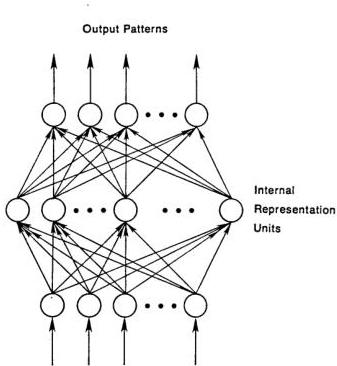

Input Patterns

FIGURE 1. A multilayer network. In this case the information coming to the input units is recoded into an internal representation and the outputs are generated by the internal representation rather than by the original pattern. Input patterns can always be encoded, if there are enough hidden units, in a form so that the appropriate output pattern can be generated from any input pattern.

structure of the patterns sufficiently to allow the solution to be learned. As illustrated in Figure 2, this can be done with a single hidden unit. The numbers on the arrows represent the strengths of the connections among the units. The numbers written in the circles represent the thresholds of the units. The value of  $+1.5$  for the threshold of the hidden unit insures that it will be turned on only when both input units are on. The value 0.5 for the output unit insures that it will turn on only when it receives a net positive input greater than 0.5. The weight of  $-2$  from the hidden unit to the output unit insures that the output unit will not come on when both input units are on. Note that from the point of view of the output unit, the hidden unit is treated as simply another input unit. It is as if the input patterns consisted of three rather than two units.

---

8. LEARNING INTERNAL REPRESENTATIONS 321

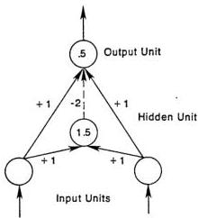
FIGURE 2. A simple XOR network with one hidden unit. See text for explanation.

The existence of networks such as this illustrates the potential power of hidden units and internal representations. The problem, as noted by Minsky and Papert, is that whereas there is a very simple guaranteed learning rule for all problems that can be solved without hidden units, namely, the perceptron convergence procedure (or the variation due originally to Widrow and Hoff, 1960, which we call the delta rule; see Chapter 11), there is no equally powerful rule for learning in networks with hidden units. There have been three basic responses to this lack. One response is represented by competitive learning (Chapter 5) in which simple unsupervised learning rules are employed so that useful hidden units develop. Although these approaches are promising, there is no external force to insure that hidden units appropriate for the required mapping are developed. The second response is to simply assume an internal representation that, on some a priori grounds, seems reasonable. This is the tack taken in the chapter on verb learning (Chapter 18) and in the interactive activation model of word perception (McClelland &amp; Rumelhart, 1981; Rumelhart &amp; McClelland, 1982). The third approach is to attempt to develop a learning procedure capable of learning an internal representation adequate for performing the task at hand. One such development is presented in the discussion of Boltzmann machines in Chapter 7. As we have seen, this procedure involves the use of stochastic units, requires the network to reach equilibrium in two different phases, and is limited to symmetric networks. Another recent approach, also employing stochastic units, has been developed by Barto (1985) and various of his colleagues (cf. Barto

---

322 BASIC MECHANISMS

&amp; Anandan, 1985). In this chapter we present another alternative that works with deterministic units, that involves only local computations, and that is a clear generalization of the delta rule. We call this the *generalized delta rule*. From other considerations, Parker (1985) has independently derived a similar generalization, which he calls *learning-logic*. Le Cun (1985) has also studied a roughly similar learning scheme. In the remainder of this chapter we first derive the generalized delta rule, then we illustrate its use by providing some results of our simulations, and finally we indicate some further generalizations of the basic idea.

## THE GENERALIZED DELTA RULE

The learning procedure we propose involves the presentation of a set of pairs of input and output patterns. The system first uses the input vector to produce its own output vector and then compares this with the *desired output*, or *target vector*. If there is no difference, no learning takes place. Otherwise the weights are changed to reduce the difference. In this case, with no hidden units, this generates the standard delta rule as described in Chapters 2 and 11. The rule for changing weights following presentation of input/output pair $p$ is given by

$$
\Delta_{p} w_{ji} = \eta (t_{pj} - o_{pj}) \, i_{pi} = \eta \delta_{pj} i_{pi} \tag{1}
$$

where $t_{pj}$ is the target input for $j$th component of the output pattern for pattern $p$, $o_{pj}$ is the $j$th element of the actual output pattern produced by the presentation of input pattern $p$, $i_{pi}$ is the value of the $i$th element of the input pattern $\delta_{pj} = t_{pj} - o_{pj}$, and $\Delta_p w_{ji}$ is the change to be made to the weight from the $i$th to the $j$th unit following presentation of pattern $p$.

*The delta rule and gradient descent*. There are many ways of deriving this rule. For present purposes, it is useful to see that for linear units it minimizes the squares of the differences between the actual and the desired output values summed over the output units and all pairs of input/output vectors. One way to show this is to show that the derivative of the error measure with respect to each weight is proportional to the weight change dictated by the delta rule, with negative constant of proportionality. This corresponds to performing steepest descent on a surface in weight space whose height at any point in weight space is equal to the error measure. (Note that some of the following sections

---

8. LEARNING INTERNAL REPRESENTATIONS 323

are written in italics. These sections constitute informal derivations of the claims made in the surrounding text and can be omitted by the reader who finds such derivations tedious.)

To be more specific, then, let

$$
E_p = \frac{1}{2} \sum_j (t_{pj} - o_{pj})^2 \tag{2}
$$

be our measure of the error on input/output pattern $p$ and let $E = \sum E_p$ be our overall measure of the error. We wish to show that the delta rule implements a gradient descent in $E$ when the units are linear. We will proceed by simply showing that

$$
- \frac{\partial E_p}{\partial w_{ji}} = \delta_{pj} i_{pi},
$$

which is proportional to $\Delta_p w_{ji}$ as prescribed by the delta rule. When there are no hidden units it is straightforward to compute the relevant derivative. For this purpose we use the chain rule to write the derivative as the product of two parts: the derivative of the error with respect to the output of the unit times the derivative of the output with respect to the weight.

$$
\frac{\partial E_p}{\partial w_{ji}} = \frac{\partial E_p}{\partial o_{pj}} \frac{\partial o_{pj}}{\partial w_{ji}}. \tag{3}
$$

The first part tells how the error changes with the output of the $j$th unit and the second part tells how much changing $w_{ji}$ changes that output. Now, the derivatives are easy to compute. First, from Equation 2

$$
\frac{\partial E_p}{\partial o_{pj}} = - (t_{pj} - o_{pj}) = - \delta_{pj}. \tag{4}
$$

Not surprisingly, the contribution of unit $u_j$ to the error is simply proportional to $\delta_{pj}$. Moreover, since we have linear units,

$$
o_{pj} = \sum_i w_{ji} i_{pi}, \tag{5}
$$

from which we conclude that

$$
\frac{\partial o_{pj}}{\partial w_{ji}} = i_{pi}.
$$

Thus, substituting back into Equation 3, we see that

$$
- \frac{\partial E_p}{\partial w_{ji}} = \delta_{pj} i_i \tag{6}
$$

---

324 BASIC MECHANISMS

as desired. Now, combining this with the observation that

$$
\frac{\partial E}{\partial w_{ji}} = \sum_{p} \frac{\partial E_{p}}{\partial w_{ji}}
$$

should lead us to conclude that the net change in $w_{ji}$ after one complete cycle of pattern presentations is proportional to this derivative and hence that the delta rule implements a gradient descent in $E$. In fact, this is strictly true only if the values of the weights are not changed during this cycle. By changing the weights after each pattern is presented we depart to some extent from a true gradient descent in $E$. Nevertheless, provided the learning rate (i.e., the constant of proportionality) is sufficiently small, this departure will be negligible and the delta rule will implement a very close approximation to gradient descent in sum-squared error. In particular, with small enough learning rate, the delta rule will find a set of weights minimizing this error function.

The delta rule for semilinear activation functions in feedforward networks. We have shown how the standard delta rule essentially implements gradient descent in sum-squared error for linear activation functions. In this case, without hidden units, the error surface is shaped like a bowl with only one minimum, so gradient descent is guaranteed to find the best set of weights. With hidden units, however, it is not so obvious how to compute the derivatives, and the error surface is not concave upwards, so there is the danger of getting stuck in local minima. The main theoretical contribution of this chapter is to show that there is an efficient way of computing the derivatives. The main empirical contribution is to show that the apparently fatal problem of local minima is irrelevant in a wide variety of learning tasks.

At the end of the chapter we show how the generalized delta rule can be applied to arbitrary networks, but, to begin with, we confine ourselves to layered feedforward networks. In these networks, the input units are the bottom layer and the output units are the top layer. There can be many layers of hidden units in between, but every unit must send its output to higher layers than its own and must receive its input from lower layers than its own. Given an input vector, the output vector is computed by a forward pass which computes the activity levels of each layer in turn using the already computed activity levels in the earlier layers.

Since we are primarily interested in extending this result to the case with hidden units and since, for reasons outlined in Chapter 2, hidden units with linear activation functions provide no advantage, we begin by generalizing our analysis to the set of nonlinear activation functions which we call semilinear (see Chapter 2). A semilinear activation function is one in which the output of a unit is a differentiable function of the net total input,

---

8. LEARNING INTERNAL REPRESENTATIONS 325

$$
net_{pj} = \sum_{i} w_{ji} o_{p,i}, \tag{7}
$$

where $o_i = i_i$ if unit $i$ is an input unit. Thus, a semilinear activation function is one in which

$$
o_{pj} = f_j(net_{pj}) \tag{8}
$$

and $f$ is differentiable. The generalized delta rule works if the network consists of units having semilinear activation functions. Notice that linear threshold units do not satisfy the requirement because their derivative is infinite at the threshold and zero elsewhere.

To get the correct generalization of the delta rule, we must set

$$
\Delta_p w_{ji} \propto -\frac{\partial E_p}{\partial w_{ji}},
$$

where $E$ is the same sum-squared error function defined earlier. As in the standard delta rule it is again useful to see this derivative as resulting from the product of two parts: one part reflecting the change in error as a function of the change in the net input to the unit and one part representing the effect of changing a particular weight on the net input. Thus we can write

$$
\frac{\partial E_p}{\partial w_{ji}} = \frac{\partial E_p}{\partial net_{pj}} \frac{\partial net_{pj}}{\partial w_{ji}}. \tag{9}
$$

By Equation 7 we see that the second factor is

$$
\frac{\partial net_{pj}}{\partial w_{ji}} = \frac{\partial}{\partial w_{ji}} \sum_{k} w_{jk} o_{pk} = o_{p,i}. \tag{10}
$$

Now let us define

$$
\delta_{pj} = -\frac{\partial E_p}{\partial net_{pj}}.
$$

(By comparing this to Equation 4, note that this is consistent with the definition of $\delta_{pj}$ used in the original delta rule for linear units since $o_{pj} = net_{pj}$ when unit $u_j$ is linear.) Equation 9 thus has the equivalent form

$$
-\frac{\partial E_p}{\partial w_{ji}} = \delta_{pj} o_{p,i}.
$$

This says that to implement gradient descent in $E$ we should make our weight changes according to

$$
\Delta_p w_{ji} = \eta \delta_{pj} o_{p,i}, \tag{11}
$$

---

BASIC MECHANISMS

just as in the standard delta rule. The trick is to figure out what $\delta_{pj}$ should be for each unit $u_j$ in the network. The interesting result, which we now derive, is that there is a simple recursive computation of these $\delta$'s which can be implemented by propagating error signals backward through the network.

To compute $\delta_{pj} = -\frac{\partial E_p}{\partial net_{pj}}$, we apply the chain rule to write this partial derivative as the product of two factors, one factor reflecting the change in error as a function of the output of the unit and one reflecting the change in the output as a function of changes in the input. Thus, we have

$$
\delta_{pj} = -\frac{\partial E_p}{\partial net_{pj}} = -\frac{\partial E_p}{\partial o_{pj}} \frac{\partial o_{pj}}{\partial net_{pj}}. \tag{12}
$$

Let us compute the second factor. By Equation 8 we see that

$$
\frac{\partial o_{pj}}{\partial net_{pj}} = f_j'(net_{pj}),
$$

which is simply the derivative of the squashing function $f_j$ for the $j$th unit, evaluated at the net input $net_{pj}$ to that unit. To compute the first factor, we consider two cases. First, assume that unit $u_j$ is an output unit of the network. In this case, it follows from the definition of $E_p$ that

$$
\frac{\partial E_p}{\partial o_{pj}} = -(t_{pj} - o_{pj}),
$$

which is the same result as we obtained with the standard delta rule. Substituting for the two factors in Equation 12, we get

$$
\delta_{pj} = (t_{pj} - o_{pj}) f_j'(net_{pj}) \tag{13}
$$

for any output unit $u_j$. If $u_j$ is not an output unit we use the chain rule to write

$$
\sum_k \frac{\partial E_p}{\partial net_{pk}} \frac{\partial net_{pk}}{\partial o_{pj}} = \sum_k \frac{\partial E_p}{\partial net_{pk}} \frac{\partial}{\partial o_{pj}} \sum_i w_{ki} o_{pi} = \sum_k \frac{\partial E_p}{\partial net_{pk}} w_{kj} = \sum_k \delta_{pk} w_{kj}.
$$

In this case, substituting for the two factors in Equation 12 yields

$$
\delta_{pj} = f_j'(net_{pj}) \sum_k \delta_{pk} w_{kj} \tag{14}
$$

whenever $u_j$ is not an output unit. Equations 13 and 14 give a recursive procedure for computing the $\delta$'s for all units in the network, which are then used to compute the weight changes in the network according to Equation 11. This procedure constitutes the generalized delta rule for a feedforward network of semilinear units.

These results can be summarized in three equations. First, the generalized delta rule has exactly the same form as the standard delta rule of Equation 1. The weight on each line should be changed by an amount proportional to the product of an error signal, $\delta$, available to

---

8. LEARNING INTERNAL REPRESENTATIONS 327

the unit receiving input along that line and the output of the unit sending activation along that line. In symbols,

$$
\Delta_{p} w_{ji} = \eta \delta_{pj} o_{pi}.
$$

The other two equations specify the error signal. Essentially, the determination of the error signal is a recursive process which starts with the output units. If a unit is an output unit, its error signal is very similar to the standard delta rule. It is given by

$$
\delta_{pj} = (t_{pj} - o_{pj}) f_{j}' (net_{pj})
$$

where $f_{j}'(net_{pj})$ is the derivative of the semilinear activation function which maps the total input to the unit to an output value. Finally, the error signal for hidden units for which there is no specified target is determined recursively in terms of the error signals of the units to which it directly connects and the weights of those connections. That is,

$$
\delta_{pj} = \hat{f}_{j}' (net_{pj}) \sum_{k} \delta_{pk} w_{kj}
$$

whenever the unit is not an output unit.

The application of the generalized delta rule, thus, involves two phases: During the first phase the input is presented and propagated forward through the network to compute the output value $o_{pj}$ for each unit. This output is then compared with the targets, resulting in an error signal $\delta_{pj}$ for each output unit. The second phase involves a backward pass through the network (analogous to the initial forward pass) during which the error signal is passed to each unit in the network and the appropriate weight changes are made. This second, backward pass allows the recursive computation of $\delta$ as indicated above. The first step is to compute $\delta$ for each of the output units. This is simply the difference between the actual and desired output values times the derivative of the squashing function. We can then compute weight changes for all connections that feed into the final layer. After this is done, then compute $\delta$'s for all units in the penultimate layer. This propagates the errors back one layer, and the same process can be repeated for every layer. The backward pass has the same computational complexity as the forward pass, and so it is not unduly expensive.

We have now generated a gradient descent method for finding weights in any feedforward network with semilinear units. Before reporting our results with these networks, it is useful to note some further observations. It is interesting that not all weights need be variable. Any number of weights in the network can be fixed. In this case, error is still propagated as before; the fixed weights are simply not

---

328 BASIC MECHANISMS

modified. It should also be noted that there is no reason why some output units might not receive inputs from other output units in earlier layers. In this case, those units receive two different kinds of error: that from the direct comparison with the target and that passed through the other output units whose activation it affects. In this case, the correct procedure is to simply add the weight changes dictated by the direct comparison to that propagated back from the other output units.

## SIMULATION RESULTS

We now have a learning procedure which could, in principle, evolve a set of weights to produce an arbitrary mapping from input to output. However, the procedure we have produced is a gradient descent procedure and, as such, is bound by all of the problems of any hill climbing procedure—namely, the problem of local maxima or (in our case) minima. Moreover, there is a question of how long it might take a system to learn. Even if we could guarantee that it would eventually find a solution, there is the question of whether our procedure could learn in a reasonable period of time. It is interesting to ask what hidden units the system actually develops in the solution of particular problems. This is the question of what kinds of internal representations the system actually creates. We do not yet have definitive answers to these questions. However, we have carried out many simulations which lead us to be optimistic about the local minima and time questions and to be surprised by the kinds of representations our learning mechanism discovers. Before proceeding with our results, we must describe our simulation system in more detail. In particular, we must specify an activation function and show how the system can compute the derivative of this function.

*A useful activation function.* In our above derivations the derivative of the activation function of unit $u_j$, $f_j'(net_j)$, always played a role. This implies that we need an activation function for which a derivative exists. It is interesting to note that the linear threshold function, on which the perceptron is based, is discontinuous and hence will not suffice for the generalized delta rule. Similarly, since a linear system achieves no advantage from hidden units, a linear activation function will not suffice either. Thus, we need a continuous, nonlinear activation function. In most of our experiments we have used the *logistic* activation function in which

---

8. LEARNING INTERNAL REPRESENTATIONS 329

$$
o_{pj} = \frac{1}{1 + e^{- \left(\sum_{i} w_{ji} o_{pi} + \theta_{j}\right)}} \tag{15}
$$

where $\theta_{j}$ is a bias similar in function to a threshold.¹ In order to apply our learning rule, we need to know the derivative of this function with respect to its total input, $net_{pj}$, where $net_{pj} = \sum w_{ji} o_{pi} + \theta_{j}$. It is easy to show that this derivative is given by

$$
\frac{do_{pj}}{dnet_{pj}} = o_{pj} (1 - o_{pj}).
$$

Thus, for the logistic activation function, the error signal, $\delta_{pj}$, for an output unit is given by

$$
\delta_{pj} = (t_{pj} - o_{pj}) o_{pj} (1 - o_{pj}),
$$

and the error for an arbitrary hidden $u_{j}$ is given by

$$
\delta_{pj} = o_{pj} (1 - o_{pj}) \sum_{k} \delta_{pk} w_{kj}.
$$

It should be noted that the derivative, $o_{pj}(1 - o_{pj})$, reaches its maximum for $o_{pj} = 0.5$ and, since $0 \leqslant o_{pj} \leqslant 1$, approaches its minimum as $o_{pj}$ approaches zero or one. Since the amount of change in a given weight is proportional to this derivative, weights will be changed most for those units that are near their midrange and, in some sense, not yet committed to being either on or off. This feature, we believe, contributes to the stability of the learning of the system.

One other feature of this activation function should be noted. The system can not actually reach its extreme values of 1 or 0 without infinitely large weights. Therefore, in a practical learning situation in which the desired outputs are binary $\{0,1\}$, the system can never actually achieve these values. Therefore, we typically use the values of 0.1 and 0.9 as the targets, even though we will talk as if values of $\{0,1\}$ are sought.

The learning rate. Our learning procedure requires only that the change in weight be proportional to $\partial E_{p} / \partial w$. True gradient descent requires that infinitesimal steps be taken. The constant of proportionality is the learning rate in our procedure. The larger this constant, the larger the changes in the weights. For practical purposes we choose a

¹ Note that the values of the bias, $\theta_{j}$, can be learned just like any other weights. We simply imagine that $\theta_{j}$ is the weight from a unit that is always on.

---

330 BASIC MECHANISMS

learning rate that is as large as possible without leading to oscillation. This offers the most rapid learning. One way to increase the learning rate without leading to oscillation is to modify the generalized delta rule to include a *momentum* term. This can be accomplished by the following rule:

$$
\Delta w_{ji}(n+1) = \eta(\delta_{pj} o_{pj}) + \alpha \Delta w_{ji}(n) \tag{16}
$$

where the subscript $n$ indexes the presentation number, $\eta$ is the learning rate, and $\alpha$ is a constant which determines the effect of past weight changes on the current direction of movement in weight space. This provides a kind of momentum in weight space that effectively filters out high-frequency variations of the error-surface in the weight space. This is useful in spaces containing long ravines that are characterized by sharp curvature across the ravine and a gently sloping floor. The sharp curvature tends to cause divergent oscillations across the ravine. To prevent these it is necessary to take very small steps, but this causes very slow progress along the ravine. The momentum filters out the high curvature and thus allows the effective weight steps to be bigger. In most of our simulations $\alpha$ was about 0.9. Our experience has been that we get the same solutions by setting $\alpha = 0$ and reducing the size of $\eta$, but the system learns much faster overall with larger values of $\alpha$ and $\eta$.

*Symmetry breaking.* Our learning procedure has one more problem that can be readily overcome and this is the problem of symmetry breaking. If all weights start out with equal values and if the solution requires that unequal weights be developed, the system can never learn. This is because error is propagated back through the weights in proportion to the values of the weights. This means that all hidden units connected directly to the output inputs will get identical error signals, and, since the weight changes depend on the error signals, the weights from those units to the output units must always be the same. The system is starting out at a kind of *local maximum*, which keeps the weights equal, but it is a maximum of the error function, so once it escapes it will never return. We counteract this problem by starting the system with small random weights. Under these conditions symmetry problems of this kind do not arise.

## The XOR Problem

It is useful to begin with the exclusive-or problem since it is the classic problem requiring hidden units and since many other difficult

---

8. LEARNING INTERNAL REPRESENTATIONS 331

problems involve an XOR as a subproblem. We have run the XOR problem many times and with a couple of exceptions discussed below, the system has always solved the problem. Figure 3 shows one of the solutions to the problem. This solution was reached after 558 sweeps through the four stimulus patterns with a learning rate of $\eta = 0.5$. In this case, both the hidden unit and the output unit have *positive biases* so they are on unless turned off. The hidden unit turns on if neither input unit is on. When it is on, it turns off the output unit. The connections from input to output units arranged themselves so that they turn off the output unit whenever both inputs are on. In this case, the network has settled to a solution which is a sort of mirror image of the one illustrated in Figure 2.

We have taught the system to solve the XOR problem hundreds of times. Sometimes we have used a single hidden unit and direct connections to the output unit as illustrated here, and other times we have allowed two hidden units and set the connections from the input units to the outputs to be zero, as shown in Figure 4. In only two cases has the system encountered a *local minimum* and thus been unable to solve the problem. Both cases involved the two hidden units version of the

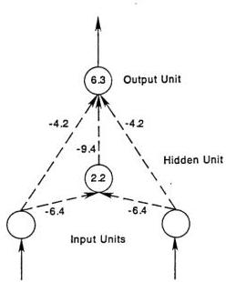

FIGURE 3. Observed XOR network. The connection weights are written on the arrows and the biases are written in the circles. Note a positive bias means that the unit is on unless turned off.

---

BASIC MECHANISMS

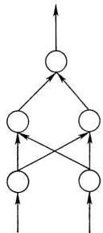
FIGURE 4. A simple architecture for solving XOR with two hidden units and no direct connections from input to output.

problem and both ended up in the same local minimum. Figure 5 shows the weights for the local minimum. In this case, the system correctly responds to two of the patterns—namely, the patterns 00 and 10. In the cases of the other two patterns 11 and 01, the output unit gets a net input of zero. This leads to an output value of 0.5 for both of these patterns. This state was reached after 6,587 presentations of each pattern with  $\eta = 0.25$ . Although many problems require more presentations for learning to occur, further trials on this problem merely increase the magnitude of the weights but do not lead to any improvement in performance. We do not know the frequency of such local minima, but our experience with this and other problems is that they are quite rare. We have found only one other situation in which a local minimum has occurred in many hundreds of problems of various sorts. We will discuss this case below.

The XOR problem has proved a useful test case for a number of other studies. Using the architecture illustrated in Figure 4, a student in our laboratory, Yves Chauvin, has studied the effect of varying the

---

8. LEARNING INTERNAL REPRESENTATIONS 333

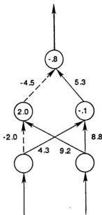
FIGURE 5. A network at a local minimum for the exclusive-or problem. The dated lines indicate negative weights. Note that whenever the right most input unit is on it turns on both hidden units. The weights connecting the hidden units to the output are arranged so that when both hidden units are on, the output unit gets a net input of zero. This leads to an output value of 0.5. In the other cases the network provides the correct answer.

number of hidden units and varying the learning rate on time to solve the problem. Using as a learning criterion an error of 0.01 per pattern, Yves found that the average number of presentations to solve the problem with $\eta = 0.25$ varied from about 245 for the case with two hidden units to about 120 presentations for 32 hidden units. The results can be summarized by $P = 280 - 33\log_2H$, where $P$ is the required number of presentations and $H$ is the number of hidden units employed. Thus, the time to solve XOR is reduced linearly with the logarithm of the number of hidden units. This result holds for values of $H$ up to about 40 in the case of XOR. The general result that the time to solution is reduced by increasing the number of hidden units has been observed in virtually all of our simulations. Yves also studied the time to solution as a function of learning rate for the case of eight hidden units. He found an average of about 450 presentations with $\eta = 0.1$ to about 68 presentations with $\eta = 0.75$. He also found that

---

BASIC MECHANISMS

learning rates larger than this led to unstable behavior. However, within this range larger learning rates speeded the learning substantially. In most of our problems we have employed learning rates of  $\eta = 0.25$  or smaller and have had no difficulty.

# Parity

One of the problems given a good deal of discussion by Minsky and Papert (1969) is the parity problem, in which the output required is 1 if the input pattern contains an odd number of 1s and 0 otherwise. This is a very difficult problem because the most similar patterns (those which differ by a single bit) require different answers. The XOR problem is a parity problem with input patterns of size two. We have tried a number of parity problems with patterns ranging from size two to eight. Generally we have employed layered networks in which direct connections from the input to the output units are not allowed, but must be mediated through a set of hidden units. In this architecture, it requires at least  $N$  hidden units to solve parity with patterns of length  $N$ . Figure 6 illustrates the basic paradigm for the solutions discovered by the system. The solid lines in the figure indicate weights of  $+1$  and the dotted lines indicate weights of  $-1$ . The numbers in the circles represent the biases of the units. Basically, the hidden units arranged

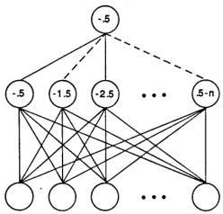
FIGURE 6. A paradigm for the solutions to the parity problem discovered by the learning system. See text for explanation.

---

8. LEARNING INTERNAL REPRESENTATIONS 335

themselves so that they count the number of inputs. In the diagram, the one at the far left comes on if one or more input units are on, the next comes on if two or more are on, etc. All of the hidden units come on if all of the input lines are on. The first $m$ hidden units come on whenever $m$ bits are on in the input pattern. The hidden units then connect with alternately positive and negative weights. In this way the net input from the hidden units is zero for even numbers and $+1$ for odd numbers. Table 3 shows the actual solution attained for one of our simulations with four input lines and four hidden units. This solution was reached after 2,825 presentations of each of the sixteen patterns with $\eta = 0.5$. Note that the solution is roughly a mirror image of that shown in Figure 6 in that the number of hidden units turned on is equal to the number of zero input values rather than the number of ones. Beyond that the principle is that shown above. It should be noted that the internal representation created by the learning rule is to arrange that the number of hidden units that come on is equal to the number of zeros in the input and that the particular hidden units that come on depend only on the number, not on which input units are on. This is exactly the sort of recoding required by parity. It is not the kind of representation readily discovered by unsupervised learning schemes such as competitive learning.

## The Encoding Problem

Ackley, Hinton, and Sejnowski (1985) have posed a problem in which a set of orthogonal input patterns are mapped to a set of orthogonal output patterns through a small set of hidden units. In such cases the internal representations of the patterns on the hidden units must be rather efficient. Suppose that we attempt to map $N$ input patterns onto $N$ output patterns. Suppose further that $\log_2 N$ hidden units are provided. In this case, we expect that the system will learn to use the

TABLE 3

|  Number of On Input Units | Hidden Unit Patterns | Output Value  |
| --- | --- | --- |
|  0 | 1111 | 0  |
|  1 | 1011 | 1  |
|  2 | 1010 | 0  |
|  3 | 0010 | 1  |
|  4 | 0000 | 0  |

---

BASIC MECHANISMS

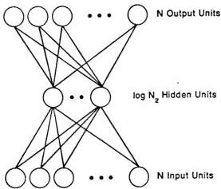
FIGURE 7. A network for solving the encoder problem. In this problem there are  $N$  orthogonal input patterns each paired with one of  $N$  orthogonal output patterns. There are only  $\log N_2$  hidden units. Thus, if the hidden units take on binary values, the hidden units must form a binary number to encode each of the input patterns. This is exactly what the system learns to do.

hidden units to form a binary code with a distinct binary pattern for each of the  $N$  input patterns. Figure 7 illustrates the basic architecture for the encoder problem. Essentially, the problem is to learn an encoding of an  $N$  bit pattern into a  $\log_2 N$  bit pattern and then learn to decode this representation into the output pattern. We have presented the system with a number of these problems. Here we present a problem with eight input patterns, eight output patterns, and three hidden units. In this case the required mapping is the identity mapping illustrated in Table 4. The problem is simply to turn on the same bit in the

TABLE 4

|  Input Patterns | Output Patterns  |
| --- | --- |
|  10000000 | 10000000  |
|  01000000 | 01000000  |
|  00100000 | 00100000  |
|  00010000 | 00010000  |
|  00001000 | 00001000  |
|  00000100 | 00000100  |
|  00000010 | 00000010  |
|  00000001 | 00000001  |

---

8. LEARNING INTERNAL REPRESENTATIONS 337

output as in the input. Table 5 shows the mapping generated by our learning system on this example. It is of some interest that the system employed its ability to use intermediate values in solving this problem. It could, of course, have found a solution in which the hidden units took on only the values of zero and one. Often it does just that, but in this instance, and many others, there are solutions that use the intermediate values, and the learning system finds them even though it has a bias toward extreme values. It is possible to set up problems that require the system to make use of intermediate values in order to solve a problem. We now turn to such a case.

Table 6 shows a very simple problem in which we have to convert from a distributed representation over two units into a local representation over four units. The similarity structure of the distributed input patterns is simply not preserved in the local output representation.

We presented this problem to our learning system with a number of constraints which made it especially difficult. The two input units were only allowed to connect to a single hidden unit which, in turn, was allowed to connect to four more hidden units. Only these four hidden units were allowed to connect to the four output units. To solve this problem, then, the system must first convert the distributed

TABLE 5

|  Input Patterns | Hidden Unit Patterns |   |   |   | Output Patterns  |
| --- | --- | --- | --- | --- | --- |
|  10000000 | — | .5 | 0 | 0 | — 10000000  |
|  01000000 | — | 0 | 1 | 0 | — 01000000  |
|  00100000 | — | 1 | 1 | 0 | — 00100000  |
|  00010000 | — | 1 | 1 | 1 | — 00010000  |
|  00001000 | — | 0 | 1 | 1 | — 00001000  |
|  00000100 | — | .5 | 0 | 1 | — 00000100  |
|  00000010 | — | 1 | 0 | .5 | — 00000010  |
|  00000001 | — | 0 | 0 | .5 | — 00000001  |

TABLE 6

|  Input Patterns | Output Patterns  |   |
| --- | --- | --- |
|  00 | — | 1000  |
|  01 | — | 0100  |
|  10 | — | 0010  |
|  11 | — | 0001  |

---

338 BASIC MECHANISMS

representation of the input patterns into various intermediate values of the singleton hidden unit in which different activation values correspond to the different input patterns. These continuous values must then be converted back through the next layer of hidden units—first to another distributed representation and then, finally, to a local representation. This problem was presented to the system and it reached a solution after 5,226 presentations with $\eta = 0.05$. Table 7 shows the sequence of representations the system actually developed in order to transform the patterns and solve the problem. Note each of the four input patterns was mapped onto a particular activation value of the singleton hidden unit. These values were then mapped onto distributed patterns at the next layer of hidden units which were finally mapped into the required local representation at the output level. In principle, this trick of mapping patterns into activation values and then converting those activation values back into patterns could be done for any number of patterns, but it becomes increasingly difficult for the system to make the necessary distinctions as ever smaller differences among activation values must be distinguished. Figure 8 shows the network the system developed to do this job. The connection weights from the hidden units to the output units have been suppressed for clarity. (The sign of the connection, however, is indicated by the form of the connection—e.g., dashed lines mean inhibitory connections). The four different activation values were generated by having relatively large weights of opposite sign. One input line turns the hidden unit full on, one turns it full off. The two differ by a relatively small amount so that when both turn on, the unit attains a value intermediate between 0 and 0.5. When neither turns on, the near zero bias causes the unit to attain a value slightly over 0.5. The connections to the second layer of hidden units is likewise interesting. When the hidden unit is full on,

TABLE 7

|  Input Patterns | Singleton Hidden Unit | Remaining Hidden Units | Output Patterns  |
| --- | --- | --- | --- |
|  10 | 0 | 1 1 1 0 | 0010  |
|  11 | .2 | 1 1 0 0 | 0001  |
|  00 | .6 | .5 0 0 .3 | 1000  |
|  01 | 1 | 0 0 0 1 | 0100  |

3 Relatively small learning rates make units employing intermediate values easier to obtain.

---

8. LEARNING INTERNAL REPRESENTATIONS 339

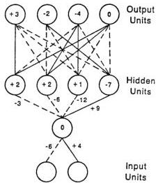
FIGURE 8. The network illustrating the use of intermediate values in solving a problem. See text for explanation.

the right-most of these hidden units is turned on and all others turned off. When the hidden unit is turned off, the other three of these hidden units are on and the left-most unit off. The other connections from the singleton hidden unit to the other hidden units are graded so that a distinct pattern is turned on for its other two values. Here we have an example of the flexibility of the learning system.

Our experience is that there is a propensity for the hidden units to take on extreme values, but, whenever the learning problem calls for it, they can learn to take on graded values. It is likely that the propensity to take on extreme values follows from the fact that the logistic is a sigmoid so that increasing magnitudes of its inputs push it toward zero or one. This means that in a problem in which intermediate values are required, the incoming weights must remain of moderate size. It is interesting that the derivation of the generalized delta rule does not depend on all of the units having identical activation functions. Thus, it would be possible for some units, those required to encode information in a graded fashion, to be linear while others might be logistic. The linear unit would have a much wider dynamic range and could encode more different values. This would be a useful role for a linear unit in a network with hidden units.

---

BASIC MECHANISMS

# Symmetry

Another interesting problem we studied is that of classifying input strings as to whether or not they are symmetric about their center. We used patterns of various lengths with various numbers of hidden units. To our surprise, we discovered that the problem can always be solved with only two hidden units. To understand the derived representation, consider one of the solutions generated by our system for strings of length six. This solution was arrived at after 1,208 presentations of each six-bit pattern with  $\eta = 0.1$ . The final network is shown in Figure 9. For simplicity we have shown the six input units in the center of the diagram with one hidden unit above and one below. The output unit, which signals whether or not the string is symmetric about its center, is shown at the far right. The key point to see about this solution is that for a given hidden unit, weights that are symmetric about the middle are equal in magnitude and opposite in sign. That means that if a symmetric pattern is on, both hidden units will receive a net input of zero from the input units, and, since the hidden units have a negative bias, both will be off. In this case, the output unit, having a positive bias,

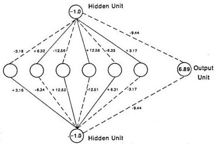
FIGURE 9. Network for solving the symmetry problem. The six open circles represent the input units. There are two hidden units, one shown above and one below the input units. The output unit is shown to the far left. See text for explanation.

---

8. LEARNING INTERNAL REPRESENTATIONS 341

will be on. The next most important thing to note about the solution is that the weights on each side of the midpoint of the string are in the ratio of 1:2:4. This insures that each of the eight patterns that can occur on each side of the midpoint sends a unique activation sum to the hidden unit. This assures that there is no pattern on the left that will exactly balance a non-mirror-image pattern on the right. Finally, the two hidden units have identical patterns of weights from the input units except for sign. This insures that for every nonsymmetric pattern, at least one of the two hidden units will come on and turn on the output unit. To summarize, the network is arranged so that both hidden units will receive exactly zero activation from the input units when the pattern is symmetric, and at least one of them will receive positive input for every nonsymmetric pattern.

This problem was interesting to us because the learning system developed a much more elegant solution to the problem than we had previously considered. This problem was not the only one in which this happened. The parity solution discovered by the learning procedure was also one that we had not discovered prior to testing the problem with our learning procedure. Indeed, we frequently discover these more elegant solutions by giving the system more hidden units than it needs and observing that it does not make use of some of those provided. Some analysis of the actual solutions discovered often leads us to the discovery of a better solution involving fewer hidden units.

## Addition

Another interesting problem on which we have tested our learning algorithm is the simple binary addition problem. This problem is interesting because there is a very elegant solution to it, because it is the one problem we have found where we can reliably find local minima and because the way of avoiding these local minima gives us some insight into the conditions under which local minima may be found and avoided. Figure 10 illustrates the basic problem and a minimal solution to it. There are four input units, three output units, and two hidden units. The output patterns can be viewed as the binary representation of the sum of two two-bit binary numbers represented by the input patterns. The second and fourth input units in the diagram correspond to the low-order bits of the two binary numbers and the first and third units correspond to the two higher order bits. The hidden units correspond to the *carry bits* in the summation. Thus the hidden unit on the far right comes on when both of the lower order bits in the input pattern are turned on, and the one on the left comes

---

BASIC MECHANISMS

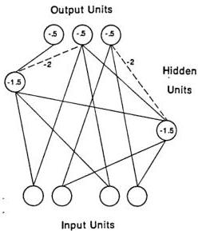
FIGURE 10. Minimal network for adding two two-bit binary numbers. There are four input units, three output units, and two hidden units. The output patterns can be viewed as the binary representation of the sum of two two-bit binary numbers represented by the input patterns. The second and fourth input units in the diagram correspond to the low-order bits of the two binary numbers, and the first and third units correspond to the two higher order bits. The hidden units correspond to the carry bits in the summation. The hidden unit on the far right comes on when both of the lower order bits in the input pattern are turned on, and the one on the left comes on when both higher order bits are turned on or when one of the higher order bits and the other hidden unit is turned on. The weights on all lines are assumed to be  $+1$  except where noted. Negative connections are indicated by dashed lines. As usual, the biases are indicated by the numbers in the circles.

on when both higher order bits are turned on or when one of the higher order bits and the other hidden unit is turned on. In the diagram, the weights on all lines are assumed to be  $+1$  except where noted. Inhibitory connections are indicated by dashed lines. As usual, the biases are indicated by the numbers in the circles. To understand how this network works, it is useful to note that the lowest order output bit is determined by an exclusive-or among the two low-order input bits. One way to solve this XOR problem is to have a hidden unit come on when both low-order input bits are on and then have it inhibit the output unit. Otherwise either of the low-order input units can turn on the low-order output bit. The middle bit is somewhat more

---

8. LEARNING INTERNAL REPRESENTATIONS 343

difficult. Note that the middle bit should come on whenever an odd number of the set containing the two higher order input bits and the lower order carry bit is turned on. Observation will confirm that the network shown performs that task. The left-most hidden unit receives inputs from the two higher order bits and from the carry bit. Its bias is such that it will come on whenever two or more of its inputs are turned on. The middle output unit receives positive inputs from the same three units and a negative input of $-2$ from the second hidden unit. This insures that whenever just one of the three are turned on, the second hidden unit will remain off and the output bit will come on. Whenever exactly two of the three are on, the hidden unit will turn on and counteract the two units exciting the output bit, so it will stay off. Finally, when all three are turned on, the output bit will receive $-2$ from its carry bit and $+3$ from its other three inputs. The net is positive, so the middle unit will be on. Finally, the third output bit should turn on whenever the second hidden unit is on—that is, whenever there is a carry from the second bit. Here then we have a minimal network to carry out the job at hand. Moreover, it should be noted that the concept behind this network is generalizable to an arbitrary number of input and output bits. In general, for adding two $m$ bit binary numbers we will require $2m$ input units, $m$ hidden units, and $m+1$ output units.

Unfortunately, this is the one problem we have found that reliably leads the system into local minima. At the start in our learning trials on this problem we allow any input unit to connect to any output unit and to any hidden unit. We allow any hidden unit to connect to any output unit, and we allow one of the hidden units to connect to the other hidden unit, but, since we can have no loops, the connection in the opposite direction is disallowed. Sometimes the system will discover essentially the same network shown in the figure.⁴ Often, however, the system ends up in a local minimum. The problem arises when the XOR problem on the low-order bits is not solved in the way shown in the diagram. One way it can fail is when the "higher" of the two hidden units is "selected" to solve the XOR problem. This is a problem because then the other hidden unit cannot "see" the carry bit and therefore cannot finally solve the problem. This problem seems to stem from the fact that the learning of the second output bit is always dependent on learning the first (because information about the carry is necessary to learn the second bit) and therefore lags behind the learning of the first bit and has no influence on the selection of a hidden unit to

⁴ The network is the same except for the highest order bit. The highest order bit is always on whenever three or more of the input units are on. This is always learned first and always learned with direct connections to the input units.

---

344 BASIC MECHANISMS

solve the first XOR problem. Thus, about half of the time (in this problem) the wrong unit is chosen and the problem cannot be solved. In this case, the system finds a solution for all of the sums except the $11 + 11 \rightarrow 110$ ($3 + 3 = 6$) case in which it misses the carry into the middle bit and gets $11 + 11 \rightarrow 100$ instead. This problem differs from others we have solved in as much as the hidden units are not "equipotential" here. In most of our other problems the hidden units have been equipotential, and this problem has not arisen.

It should be noted, however, that there is a relatively simple way out of the problem—namely, add some extra hidden units. In this case we can afford to make a mistake on one or more selections and the system can still solve the problems. For the problem of adding two-bit numbers we have found that the system always solves the problem with one extra hidden unit. With larger numbers it may require two or three more. For purposes of illustration, we show the results of one of our runs with three rather than the minimum two hidden units. Figure 11 shows the state reached by the network after 3,020 presentations of each input pattern and with a learning rate of $\eta = 0.5$. For convenience, we show the network in four parts. In Figure 11A we show the connections to and among the hidden units. This figure shows the internal representation generated for this problem. The "lowest" hidden unit turns off whenever either of the low-order bits are on. In other words it detects the case in which no low-order bit is turn on. The "highest" hidden unit is arranged so that it comes on whenever the sum is less than two. The conditions under which the middle hidden unit comes on are more complex. Table 8 shows the patterns of hidden units which occur to each of the sixteen input patterns. Figure 11B shows the connections to the lowest order output unit. Noting that the relevant hidden unit comes on when neither low-order input unit is on, it is clear how the system computes XOR. When both low-order inputs are off, the output unit is turned off by the hidden unit. When both low-order input units are on, the output is turned off directly by the two input units. If just one is on, the positive bias on the output unit keeps it on. Figure 11C gives the connections to the middle output unit, and in Figure 11D we show those connections to the left-most, highest order output unit. It is somewhat difficult to see how these connections always lead to the correct output answer, but, as can be verified from the figures, the network is balanced so that this works.

It should be pointed out that most of the problems described thus far have involved hidden units with quite simple interpretations. It is much more often the case, especially when the number of hidden units exceeds the minimum number required for the task, that the hidden units are not readily interpreted. This follows from the fact that there is very little tendency for *localist* representations to develop. Typically

---

8. LEARNING INTERNAL REPRESENTATIONS 345

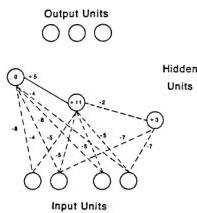
A

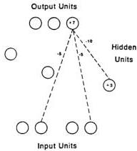
B

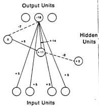
C

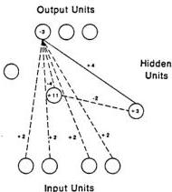
D
FIGURE 11. Network found for the summation problem. A: The connections from the input units to the three hidden units and the connections among the hidden units. B: The connections from the input and hidden units to the lowest order output unit. C: The connections from the input and hidden units to the middle output unit. D: The connections from the input and hidden units to the highest order output unit.

---

BASIC MECHANISMS

TABLE 8

|  Input Patterns | Hidden Unit Patterns | Output Patterns  |
| --- | --- | --- |
|  00 + 00 → | 111 → | 000  |
|  00 + 01 → | 110 → | 001  |
|  00 + 10 → | 011 → | 010  |
|  00 + 11 → | 010 → | 011  |
|  01 + 00 → | 110 → | 001  |
|  01 + 01 → | 010 → | 010  |
|  01 + 10 → | 010 → | 011  |
|  01 + 11 → | 000 → | 100  |
|  10 + 00 → | 011 → | 010  |
|  10 + 01 → | 010 → | 011  |
|  10 + 10 → | 001 → | 100  |
|  10 + 11 → | 000 → | 101  |
|  11 + 00 → | 010 → | 011  |
|  11 + 01 → | 000 → | 100  |
|  11 + 10 → | 000 → | 101  |
|  11 + 11 → | 000 → | 110  |

the internal representations are distributed and it is the pattern of activity over the hidden units, not the meaning of any particular hidden unit that is important.

## The Negation Problem

Consider a situation in which the input to a system consists of patterns of $n + 1$ binary values and an output of $n$ values. Suppose further that the general rule is that $n$ of the input units should be mapped directly to the output patterns. One of the input bits, however, is special. It is a negation bit. When that bit is off, the rest of the pattern is supposed to map straight through, but when it is on, the complement of the pattern is to be mapped to the output. Table 9 shows the appropriate mapping. In this case the left element of the input pattern is the negation bit, but the system has no way of knowing this and must learn which bit is the negation bit. In this case, weights were allowed from any input unit to any hidden or output unit and from any hidden unit to any output unit. The system learned to set all of the weights to zero except those shown in Figure 12. The basic structure of the problem and of the solution is evident in the figure. Clearly the problem was reduced to a set of three XORs between the negation bit

---

8. LEARNING INTERNAL REPRESENTATIONS 347

TABLE 9

|  Input Patterns | Output Patterns  |
| --- | --- |
|  0000 | 000  |
|  0001 | 001  |
|  0010 | 010  |
|  0011 | 011  |
|  0100 | 100  |
|  0101 | 101  |
|  0110 | 110  |
|  0111 | 111  |
|  1000 | 111  |
|  1001 | 110  |
|  1010 | 101  |
|  1011 | 100  |
|  1100 | 011  |
|  1101 | 010  |
|  1110 | 001  |
|  1111 | 000  |

and each input. In the case of the two right-most input units, the XOR problems were solved by recruiting a hidden unit to detect the case in which neither the negation unit nor the corresponding input unit was on. In the third case, the hidden unit detects the case in which both the negation unit and relevant input were on. In this case the problem was solved in less than 5,000 passes through the stimulus set with $\eta = 0.25$.

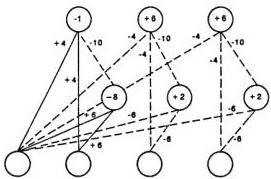

FIGURE 12. The solution discovered for the negation problem. The right-most unit is the negation unit. The problem has been reduced and solved as three exclusive-ors between the negation unit and each of the other three units.

---

BASIC MECHANISMS

# The T-C Problem

Most of the problems discussed so far (except the symmetry problem) are rather abstract mathematical problems. We now turn to a more geometric problem—that of discriminating between a  $T$  and a  $C$ -independent of translation and rotation. Figure 13 shows the stimulus patterns used in these experiments. Note, these patterns are each made of five squares and differ from one another by a single square. Moreover, as Minsky and Papert (1969) point out, when considering the set of patterns over all possible translations and rotations (of  $90^{\circ}$ ,  $180^{\circ}$ , and  $270^{\circ}$ ), the patterns do not differ in the set of distances among their pairs of squares. To see a difference between the sets of patterns one must look, at least, at configurations of triplets of squares. Thus Minsky and Papert call this a problem of order three. In order to facilitate the learning, a rather different architecture was employed for this problem. Figure 14 shows the basic structure of the network we employed. Input patterns were now conceptualized as two-dimensional patterns superimposed on a rectangular grid. Rather than allowing each input unit to connect to each hidden unit, the hidden units themselves were organized into a two-dimensional grid with each unit receiving input from a square  $3 \times 3$  region of the input space. In this sense, the overlapping square regions constitute the predefined receptive field of the hidden units. Each of the hidden units, over the entire field, feeds into a single output unit which is to take on the value

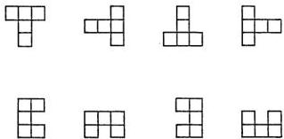
FIGURE 13. The stimulus set for the T-C problem. The set consists of a block  $T$  and a block  $C$  in each of four orientations. One of the eight patterns is presented on each trial.

---

8. LEARNING INTERNAL REPRESENTATIONS 349

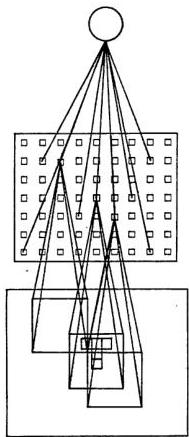

Output Unit

Hidden Units

Input Units

FIGURE 14. The network for solving the T-C problem. See text for explanation.

1 if the input is a $T$ (at any location or orientation) and 0 if the input is a $C$. Further, in order that the learning that occurred be independent of where on the field the pattern appeared, we constrained all of the units to learn exactly the same pattern of weights. In this way each unit was constrained to compute exactly the same function over its receptive field—the receptive fields were constrained to all have the same shape. This guarantees translation independence and avoids any possible "edge effects" in the learning. The learning can readily be extended to arbitrarily large fields of input units. This constraint was accomplished by simply adding together the weight changes dictated by the delta rule for each unit and then changing all weights exactly the same amount. In

---

350 BASIC MECHANISMS

this way, the whole field of hidden units consists simply of replications of a single feature detector centered on different regions of the input space, and the learning that occurs in one part of the field is automatically generalized to the rest of the field.⁶

We have run this problem in this way a number of times. As a result, we have found a number of solutions. Perhaps the simplest way to understand the system is by looking at the form of the receptive field for the hidden units. Figure 15 shows several of the receptive fields we have seen.⁷ Figure 15A shows the most local representation developed. This *on-center-off-surround* detector turns out to be an excellent $T$ detector. Since, as illustrated, a $T$ can extend into the on-center and achieve a net input of $+1$, this detector will be turned on for a $T$ at any orientation. On the other hand, any $C$ extending into the center must cover at least *two* inhibitory cells. With this detector the bias can be set so that only one of the whole field of inhibitory units will come on whenever a $T$ is presented and none of the hidden units will be turned on by any $C$. This is a kind of *protrusion* detector which differentiates between a $T$ and $C$ by detecting the protrusion of the $T$.

The receptive field shown in Figure 15B is again a kind of $T$ detector. Every $T$ activates one of the hidden units by an amount $+2$ and none of the hidden units receives more than $+1$ from any of the $C$'s. As shown in the figure, $T$'s at $90^\circ$ and $270^\circ$ send a total of $+2$ to the hidden units on which the crossbar lines up. The $T$'s at the other two orientations receive $+2$ from the way it detects the vertical protrusions of those two characters. Figure 15C shows a more distributed representation. As illustrated in the figure, each $T$ activates five different hidden units whereas each $C$ excites only three hidden units. In this case the system again is differentiating between the characters on the basis of the protruding end of the $T$ which is not shared by the $C$.

Finally, the receptive field shown in Figure 15D is even more interesting. In this case every hidden unit has a positive bias so that it is on unless turned off. The strength of the inhibitory weights are such that if a character overlaps the receptive field of a hidden unit, that unit turns off. The system works because a $C$ is more compact than a $T$ and therefore the $T$ turns off more units than the $C$. The $T$ turns off 21 hidden units, and the $C$ turns off only 20. This is a truly distributed

---

⁶ A similar procedure has been employed by Fukushima (1980) in his *neocognitron* and by Kienker, Sejnowski, Hinton, and Schumacher (1985).

⁷ The ratios of the weights are about right. The actual values can be larger or smaller than the values given in the figure.

---

8. LEARNING INTERNAL REPRESENTATIONS 351

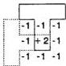
A

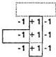
B

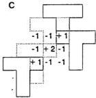
C

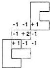
D

-2 -2 -2
-2 -2 -2
-2 -2 -2

FIGURE 15. Receptive fields found in different runs of the T-C problem. A: An on-center-off-surround receptive field for detecting $T$'s. B: A vertical bar detector which responds to $T$'s more strongly than $C$'s. C: A diagonal bar detector. A $T$ activates five such detectors whereas a $C$ activates only three such detectors. D: A compactness detector. This inhibitory receptive field turns off whenever an input covers any region of its receptive field. Since the $C$ is more compact than the $T$ it turns off 20 such detectors whereas the $T$ turns off 21 of them.

representation. In each case, the solution was reached in from about 5,000 to 10,000 presentations of the set of eight patterns.⁸

It is interesting that the inhibitory type of receptive field shown in Figure 15D was the most common and that there is a predominance of inhibitory connections in this and indeed all of our simulations. This can be understood by considering the trajectory through which the learning typically moves. At first, when the system is presented with a

⁸ Since translation independence was built into the learning procedure, it makes no difference where the input occurs; the same thing will be learned wherever the pattern is presented. Thus, there are only eight distinct patterns to be presented to the system.

---

352 BASIC MECHANISMS

difficult problem, the initial random connections are as likely to mislead as to give the correct answer. In this case, it is best for the output units to take on a value of 0.5 than to take on a more extreme value. This follows from the form of the error function given in Equation 2. The output unit can achieve a constant output of 0.5 by turning off those units feeding into it. Thus, the first thing that happens in virtually every difficult problem is that the hidden units are turned off. One way to achieve this is to have the input units inhibit the hidden units. As the system begins to sort things out and to learn the appropriate function some of the connections will typically go positive, but the majority of the connections will remain negative. This *bias* for solutions involving inhibitory inputs can often lead to nonintuitive results in which hidden units are often on unless turned off by the input.

## More Simulation Results

We have offered a sample of our results in this section. In addition to having studied our learning system on the problems discussed here, we have employed back propagation for learning to multiply binary digits, to play tic-tac-toe, to distinguish between vertical and horizontal lines, to perform sequences of actions, to recognize characters, to associate random vectors, and a host of other applications. In all of these applications we have found that the generalized delta rule was capable of generating the kinds of internal representations required for the problems in question. We have found local minima to be very rare and that the system learns in a reasonable period of time. Still more studies of this type will be required to understand precisely the conditions under which the system will be plagued by local minima. Suffice it to say that the problem has not been serious to date. We now turn to a pointer to some future developments.

## SOME FURTHER GENERALIZATIONS

We have intensively studied the learning characteristics of the generalized delta rule on feedforward networks and semilinear activations functions. Interestingly these are not the most general cases to which the learning procedure is applicable. As yet we have only studied a few examples of the more fully generalized system, but it is relatively easy to apply the same learning rule to sigma-pi units and to recurrent networks. We will simply sketch the basic ideas here.

---

8. LEARNING INTERNAL REPRESENTATIONS 353

# The Generalized Delta Rule and Sigma-Pi Units

It will be recalled from Chapter 2 that in the case of sigma-pi units we have

$$
o _ {j} = f _ {j} \left(\sum_ {i} w _ {j i} \prod_ {k} o _ {i _ {k}}\right) \tag {17}
$$

where $i$ varies over the set of conjuncts feeding into unit $j$ and $k$ varies over the elements of the conjuncts. For simplicity of exposition, we restrict ourselves to the case in which no conjuncts involve more than two elements. In this case we can notate the weight from the conjunction of units $i$ and $j$ to unit $k$ by $w_{ijk}$. The weight on the direct connection from unit $i$ to unit $j$ would, thus, be $w_{ji}$, and since the relation is multiplicative, $w_{kij} = w_{kji}$. We can now rewrite Equation 17 as

$$
o _ {j} = f _ {j} \left(\sum_ {i, h} w _ {j h i} o _ {h} o _ {i}\right).
$$

We now set

$$
\Delta_ {p} w _ {k i j} \propto - \frac {\partial E _ {p}}{\partial w _ {k i j}}.
$$

Taking the derivative and simplifying, we get a rule for sigma-pi units strictly analogous to the rule for semilinear activation functions:

$$
\Delta_ {p} w _ {k i j} = \delta_ {k} o _ {i} o _ {j}.
$$

We can see the correct form of the error signal, $\delta$, for this case by inspecting Figure 16. Consider the appropriate value of $\delta_{i}$ for unit $u_{i}$ in the figure. As before, the correct value of $\delta_{i}$ is given by the sum of the $\delta$'s for all of the units into which $u_{i}$ feeds, weighted by the amount of effect due to the activation of $u_{i}$ times the derivative of the activation function. In the case of semilinear functions, the measure of a unit's effect on another unit is given simply by the weight $w$ connecting the first unit to the second. In this case, the $u_{i}$'s effect on $u_{k}$ depends not only on $w_{kij}$, but also on the value of $u_{j}$. Thus, we have

$$
\delta_ {i} = f _ {i} ^ {\prime} \left(n e t _ {i}\right) \sum_ {j, k} \delta_ {k} w _ {k i j} o _ {j}
$$

if $u_{i}$ is not an output unit and, as before,

$$
\delta_ {i} = f _ {i} ^ {\prime} \left(n e t _ {i}\right) \left(t _ {i} - o _ {i}\right)
$$

if it is an output unit.

---

BASIC MECHANISMS

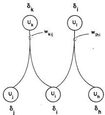
FIGURE 16. The generalized delta rule for sigma-pi units. The products of activation values of individual units activate output units. See text for explanation of how the  $\delta$  values are computed in this case.

# Recurrent Nets

We have thus far restricted ourselves to feedforward nets. This may seem like a substantial restriction, but as Minsky and Papert point out, there is, for every recurrent network, a feedforward network with identical behavior (over a finite period of time). We will now indicate how this construction can proceed and thereby show the correct form of the learning rule for the recurrent network. Consider the simple recurrent network shown in Figure 17A. The same network in a feedforward architecture is shown in Figure 17B. The behavior of a recurrent network can be achieved in a feedforward network at the cost of duplicating the hardware many times over for the feedforward version of the network. We have distinct units and distinct weights for each point in time. For naming convenience, we subscript each unit with its unit number in the corresponding recurrent network and the time it represents. As long as we constrain the weights at each level of the feedforward network to be the same, we have a feedforward network which performs identically with the recurrent network of Figure 17A.

---

8. LEARNING INTERNAL REPRESENTATIONS 355

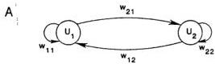

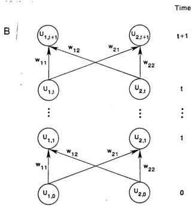

FIGURE 17. A comparison of a recurrent network and a feedforward network with identical behavior. A: A completely connected recurrent network with two units. B: A feedforward network which behaves the same as the recurrent network. In this case, we have a separate unit for each time step and we require that the weights connecting each layer of units to the next be the same for all layers. Moreover, they must be the same as the analogous weights in the recurrent case.

The appropriate method for maintaining the constraint that all weights be equal is simply to keep track of the changes dictated for each weight at each level and then change each of the weights according to the sum of these individually prescribed changes. Now, the general rule for determining the change prescribed for a weight in the system for a particular time is simply to take the product of an appropriate error

---

356 BASIC MECHANISMS

measure δ and the input along the relevant line both for the appropriate times. Thus, the problem of specifying the correct learning rule for recurrent networks is simply one of determining the appropriate value of δ for each time. In a feedforward network we determine δ by multiplying the derivative of the activation function by the sum of the δ’s for those units it feeds into weighted by the connection strengths. The same process works for the recurrent network—except in this case, the value of δ associated with a particular unit changes in time as a unit passes error back, sometimes to itself. After each iteration, as error is being passed back through the network, the change in weight for that iteration must be added to the weight changes specified by the preceding iterations and the sum stored. This process of passing error through the network should continue for a number of iterations equal to the number of iterations through which the activation was originally passed. At this point, the appropriate changes to all of the weights can be made.

In general, the procedure for a recurrent network is that an input (generally a sequence) is presented to the system while it runs for some number of iterations. At certain specified times during the operation of the system, the output of certain units are compared to the target for that unit at that time and error signals are generated. Each such error signal is then passed back through the network for a number of iterations equal to the number of iterations used in the forward pass. Weight changes are computed at each iteration and a sum of all the weight changes dictated for a particular weight is saved. Finally, after all such error signals have been propagated through the system, the weights are changed. The major problem with this procedure is the memory required. Not only does the system have to hold its summed weight changes while the error is being propagated, but each unit must somehow record the sequence of activation values through which it was driven during the original processing. This follows from the fact that during each iteration while the error is passed back through the system, the current δ is relevant to a point earlier in time and the required weight changes depend on the activation levels of the units at that time. It is not entirely clear how such a mechanism could be implemented in the brain. Nevertheless, it is tantalizing to realize that such a procedure is potentially very powerful, since the problem it is attempting to solve amounts to that of finding a sequential program (like that for a digital computer) that produces specified input-sequence/output-sequence pairs. Furthermore, the interaction of the teacher with the system can be quite flexible, so that, for example, should the system get stuck in a local minimum, the teacher could introduce "hints" in the form of desired output values for intermediate stages of processing. Our experience with recurrent networks is limited, but we have carried out some

---

8. LEARNING INTERNAL REPRESENTATIONS 357

experiments. We turn first to a very simple problem in which the system is induced to invent a shift register to solve the problem.

*Learning to be a shift register.* Perhaps the simplest class of recurrent problems we have studied is one in which the input and output units are one and the same and there are no hidden units. We simply present a pattern and let the system process it for a period of time. The state of the system is then compared to some target state. If it hasn't reached the target state at the designated time, error is injected into the system and it modifies its weights. Then it is shown a new input pattern and restarted. In these cases, there is no constraint on the connections in the system. Any unit can connect to any other unit. The simplest such problem we have studied is what we call the *shift register* problem. In this problem, the units are conceptualized as a circular shift register. An arbitrary bit pattern is first established on the units. They are then allowed to process for two time-steps. The target state, after those two time-steps, is the original pattern shifted two spaces to the left. The interesting question here concerns the state of the units between the presentation of the start state and the time at which the target state is presented. One solution to the problem is for the system to become a shift register and shift the pattern exactly one unit to the left during each time period. If the system did this then it would surely be shifted two places to the left after two time units. We have tried this problem with groups of three or five units and, if we constrain the biases on all of the units to be negative (so the units are off unless turned on), the system always learns to be a shift register of this sort.¹⁰ Thus, even though in principle any unit can connect to any other unit, the system actually learns to set all weights to zero except the ones connecting a unit to its left neighbor. Since the target states were determined on the assumption of a circular register, the left-most unit developed a strong connection to the right-most unit. The system learns this relatively quickly. With $\eta = 0.25$ it learns perfectly in fewer than 200 sweeps through the set of possible patterns with either three- or five-unit systems.

The tasks we have described so far are exceptionally simple, but they do illustrate how the algorithm works with unrestricted networks. We have attempted a few more difficult problems with recurrent networks.

¹⁰ If the constraint that biases be negative is not imposed, other solutions are possible. These solutions can involve the units passing through the complements of the shifted pattern or even through more complicated intermediate states. These trajectories are interesting in that they match a simple shift register on all even numbers of shifts, but do not match following an odd number of shifts.

---

358 BASIC MECHANISMS

One of the more interesting involves learning to complete sequences of patterns. Our final example comes from this domain.

*Learning to complete sequences.* Table 10 shows a set of 25 sequences which were chosen so that the first two items of a sequence uniquely determine the remaining four. We used this set of sequences to test out the learning abilities of a recurrent network. The network consisted of five input units (A, B, C, D, E), 30 hidden units, and three output units (1, 2, 3). At Time 1, the input unit corresponding to the first item of the sequence is turned on and the other input units are turned off. At Time 2, the input unit for the second item in the sequence is turned on and the others are all turned off. Then all the input units are turned off and kept off for the remaining four steps of the forward iteration. The network must learn to make the output units adopt states that represent the rest of the sequence. Unlike simple feedforward networks (or their iterative equivalents), the errors are not only assessed at the final layer or time. The output units must adopt the appropriate states *during* the forward iteration, and so during the back-propagation phase, errors are injected at each time-step by comparing the remembered actual states of the output units with their desired states.

The learning procedure for recurrent nets places no constraints on the allowable connectivity structure.¹¹ For the sequence completion problem, we used one-way connections from the input units to the hidden units and from the hidden units to the output units. Every hidden unit had a one-way connection to every other hidden unit and to itself,

TABLE 10
25 SEQUENCES TO BE LEARNED

|  AA1212 | AB1223 | AC1231 | AD1221 | AE1213  |
| --- | --- | --- | --- | --- |
|  BA2312 | BB2323 | BC2331 | BD2321 | BE2313  |
|  CA3112 | CB3123 | CC3131 | CD3121 | CE3113  |
|  DA2112 | DB2123 | DC2131 | DD2121 | DE2113  |
|  EA1312 | EB1323 | EC1331 | ED1321 | EE1313  |

¹¹ The constraint in feedforward networks is that it must be possible to arrange the units into layers such that units do not influence units in the same or lower layers. In recurrent networks this amounts to the constraint that during the forward iteration, future states must not affect past ones.

---

8. LEARNING INTERNAL REPRESENTATIONS 359

and every output unit was also connected to every other output unit and to itself. All the connections started with small random weights uniformly distributed between $-0.3$ and $+0.3$. All the hidden and output units started with an activity level of 0.2 at the beginning of each sequence.

We used a version of the learning procedure in which the gradient of the error with respect to each weight is computed for a whole set of examples before the weights are changed. This means that each connection must accumulate the sum of the gradients for all the examples and for all the time steps involved in each example. During training, we used a particular set of 20 examples, and after these were learned almost perfectly we tested the network on the remaining examples to see if it had picked up on the obvious regularity that relates the first two items of a sequence to the subsequent four. The results are shown in Table 11. For four out of the five test sequences, the output units all have the correct values at all times (assuming we treat values above 0.5 as 1 and values below 0.5 as 0). The network has clearly captured the rule that the first item of a sequence determines the third and fourth, and the second determines the fifth and sixth. We repeated the simulation with a different set of random initial weights, and it got all five test sequences correct.

The learning required 260 sweeps through all 20 training sequences. The errors in the output units were computed as follows: For a unit that should be on, there was no error if its activity level was above 0.8, otherwise the derivative of the error was the amount below 0.8. Similarly, for output units that should be off, the derivative of the error was the amount above 0.2. After each sweep, each weight was decremented by .02 times the total gradient accumulated on that sweep plus 0.9 times the previous weight change.

We have shown that the learning procedure can be used to create a network with interesting sequential behavior, but the particular problem we used can be solved by simply using the hidden units to create "delay lines" which hold information for a fixed length of time before allowing it to influence the output. A harder problem that cannot be solved with delay lines of fixed duration is shown in Table 12. The output is the same as before, but the two input items can arrive at variable times so that the item arriving at time 2, for example, could be either the first or the second item and could therefore determine the states of the output units at either the fifth and sixth or the seventh and eighth times. The new task is equivalent to requiring a buffer that receives two input "words" at variable times and outputs their "phonemic realizations" one after the other. This problem was solved successfully by a network similar to the one above except that it had 60 hidden units and half of their possible interconnections were omitted at random. The

---

BASIC MECHANISMS

TABLE 11
PERFORMANCE OF THE NETWORK ON FIVE NOVEL TEST SEQUENCES

|  Input Sequence | A | D | - | - | - | -  |
| --- | --- | --- | --- | --- | --- | --- |
|  Desired Outputs | - | - | 1 | 2 | 2 | 1  |
|  Actual States of: |  |  |  |  |  |   |
|  Output Unit 1 | 0.2 | 0.12 | 0.90 | 0.22 | 0.11 | 0.83  |
|  Output Unit 2 | 0.2 | 0.16 | 0.13 | 0.82 | 0.88 | 0.03  |
|  Output Unit 3 | 0.2 | 0.07 | 0.08 | 0.03 | 0.01 | 0.22  |
|  Input Sequence | B | E | - | - | - | -  |
|  Desired Outputs | - | - | 2 | 3 | 1 | 3  |
|  Actual States of: |  |  |  |  |  |   |
|  Output Unit 1 | 0.2 | 0.12 | 0.20 | 0.25 | 0.48 | 0.26  |
|  Output Unit 2 | 0.2 | 0.16 | 0.80 | 0.05 | 0.04 | 0.09  |
|  Output Unit 3 | 0.2 | 0.07 | 0.02 | 0.79 | 0.48 | 0.53  |
|  Input Sequence | C | A | - | - | - | -  |
|  Desired Outputs | - | - | 3 | 1 | 1 | 2  |
|  Actual States of: |  |  |  |  |  |   |
|  Output Unit 1 | 0.2 | 0.12 | 0.19 | 0.80 | 0.87 | 0.11  |
|  Output Unit 2 | 0.2 | 0.16 | 0.19 | 0.00 | 0.13 | 0.70  |
|  Output Unit 3 | 0.2 | 0.07 | 0.80 | 0.13 | 0.01 | 0.25  |
|  Input Sequence | D | B | - | - | - | -  |
|  Desired Outputs | - | - | 2 | 1 | 2 | 3  |
|  Actual States of: |  |  |  |  |  |   |
|  Output Unit 1 | 0.2 | 0.12 | 0.16 | 0.79 | 0.07 | 0.11  |
|  Output Unit 2 | 0.2 | 0.16 | 0.80 | 0.15 | 0.87 | 0.05  |
|  Output Unit 3 | 0.2 | 0.07 | 0.20 | 0.01 | 0.13 | 0.96  |
|  Input Sequence | E | C | - | - | - | -  |
|  Desired Outputs | - | - | 1 | 3 | 3 | 1  |
|  Actual States of: |  |  |  |  |  |   |
|  Output Unit 1 | 0.2 | 0.12 | 0.80 | 0.09 | 0.27 | 0.78  |
|  Output Unit 2 | 0.2 | 0.16 | 0.20 | 0.13 | 0.01 | 0.02  |
|  Output Unit 3 | 0.2 | 0.07 | 0.07 | 0.94 | 0.76 | 0.13  |

learning was much slower, requiring thousands of sweeps through all 136 training examples. There were also a few more errors on the 14 test examples, but the generalization was still good with most of the test sequences being completed perfectly.

---

8. LEARNING INTERNAL REPRESENTATIONS 361

## TABLE 12

SIX VARIATIONS OF THE SEQUENCE EA1312 PRODUCED BY PRESENTING THE FIRST TWO ITEMS AT VARIABLE TIMES

|  EA--1312 | E-A-1312 | E--A1312  |
| --- | --- | --- |
|  -EA-1312 | -E-A1312 | --EA1312  |

Note: With these temporal variations, the 25 sequences shown in Table 10 can be used to generate 150 different sequences.

## CONCLUSION

Minsky and Papert (1969) in their pessimistic discussion of perceptrons finally, near the end of their book, discuss multilayer machines. They state:

The perceptron has shown itself worthy of study despite (and even because of!) its severe limitations. It has many features that attract attention: its linearity; its intriguing learning theorem; its clear paradigmatic simplicity as a kind of parallel computation. There is no reason to suppose that any of these virtues carry over to the many-layered version. Nevertheless, we consider it to be an important research problem to elucidate (or reject) our intuitive judgement that the extension is sterile. Perhaps some powerful convergence theorem will be discovered, or some profound reason for the failure to produce an interesting "learning theorem" for the multilayered machine will be found. (pp. 231-232)

Although our learning results do not guarantee that we can find a solution for all solvable problems, our analyses and results have shown that as a practical matter, the error propagation scheme leads to solutions in virtually every case. In short, we believe that we have answered Minsky and Papert's challenge and have found a learning result sufficiently powerful to demonstrate that their pessimism about learning in multilayer machines was misplaced.

One way to view the procedure we have been describing is as a parallel computer that, having been shown the appropriate input/output exemplars specifying some function, programs itself to compute that function in general. Parallel computers are notoriously difficult to program. Here we have a mechanism whereby we do not actually have to know how to write the program in order to get the system to do it. Parker (1985) has emphasized this point.

---

362 BASIC MECHANISMS

On many occasions we have been surprised to learn of new methods of computing interesting functions by observing the behavior of our learning algorithm. This also raised the question of generalization. In most of the cases presented above, we have presented the system with the entire set of exemplars. It is interesting to ask what would happen if we presented only a subset of the exemplars at training time and then watched the system generalize to remaining exemplars. In small problems such as those presented here, the system sometimes finds solutions to the problems which do not properly generalize. However, preliminary results on larger problems are very encouraging in this regard. This research is still in progress and cannot be reported here. This is currently a very active interest of ours.

Finally, we should say that this work is not yet in a finished form. We have only begun our study of recurrent networks and sigma-pi units. We have not yet applied our learning procedure to many very complex problems. However, the results to date are encouraging and we are continuing our work.