A Symbolic Analysis of Relay and Switching Circuits*

Claude E. Shannon**

# 1. Introduction

In the control and protective circuits of complex electrical systems it is frequently necessary to make intricate interconnections of relay contacts and switches. Examples of these circuits occur in automatic telephone exchanges, industrial motor-control equipment, and in almost any circuits designed to perform complex operations automatically. In this paper a mathematical analysis of certain of the properties of such networks will be made. Particular attention will be given to the problem of network synthesis. Given certain characteristics, it is required to find a circuit incorporating these characteristics. The solution of this type of problem is not unique and methods of finding those particular circuits requiring the least number of relay contacts and switch blades will be studied. Methods will also be described for finding any number of circuits equivalent to a given circuit in all operating characteristics. It will be shown that several of the well-known theorems on impedance networks have roughly analogous theorems in relay circuits. Notable among these are the delta-wye and star-mesh transformations, and the duality theorem.

The method of attack on these problems may be described briefly as follows: any circuit is represented by a set of equations, the terms of the equations corresponding to the various relays and switches in the circuit. A calculus is developed for manipulating these equations by simple mathematical processes, most of which are similar to ordinary algebraic algorisms. This calculus is shown to be exactly analogous to the calculus of propositions used in the symbolic study of logic. For the synthesis problem the desired characteristics are first written as a system of equations, and the equations are then manipulated into the form representing the simplest circuit. The circuit may then be immediately drawn from the equations. By this method it is always possible to find the simplest circuit containing only series and parallel connections, and in some cases the simplest circuit containing any type of connection.

Our notation is taken chiefly from symbolic logic. Of the many systems in common use we have chosen the one which seems simplest and most suggestive for our interpretation. Some of our phraseology, such as node, mesh, delta, wye, etc., is borrowed from ordinary network theory for simple concepts in switching circuits.

*Transactions American Institute of Electrical Engineers, vol. 57, 1938. (Paper number 38-80, recommended by the AIEE committees on communication and basic sciences and presented at the AIEE summer convention, Washington, D.C., June 20-24, 1938. Manuscript submitted March 1, 1938; made available for preprinting May 27, 1938.)

**Claude E. Shannon is a research assistant in the department of electrical engineering at Massachusetts Institute of Technology, Cambridge. This paper is an abstract of a thesis presented at MIT for the degree of master of science. The author is indebted to Doctor F. L. Hitchcock, Doctor Vannevar Bush, and Doctor S. H. Caldwell, all of MIT, for helpful encouragement and criticism.

471

---

472
C. E. Shannon

## II. Series-Parallel Two-Terminal Circuits

### Fundamental Definitions and Postulates

We shall limit our treatment of circuits containing only relay contacts and switches, and therefore at any given time the circuit between any two terminals must be either open (infinite impedance) or closed (zero impedance). Let us associate a symbol $X_{ab}$ or more simply $X$, with the terminals $a$ and $b$. This variable, a function of time, will be called the hindrance of the two-terminal circuit $a - b$. The symbol 0 (zero) will be used to represent the hindrance of a closed circuit, and the symbol 1 (unity) to represent the hindrance of an open circuit. Thus when the circuit $a - b$ is open $X_{ab} = 1$ and when closed $X_{ab} = 0$. Two hindrances $X_{ab}$ and $X_{cd}$ will be said to be equal if whenever the circuit $a - b$ is open, the circuit $c - d$ is open, and whenever $a - b$ is closed, $c - d$ is closed. Now let the symbol $+$ (plus) be defined to mean the series connection of the two-terminal circuits whose hindrances are added together. Thus $X_{ab} + X_{cd}$ is the hindrance of the circuit $a - d$ when $b$ and $c$ are connected together. Similarly the product of two hindrances $X_{ab} \cdot X_{cd}$ or more briefly $X_{ab}X_{cd}$ will be defined to mean the hindrance of the circuit formed by connecting the circuits $a - b$ and $c - d$ in parallel. A relay contact or switch will be represented in a circuit by the symbol in Figure 1, the letter being the corresponding hindrance function. Figure 2 shows the interpretation of the plus sign and Figure 3 the multiplication sign. This choice of symbols makes the manipulation of hindrances very similar to ordinary numerical algebra.

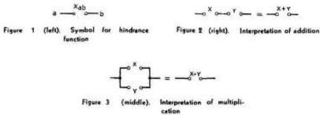

It is evident that with the above definitions the following postulates will hold:

### Postulates

1.  $a$. $0 \cdot 0 = 0$  A closed circuit in parallel with a closed circuit is a closed circuit.
$b$. $1 + 1 = 1$  An open circuit in series with an open circuit is an open circuit.

2.  $a$. $1 + 0 = 0 + 1 = 1$  An open circuit in series with a closed circuit in either order (i.e., whether the open circuit is to the right or left of the closed circuit) is an open circuit.
$b$. $0 \cdot 1 = 1 \cdot 0 = 0$  A closed circuit in parallel with an open circuit in either order is a closed circuit.

3.  $a$. $0 + 0 = 0$  A closed circuit in series with a closed circuit is a closed circuit.
$b$. $1 \cdot 1 = 1$  An open circuit in parallel with an open circuit is an open circuit.

4. At any given time either $X = 0$ or $X = 1$.

---

A Symbolic Analysis of Relay and Switching Circuits
473

These are sufficient to develop all the theorems which will be used in connection with circuits containing only series and parallel connections. The postulates are arranged in pairs to emphasize a duality relationship between the operations of addition and multiplication and the quantities zero and one. Thus if in any of the $a$ postulates the zero's are replaced by one's and the multiplications by additions and vice versa, the corresponding $b$ postulate will result. This fact is of great importance. It gives each theorem a dual theorem, it being necessary to prove only one to establish both. The only one of these postulates which differs from ordinary algebra is $1b$. However, this enables great simplifications in the manipulation of these symbols.

## Theorems

In this section a number of theorems governing the combination of hindrances will be given. Inasmuch as any of the theorems may be proved by a very simple process, the proofs will not be given except for an illustrative example. The method of proof is that of "perfect induction," i.e., the verification of the theorem for all possible cases. Since by Postulate 4 each variable is limited to the values 0 and 1, this is a simple matter. Some of the theorems may be proved more elegantly by recourse to previous theorems, but the method of perfect induction is so universal that it is probably to be preferred.

$$
X + Y = Y + X, \tag{1a}
$$

$$
XY = YX, \tag{1b}
$$

$$
X + (Y + Z) = (X + Y) + Z, \tag{2a}
$$

$$
X(YZ) = (XY)Z, \tag{2b}
$$

$$
X(Y + Z) = XY + XZ, \tag{3a}
$$

$$
X + YZ = (X + Y)(X + Z), \tag{3b}
$$

$$
1 \cdot X = X, \tag{4a}
$$

$$
0 + X = X, \tag{4b}
$$

$$
1 + X = 1, \tag{5a}
$$

$$
0 \cdot X = 0. \tag{5b}
$$

For example, to prove Theorem 4a, note that $X$ is either 0 or 1. If it is 0, the theorem follows from Postulate 2b; if 1, it follows from Postulate 3b. Theorem 4b now follows by the duality principle, replacing the 1 by 0 and the $\cdot$ by $+$.

Due to the associative laws (2a and 2b) parentheses may be omitted in a sum or product of several terms without ambiguity. The $\Sigma$ and $\Pi$ symbols will be used as in ordinary algebra.

The distributive law (3a) makes it possible to "multiply out" products and to factor sums. The dual of this theorem, (3b), however, is not true in numerical algebra.

We shall now define a new operation to be called negation. The negative of a hindrance $X$ will be written $X'$ and is defined to be a variable which is equal to 1 when $X$ equals 0 and equal to 0 when $X$ equals 1. If $X$ is the hindrance of the make contacts of a relay, then $X'$ is the hindrance of the break contacts of the same relay. The definition of the negative of a hindrance gives the following theorems:

$$
X + X' = 1, \tag{6a}
$$

---

C. E. Shannon

$$
X X ^ {\prime} = 0, \tag {6b}
$$

$$
0 ^ {\prime} = 1, \tag {7a}
$$

$$
1 ^ {\prime} = 0, \tag {7b}
$$

$$
\left(X ^ {\prime}\right) ^ {\prime} = X. \tag {8}
$$

# Analogue With the Calculus of Propositions

We are now in a position to demonstrate the equivalence of this calculus with certain elementary parts of the calculus of propositions. The algebra of logic $^{1-3}$, originated by George Boole, is a symbolic method of investigating logical relationships. The symbols of Boolean algebra admit of two logical interpretations. If interpreted in terms of classes, the variables are not limited to the two possible values 0 and 1. This interpretation is known as the algebra of classes. If, however, the terms are taken to represent propositions, we have the calculus of propositions in which variables are limited to the values 0 and $1$, as are the hindrance functions above. Usually the two subjects are developed simultaneously from the same set of postulates, except for the addition in the case of the calculus of propositions of a postulate equivalent to Postulate 4 above. E. V. Huntington gives the following set of postulates for symbolic logic:

1. The class $K$ contains at least two distinct elements.
2. If $a$ and $b$ are in the class $K$ then $a + b$ is in the class $K$.
3. $a + b = b + a$
4. $(a + b) + c = a + (b + c)$
5. $a + a = a$
6. $ab + ab' = a$ where $ab$ is defined as $(a' + b')'$.

If we let the class $K$ be the class consisting of the two elements 0 and 1, then these postulates follow from those given in the first section. Also Postulates 1, 2, and 3 given there can be deduced from Huntington's postulates. Adding 4 and restricting our discussion to the calculus of propositions, it is evident that a perfect analogy exists between the calculus for switching circuits and this branch of symbolic logic. $^{**}$ The two interpretations of the symbols are shown in Table I.

Due to this analogy any theorem of the calculus of propositions is also a true theorem if interpreted in terms of relay circuits. The remaining theorems in this section are taken directly from this field.

De Morgan's theorem:

$$
(X + Y + Z \dots) ^ {\prime} = X ^ {\prime} \cdot Y ^ {\prime} \cdot Z ^ {\prime} \dots , \tag {9a}
$$

$$
(X \cdot Y \cdot Z \dots) ^ {\prime} = X ^ {\prime} + Y ^ {\prime} + Z ^ {\prime} + \dots . \tag {9b}
$$

* This refers only to the classical theory of the calculus of propositions. Recently some work has been done with logical systems in which propositions may have more than two "truth values."

** This analogy may also be seen from a slightly different viewpoint. Instead of associating $X_{\alpha}$ directly with the circuit $a - b$ let $X_{\alpha}$ represent the proposition that the circuit $a - b$ is open. Then all the symbols are directly interpreted as propositions and the operations of addition and multiplication will be seen to represent series and parallel connections.

---

A Symbolic Analysis of Relay and Switching Circuits

This theorem gives the negative of a sum or product in terms of the negatives of the summands or factors. It may be easily verified for two terms by substituting all possible values and then extended to any number $n$ of variables by mathematical induction.

A function of certain variables $X_{1}, X_{2}, \ldots, X_{n}$ is any expression formed from the variables with the operations of addition, multiplication, and negation. The notation $f(X_{1}, X_{2}, \ldots, X_{n})$ will be used to represent a function. Thus we might have $f(X, Y, Z) = XY + X'(Y' + Z')$. In infinitesimal calculus it is shown that any function (providing it is continuous and all derivatives are continuous) may be expanded in a Taylor series. A somewhat similar expansion is possible in the calculus of propositions. To develop the series expansion of functions first note the following equations:

$$
f \left(X _ {1}, X _ {2}, \dots X _ {n}\right) = X _ {1} \cdot f \left(1, X _ {2} \dots X _ {n}\right) + X _ {1} ^ {\prime} \cdot f \left(0, X _ {2} \dots X _ {n}\right), \tag {10a}
$$

$$
f \left(X _ {1}, \dots , X _ {n}\right) = \left[ f \left(0, X _ {2} \dots X _ {n}\right) + X _ {1} \right] \cdot \left[ f \left(1, X _ {2} \dots X _ {n}\right) + X _ {1} ^ {\prime} \right]. \tag {10b}
$$

These reduce to identities if we let $X_{1}$ equal either 0 or 1. In these equations the function $f$ is said to be expanded about $X_{1}$. The coefficients of $X_{1}$ and $X_{1}'$ in 10a are functions of the $(n - 1)$ variables $X_{2} \ldots X_{n}$ and may thus be expanded about any of these variables in the same manner. The additive terms in 10b also may be expanded in this manner. Expanding about $X_{2}$ we have:

$$
f \left(X _ {1} \dots X _ {n}\right) = X _ {1} X _ {2} f \left(1, 1, X _ {3} \dots X _ {n}\right) + X _ {1} X _ {1} ^ {\prime} f \left(1, 0, X _ {3} \dots X _ {n}\right) +
$$

$$
X _ {1} ^ {\prime} X _ {2} f (0, 1, X _ {3} \dots X _ {n}) + X _ {1} ^ {\prime} X _ {2} ^ {\prime} f (0, 0, X _ {3} \dots X _ {n}), \tag {11a}
$$

$$
f \left(X _ {1} \dots X _ {n}\right) = \left[ X _ {1} + X _ {2} + f (0, 0, X _ {3} \dots X _ {n}) \right] \cdot \left[ X _ {1} + X _ {2} + f (0, 1, X _ {3} \dots X _ {n}) \right] \cdot
$$

$$
\left[ X _ {1} ^ {\prime} + X _ {2} + f (1, 0, X _ {3} \dots X _ {n}) \right] \cdot \left[ X _ {1} ^ {\prime} + X _ {2} + f (1, 1, X _ {3} \dots X _ {n}) \right]. \tag {11b}
$$

Continuing this process $n$ times we will arrive at the complete series expansion having the form:

$$
f \left(X _ {1} \dots X _ {n}\right) = f (1, 1, 1 \dots 1) X _ {1} X _ {2} \dots X _ {n} + f (0, 1, 1 \dots 1) X _ {1} ^ {\prime} X _ {2} \dots X _ {n} + \dots \tag {12a}
$$

$$
+ f (0, 0, 0 \dots 0) X _ {1} ^ {\prime} X _ {2} ^ {\prime} \dots X _ {n} ^ {\prime},
$$

$$
f \left(X _ {1} \dots X _ {n}\right) = \left[ X _ {1} + X _ {2} + \dots X _ {n} + f (0, 0, 0 \dots 0) \right] \dots \tag {12b}
$$

$$
\cdot \left[ X _ {1} ^ {\prime} + X _ {2} ^ {\prime} \dots + X _ {n} ^ {\prime} + f (1, 1 \dots 1) \right].
$$

Table I. Analogue Between the Calculus of Propositions and the Symbolic Relay Analysis

|  Symbol | Interpretation in Relay Circuits | Interpretation in the Calculus of Propositions  |
| --- | --- | --- |
|  X | The circuit X | The proposition X  |
|  0 | The circuit is closed | The proposition is false  |
|  1 | The circuit is open | The proposition is true  |
|  X + Y | The series connection of circuits X and Y | The proposition which is true if either X or Y is true  |
|  X Y | The parallel connection of circuits X and Y | The proposition which is true if both X and Y are true  |
|  X' | The circuit which is open when X is closed and closed when X is open | The contradictory of proposition X  |
|  = | The circuits open and close simultaneously | Each proposition implies the other  |

---

C. E. Shannon

By 12a, $f$ is equal to the sum of the products formed by permuting primes on the terms of $X_{1}X_{2}\ldots X_{n}$ in all possible ways and giving each product a coefficient equal to the value of the function when that product is 1. Similarly for 12b.

As an application of the series expansion it should be noted that if we wish to find a circuit representing any given function we can always expand the function by either 10a or 10b in such a way that any given variable appears at most twice, once as a make contact and once as a break contact. This is shown in Figure 4. Similarly by 11 any other variable need appear no more than four times (two make and two break contacts), etc.

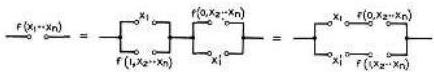
Figure 4. Expansion about one variable

A generalization of De Morgan's theorem is represented symbolically in the following equation:

$$
f \left(X _ {1}, X _ {2} \dots X _ {n}, +, -\right) ^ {\prime} = f \left(X _ {1} ^ {\prime}, X _ {2} ^ {\prime} \dots X _ {n} ^ {\prime}, +\right). \tag{13}
$$

By this we mean that the negative of any function may be obtained by replacing each variable by its negative and interchanging the + and - symbols. Explicit and implicit parentheses will, of course, remain in the same places. For example, the negative of $X + Y \cdot (Z + WX')$ will be $X'[Y' + Z'(W' + X)]$.

Some other theorems useful in simplifying expressions are given below:

$$
X = X + X = X + X + X = \text{etc.} \tag{14a}
$$

$$
X = X \cdot X = X \cdot X \cdot X = \text{etc.} \tag{14b}
$$

$$
X + XY = X \tag{15a}
$$

$$
X (X + Y) + X \tag{15b}
$$

$$
XY + X'Z = XY + X'Z + YZ \tag{16a}
$$

$$
(X + Y)(X' + Z) = (X + Y)(X' + Z)(Y + Z) \tag{16b}
$$

$$
Xf(X, Y, Z, \dots) = Xf(1, Y, Z, \dots) \tag{17a}
$$

$$
X + f(X, Y, Z, \dots) = X + f(0, Y, Z, \dots) \tag{17b}
$$

$$
X'f(X, Y, Z, \dots) = X'f(0, Y, Z, \dots) \tag{18a}
$$

$$
X' + f(X, Y, Z, \dots) = X' + f(1, Y, Z, \dots) \tag{18b}
$$

All of these theorems may be proved by the method of perfect induction.

Any expression formed with the operations of addition, multiplication, and negation represents explicitly a circuit containing only series and parallel connections. Such a circuit will be called a series-parallel circuit. Each letter in an expression of this sort represents a make or break relay contact, or a switch blade and contact. To find the circuit requiring the least number of contacts, it is therefore necessary to manipulate the expression into the form in which the least number of letters appear. The theorems given above are always sufficient to do

---

A Symbolic Analysis of Relay and Switching Circuits
477

this. A little practice in the manipulation of these symbols is all that is required. Fortunately most of the theorems are exactly the same as those of numerical algebra – the associative, commutative, and distributive laws of algebra hold here. The writer has found Theorems 3, 6, 9, 14, 15, 16a, 17, and 18 to be especially useful in the simplification of complex expressions.

Frequently a function may be written in several ways, each requiring the same minimum number of elements. In such a case the choice of circuit may be made arbitrarily from among these, or from other considerations.

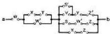
Figure 5. Circuit to be simplified

As an example of the simplification of expressions consider the circuit shown in Figure 5. The hindrance function $X_{ub}$ for this circuit will be:

$$
\begin{array}{l}
X_{ub} = W + W'(X + Y) + (X + Z)(S + W' + Z)(Z' + Y + S'V) \\
= W + X + Y + (X + Z)(S + 1 + Z)(Z' + Y + S'V) \\
= W + X + Y + Z(Z' + S'V).
\end{array}
$$

These reductions were made with 17b using first $W$, then $X$ and $Y$ as the "X" of 17b. Now multiplying out:

$$
\begin{array}{l}
X_{ub} = W + X + Y + ZZ' + ZS'V \\
= W + X + Y + ZS'V.
\end{array}
$$

The circuit corresponding to this expression is shown in Figure 6. Note the large reduction in the number of elements.

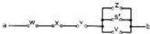
Figure 6. Simplification of figure 5

It is convenient in drawing circuits to label a relay with the same letter as the hindrance of make contacts of the relay. Thus if a relay is connected to a source of voltage through a network whose hindrance function is $X$, the relay and any make contacts on it would be labeled $X$. Break contacts would be labeled $X'$. This assumes that the relay operates instantly and that the make contacts close and the break contacts open simultaneously. Cases in which there is a time delay will be treated later.

## III. Multi-Terminal and Non-Series-Parallel Circuits

### Equivalence of $n$-Terminal Networks

The usual relay control circuit will take the form of Figure 7, where $X_{1}, X_{2}, \ldots, X_{n}$ are relays or other devices controlled by the circuit and $N$ is a network of relay contacts and switches. It is desirable to find transformations that may be applied to $N$ which will keep the operation of

---

C. E. Shannon

all the relays $X_{1}, \ldots, X_{n}$ the same. So far we have only considered transformations which may be applied to a two-terminal network keeping the operation of one relay in series with this network the same. To this end we define equivalence of $n$-terminal networks as follows. Definition: Two $n$-terminal networks $M$ and $N$ will be said to be equivalent with respect to these $n$ terminals if and only if $X_{jk} = Y_{jk}$; $j, k = 1, 2, 3 \ldots, n$, where $X_{jk}$ is the hindrance of $N$ (considered as a two-terminal network) between terminals $j$ and $k$, and $Y_{jk}$ is that for $M$ between the corresponding terminals. Under this definition the equivalences of the preceding sections were with respect to two terminals.

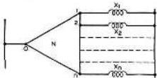
Figure 7. General constant-voltage relay circuit

## Star-Mesh and Delta-Wye Transformations

As in ordinary network theory there exist star-to-mesh and delta-to-wye transformations. In impedance circuits these transformations, if they exist, are unique. In hindrance networks the transformations always exist and are not unique. Those given here are the simplest in that they require the least number of elements. The delta-to-wye transformation is shown in Figure 8. These two networks are equivalent with respect to the three terminals $a, b$, and $c$, since by distributive law $X_{ab} = R(S + T) = RS + RT$ and similarly for the other pairs of terminals $a - c$ and $b - c$.

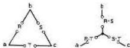
Figure 8. Delta-wye transformation

The wye-to-delta transformation is shown in Figure 9. This follows from the fact that $X_{ab} = R + S = (R + S) \cdot (R + T + T + S)$, etc. An $n$-point star also has a mesh equivalent with the central junction point eliminated. This is formed exactly as in the simple three-point star, by connecting each pair of terminals of the mesh through a hindrance which is the sum of the corresponding arms of the star. This may be proved by mathematical induction. We have shown it to be true for $n = 3$. Now assuming it true for $n - 1$, we shall prove it for $n$. Suppose we construct a mesh circuit from the given $n$-point star according to this method. Each corner of the mesh will be an $(n - 1)$-point star and since we have assumed the theorem true for $n - 1$ we may replace the $n$th corner by its mesh equivalent. If $Y_{0j}$ was the hindrance of the original star from the central node 0 to the point $j$, then the reduced mesh will have the hindrance $(Y_{0s} + Y_{ar}) \cdot (Y_{0s} + Y_{an} + Y_{0r} + Y_{0n})$ connecting nodes $r$ and $s$. But this reduces to $Y_{0s}Y_{0r}$ which is the correct value, since the original $n$-point star with the $n$th arm deleted becomes an $(n - 1)$-point star and by our assumption may be replaced by a mesh having this hindrance connecting nodes $r$ and $s$. Therefore the two networks are equivalent with respect to

---

A Symbolic Analysis of Relay and Switching Circuits
479

the first $n - 1$ terminals. By eliminating other nodes than the $n$th, or by symmetry, the equivalence with respect to all $n$ terminals is demonstrated.

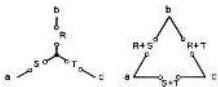
Figure 9. Wye-delta transformation

## Hindrance Function of a Non-Series-Parallel Network

The methods of Part II were not sufficient to handle circuits which contained connections other than those of a series-parallel type. The "bridge" of Figure 10, for example, is a non-series-parallel network. These networks will be treated by first reducing to an equivalent series-parallel circuit. Three methods have been developed for finding the equivalent of a network such as the bridge.

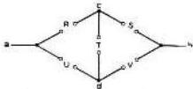
Figure 10. Non-series-parallel circuit

The first is the obvious method of applying the transformations until the network is of the series-parallel type and then writing the hindrance function by inspection. This process is exactly the same as is used in simplifying the complex impedance networks. To apply this to the circuit of Figure 10, first we may eliminate the node $c$, by applying the star-to-mesh transformation to the star $\sigma - c$, $b - c$, $d - c$. This gives the network of Figure 11. The hindrance function may be written down from inspection for this network:

$$
X_{ab} = (R + S)[U(R + T) + V(T + S)].
$$

This may be written as

$$
X_{ab} = RU + SV + RTV + STU = R(U + TV) + S(V + TU).
$$

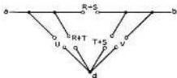
Figure 11. Hindrance function by means of transformations

The second method of analysis is to draw all possible paths through the network between the points under consideration. These paths are drawn along the lines representing the component hindrance elements of the circuit. If any one of these paths has zero hindrance, the required

---

C. E. Shannon

function must be zero. Hence if the result is written as a product, the hindrance of each path will be a factor of this product. The required result may therefore be written as the product of the hindrances of all possible paths between the two points. Paths which touch the same point more than once need not be considered. In Figure 12 this method is applied to the bridge. The paths are shown dotted. The function is therefore given by

$$
\begin{array}{l}
X_{ab} = (R + S)(U + V)(R + T + V)(U + T + S) \\
= RU + SV + RTV + UTS = R(U + TV) + S(V + TU).
\end{array}
$$

The same result is thus obtained as with the first method.

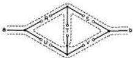
Figure 12. Hindrance function as a product of sums

The third method is to draw all possible lines which would break the circuit between the points under consideration, making the lines go through the hindrances of the circuit. The result is written as a sum, each term corresponding to a certain line. These terms are the products of all the hindrances on the line. The justification of the method is similar to that for the second method. This method is applied to the bridge in Figure 13.

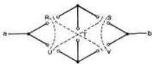
Figure 13. Hindrance function as a sum of products

This again gives for the hindrance of the network:

$$
X_{ab} = RU + SV + RTV + STU = R(U + TV) + S(V + TU).
$$

The third method is usually the most convenient and rapid, for it gives the result directly as a sum. It seems much easier to handle sums than products due, no doubt, to the fact that in ordinary algebra we have the distributive law $X(Y + Z) = XY + XZ$, but not its dual $X + YZ = (X + Y)(X + Z)$. It is, however, sometimes difficult to apply the third method to nonplanar networks (networks which cannot be drawn on a plane without crossing lines) and in this case one of the other two methods may be used.

## Simultaneous Equations

In analyzing a given circuit it is convenient to divide the various variables into two classes. Hindrance elements which are directly controlled by a source external to the circuit under consideration will be called independent variables. These will include hand-operated switches,

---

A Symbolic Analysis of Relay and Switching Circuits
481

contacts on external relays, etc. Relays and other devices controlled by the network will be called dependent variables. We shall, in general, use the earlier letters of the alphabet to represent independent variables and the later letters for dependent variables. In Figure 7 the dependent variables are $X_{1}, X_{2} \ldots X_{n}$. $X_{k}$ will evidently be operated if and only if $X_{0k} = 0$, where $X_{0k}$ is the hindrance function of $N$ between terminals 0 and $k$. That is,

$$
X_{k} = X_{0k},\ k = 1,2,\dots n.
$$

This is a system of equations which completely define the operation of the system. The right-hand members will be known functions involving the various dependent and independent variables and given the starting conditions and the values of the independent variables the dependent variables may be computed.

A transformation will now be described for reducing the number of elements required to realize a set of simultaneous equations. This transformation keeps $X_{0k}$ ($k = 1,2\dots n$) invariant, but $X_{jk}$ ($j,k = 1,2\dots n$) may be changed, so that the new network may not be equivalent in the strict sense defined to the old one. The operation of all the relays will be the same, however. This simplification is only applicable if the $X_{0k}$ functions are written as sums and certain terms are common to two or more equations. For example, suppose the set of equations is as follows:

$$
W = A + B + CW,
$$

$$
X = A + B + WX,
$$

$$
Y = A + CY,
$$

$$
Z = EZ + F.
$$

This may be realized with the circuit of Figure 14, using only one $A$ element for the three places where $A$ occurs and only one $B$ element for its two appearances. The justification is quite obvious. This may be indicated symbolically by drawing a vertical line after the terms common to the various equations, as shown below.

$$
\begin{array}{c c c}
W = & & B + \\
X = & A + & \\
Y = & & CY \\
Z = & & F + EZ
\end{array}
\quad
\begin{array}{c c c}
& CW & \\
& WX & \\
\end{array}
$$

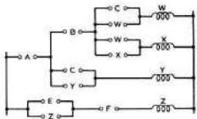
Figure 14. Example of reduction of simultaneous equations

---

C.E. Shannon

It follows from the principle of duality that if we had defined multiplication to represent series connection, and addition for parallel connection, exactly the same theorems of manipulation would be obtained. There were two reasons for choosing the definitions given. First, as has been mentioned, it is easier to manipulate sums than products and the transformation just described can only be applied to sums (for constant-current relay circuits this condition is exactly reversed), and second, this choice makes the hindrance functions closely analogous to impedances. Under the alternative definitions they would be more similar to admittances, which are less commonly used.

Sometimes the relation $XY' = 0$ obtains between two relays $X$ and $Y$. This is true if $Y$ can operate only if $X$ is operated. This frequently occurs in what is known as a sequential system. In a circuit of this type the relays can only operate in a certain order or sequence, the operation of one relay in general "preparing" the circuit so that the next in order can operate. If $X$ precedes $Y$ in the sequence and both are constrained to remain operated until the sequence is finished then this condition will be fulfilled. In such a case the following equations hold and may sometimes be used for simplification of expressions. If $XY' = 0$, then

$$
\begin{array}{l}
X' Y' = Y', \\
X Y = X, \\
X' + Y = 1, \\
X' + Y' = X', \\
X + Y = Y.
\end{array}
$$

These may be proved by adding $XY' = 0$ to the left-hand member or multiplying it by $X' + Y = 1$, thus not changing the value. For example, to prove the first one, add $XY'$ to $X'Y'$ and factor.

## Special Types of Relays and Switches

In certain types of circuits it is necessary to preserve a definite sequential relation in the operation of the contacts of a relay. This is done with make-before-break (or continuity) and break-make (or transfer) contacts. In handling this type of circuit the simplest method seems to be to assume in setting up the equations that the make and break contacts operate simultaneously, and after all simplifications of the equations have been made and the resulting circuit drawn, the required type of contact sequence is found from inspection.

Relays having a time delay in operating or deoperating may be treated similarly or by shifting the time axis. Thus if a relay coil is connected to a battery through a hindrance $X$, and the relay has a delay of $p$ seconds in operating and releasing, then the hindrance function of the contacts of the relay will also be $X$, but at a time $p$ seconds later. This may be indicated by writing $X(t)$ for the hindrance in series with the relay, and $X(t - p)$ for that of the relay contacts.

There are many special types of relays and switches for particular purposes, such as the stepping switches and selector switches of various sorts, multiwinding relays, cross-bar switches, etc. The operation of all these types may be described with the words "or," "and," "if," "operated," and "not operated." This is a sufficient condition that they may be described in terms of hindrance functions with the operations of addition, multiplication, negation, and equality. Thus a two-winding relay might be so constructed that it is operated if the first or the second winding is operated (activated) and the first and the second windings are not operated. If the first winding is $X$ and the second $Y$, the hindrance function of make

---

A Symbolic Analysis of Relay and Switching Circuits
483

contacts on the relay will then be $XY + X'Y'$. Usually, however, these special relays occur only at the end of a complex circuit and may be omitted entirely from the calculations to be added after the rest of the circuit is designed.

Sometimes a relay $X$ is to operate when a circuit $R$ closes and to remain closed independent of $R$ until a circuit $S$ opens. Such a circuit is known as a lock-in circuit. Its equation is:

$$
X = R X + S.
$$

Replacing $X$ by $X'$ gives:

$$
X' = R X' + S
$$

or

$$
X = (R' + X) S'.
$$

In this case $X$ is opened when $R$ closes and remains open until $S$ opens.

## IV. Synthesis of Networks

### Some General Theorems on Networks and Functions

It has been shown that any function may be expanded in a series consisting of a sum of products, each product being of the form $X_{1}X_{2}\ldots X_{n}$ with some permutation of primes on the letters, and each product having the coefficient 0 or 1. Now since each of the $n$ variables may or may not have a prime, there is a total of $2^{n}$ different products of this form. Similarly each product may have the coefficient 0 or the coefficient 1 so there are $2^{2^{n}}$ possible sums of this sort. Hence we have the theorem: The number of functions obtainable from $n$ variables is $2^{2^{n}}$.

Each of these sums will represent a different function, but some of the functions may actually involve fewer than $n$ variables (that is, they are of such a form that for one or more of the $n$ variables, say $X_{k}$, we have identically $f|_{X_{k} = 0} = f|_{X_{k} = 1}$ so that under no conditions does the value of the function depend on the value $X_{k}$). Thus for two variables, $X$ and $Y$, among the 16 functions obtained will be $X, Y, X', Y', 0$, and 1 which do not involve both $X$ and $Y$. To find the number of functions which actually involve all of the $n$ variables we proceed as follows. Let $\phi(n)$ be the number. Then by the theorem just given:

$$
2^{2^{n}} = \sum_{k=0}^{n} \binom{n}{k} \phi(k),
$$

where $\binom{n}{k} = n! / k!(n-k)!$ is the number of combinations of $n$ things taken $k$ at a time. That is, the total number of functions obtainable from $n$ variables is equal to the sum of the numbers of those functions obtainable from each possible selection of variables from these $n$ which actually involve all the variables in the selection. Solving for $\phi(n)$ gives

$$
\phi(n) = 2^{2^{n}} - \sum_{k=0}^{n-1} \binom{n}{k} \phi(k).
$$

By substituting for $\phi(n - 1)$ on the right the similar expression found by replacing $n$ by $n - 1$ in this equation, then similarly substituting for $\phi(n - 2)$ in the expression thus obtained, etc., an equation may be obtained involving only $\phi(n)$. This equation may then be simplified to the form

$$
\phi(n) = \sum_{k=0}^{n} \binom{n}{k} 2^{2^{n}} (-1)^{n-k}.
$$

---

484
C. E. Shannon

As $n$ increases this expression approaches its leading term $2^{2^n}$ asymptotically. The error in using only this term for $n = 5$ is less than 0.01 percent.

We shall now determine those functions of $n$ variables which require the most relay contacts to realize, and find the number of contacts required. In order to do this, it is necessary to define a function of two variables known as the sum modulo two or disjunct of the variables. This function is written $X_{1} \oplus X_{2}$ and is defined by the equation:

$$
X_{1} \oplus X_{2} = X_{1} X_{2}' + X_{1}' X_{2}.
$$

It is easy to show that the sum modulo two obeys the commutative, associative, and the distributive law with respect to multiplication, that is,

$$
\begin{array}{l}
X_{1} \oplus X_{2} = X_{2} \oplus X_{1}, \\
(X_{1} \oplus X_{2}) \oplus X_{3} = X_{1} \oplus (X_{2} \oplus X_{3}), \\
X_{1} (X_{2} \oplus X_{3}) = X_{1} X_{2} \oplus X_{1} X_{3}.
\end{array}
$$

Also

$$
\begin{array}{l}
(X_{1} \oplus X_{2})' = X_{1} \oplus X_{2}' = X_{1}' \oplus X_{2}, \\
X_{1} \oplus 0 = X_{1}, \\
X_{1} \oplus 1 = X_{1}'.
\end{array}
$$

Since the sum modulo two obeys the associative law, we may omit parentheses in a sum of several terms without ambiguity. The sum modulo two of the $n$ variables $X_{1}, X_{2}, \ldots, X_{n}$ will for convenience be written:

$$
X_{1} \oplus X_{2} \oplus X_{3} \ldots \oplus X_{n} = \sum_{k=1}^{n} X_{k}.
$$

**Theorem:** The two functions of $n$ variables which require the most elements (relay contacts) in a series-parallel realization are $\sum_{1}^{n} X_{k}$ and $(\sum_{1}^{n} X_{k})'$, each of which requires $(3 \cdot 2^{n-1} - 2)$ elements.

This will be proved by mathematical induction. First note that it is true for $n = 2$. There are ten functions involving two variables, namely, $XY$, $X + Y$, $X'Y$, $X' + Y$, $XY'$, $X + Y'$, $X'Y'$, $X' + Y'$, $XY' + X'Y$, $XY + X'Y'$. All of these but the last two require two elements: the last two require four elements and are $X \oplus Y$ and $(X \oplus Y)'$, respectively. Thus the theorem is true for $n = 2$. Now assuming it true for $n - 1$, we shall prove it true for $n$ and thus complete the induction. Any function of $n$ variables may be expanded about the $n$th variable as follows:

$$
f(X_{1}, X_{2}, \dots, X_{n}) = f = X_{n} f(X_{1} \dots X_{n-1}, 1) + X_{n}' f(X_{1} \dots X_{n-1}, 0). \tag{19}
$$

Now the terms $f(X_{1} \dots X_{n-1}, 1)$ and $f(X_{1} \dots X_{n-1}, 0)$ are functions of $n - 1$ variables and if they individually require the most elements for $n - 1$ variables, then $f$ will require the most elements for $n$ variables, providing there is no other method of writing $f$ so that fewer elements are required. We have assumed that the most elements for $n - 1$ variables are required by $\sum_{1}^{n-1} X_{k}$ and its negative. If we, therefore, substitute for $f(X_{1} \dots X_{n-1}, 1)$ the function $\sum_{1}^{n-1} X_{k}$ and for $f(X_{1} \dots X_{n-1}, 0)$ the function $(\sum_{1}^{n-1} X_{k})'$ we find

* See the Notes to this paper.

---

A Symbolic Analysis of Relay and Switching Circuits
485

$$
f = X _ {n} \sum_ {1} ^ {n - 1} X _ {k} + X _ {n} ^ {\prime} \left(\sum_ {1} ^ {n - 1} X _ {k}\right) ^ {\prime} = \left(\sum_ {1} ^ {n} X _ {k}\right) ^ {\prime}.
$$

From the symmetry of this function there is no other way of expanding which will reduce the number of elements. If the functions are substituted in the other order we get

$$
f = X _ {n} \left(\sum_ {1} ^ {n - 1} X _ {k}\right) ^ {\prime} + X _ {n} ^ {\prime} \sum_ {1} ^ {n - 1} X _ {k} = \sum_ {1} ^ {n} X _ {k}.
$$

This completes the proof that these functions require the most elements.

To show that each requires $(3\cdot 2^{n - 1} - 2)$ elements, let the number of elements required be denoted by $s(n)$. Then from (19) we get the difference equation

$$
s (n) = 2 s (n - 1) + 2,
$$

with $s(2) = 4$. This is linear, with constant coefficients, and may be solved by the usual methods. The solution is

$$
s (n) = 3 \cdot 2 ^ {n - 1} - 2,
$$

as may easily be verified by substituting in the difference equation and boundary condition.

Note that the above only applies to a series-parallel realization. In a later section it will be shown that the function $\sum_{1}^{n}X_{k}$ and its negative may be realized with $4(n - 1)$ elements using a more general type of circuit. The function requiring the most elements using any type of circuit has not as yet been determined.

## Dual Networks

The negative of any network may be found by De Morgan's theorem, but the network must first be transformed into an equivalent series-parallel circuit (unless it is already of this type). A theorem will be developed with which the negative of any planar two-terminal circuit may be found directly. As a corollary a method of finding a constant-current circuit equivalent to a given constant-voltage circuit and vice versa will be given.

Let $N$ represent a planar network of hindrances, with the function $X_{ab}$ between the terminals $a$ and $b$ which are on the outer edge of the network. For definiteness consider the network of Figure 15 (here the hindrances are shown merely as lines).

Now let $M$ represent the dual of $N$ as found by the following process; for each contour or mesh of $N$ assign a node or junction point of $M$. For each element of $N$, say $X_{k}$, separating the contours $r$ and $s$ there corresponds an element $X_{k}^{\prime}$ connecting the nodes $r$ and $s$ of $M$. The area exterior to $N$ is to be considered as two meshes, $c$ and $d$, corresponding to nodes $c$ and $d$ of $M$. Thus the dual of Figure 15 is the network of Figure 16.

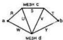
Figure 15 (left). Planar network for illustration of duality theorem

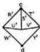
Figure 16 (right). Dual of figure 15

---

C.E. Shannon

Theorem: If $M$ and $N$ bear this duality relationship, then $X_{ab} = X_{cd}'$. To prove this, let the network $M$ be superimposed upon $N$, the nodes of $M$ within the corresponding meshes of $N$ and corresponding elements crossing. For the network of Figure 15, this is shown in Figure 17 with $N$ solid and $M$ dotted. Incidentally, the easiest method of finding the dual of a network (whether of this type or an impedance network) is to draw the required network superimposed on the given network. Now, if $X_{ab} = 0$, then there must be some path from $a$ to $b$ along the lines of $N$ such that every element on this path equals zero. But this path represents a path across $M$ dividing the circuit from $c$ to $d$ along which every element of $M$ is one. Hence $X_{cd} = 1$. Similarly, if $X_{cd} = 0$, then $X_{ab} = 1$, and it follows that $X_{ab} = X_{cd}'$.

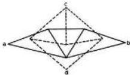
Figure 17. Superposition of a network and its dual

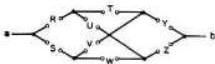
Figure 18. Nonplanar network

It is evident from this theorem that a negative for any planar network may be realized with the same number of elements as the given network.

In a constant-voltage relay system all the relays are in parallel across the line. To open a relay a series connection is opened. The general constant-voltage system is shown in Figure 19. In a constant-current system the relays are all in series in the line. To de-operate a relay it is short-circuited. The general constant-current circuit corresponding to Figure 19 is shown in Figure 20. If the relay $Y_{k}$ of Figure 20 is to be operated whenever the relay $X_{k}$ of Figure 19 is operated and not otherwise, then evidently the hindrance in parallel with $Y_{k}$ which short-circuits it must be the negative of the hindrance in series with $X_{k}$ which connects it across the voltage source. If this is true for all the relays, we shall say that the constant-current and constant-voltage systems are equivalent. The above theorem may be used to find equivalent circuits of this sort, for if we make the networks $N$ and $M$ of Figures 19 and 20 duals in the sense described, with $X_{k}$ and $Y_{k}$ as corresponding elements, then the condition will be satisfied. A simple example of this is shown in Figures 21 and 22.

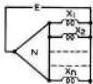
Figure 19 (left). General constant-voltage relay circuit

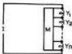
Figure 20 (right). General constant-current relay circuit

---

A Symbolic Analysis of Relay and Switching Circuits
487

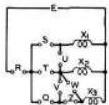
Figure 21 (left). Simple constant-voltage system

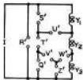
Figure 22 (right). Constant-current system equivalent to figure 21

## Synthesis of the General Symmetric Function

It has been shown that any function represents explicitly a series-parallel circuit. The series-parallel realization may require more elements, however, than some other network representing the same function. In this section a method will be given for finding a circuit representing a certain type of function which in general is much more economical of elements than the best series-parallel circuit. This type of function is known as a symmetric function and appears frequently in relay circuits.

**Definition:** A function of the $n$ variables $X_{1}, X_{2}, \ldots, X_{n}$ is said to be symmetric in these variables if any interchange of the variables leaves the function identically the same. Thus $XY + XZ + YZ$ is symmetric in the variables $X, Y,$ and $Z$. Since any permutation of variables may be obtained by successive interchanges of two variables, a necessary and sufficient condition that a function be symmetric is that any interchange of two variables leaves the function unaltered.

By proper selection of the variables many apparently unsymmetric functions may be made symmetric. For example, $XY'Z + X'YZ + X'Y'Z'$ although not symmetric in $X, Y,$ and $Z$ is symmetric in $X, Y,$ and $Z'$. It is also sometimes possible to write an unsymmetric function as a symmetric function multiplied by a simple term or added to a simple term. In such a case the symmetric part may be realized with the methods to be described, and the additional term supplied as a series or parallel connection.

The following theorem forms the basis of the method of design which has been developed.

**Theorem:** A necessary and sufficient condition that a function be symmetric is that it may be specified by stating a set of numbers $a_1, a_2, \ldots, a_k$ such that if exactly $a_j (j = 1, 2, 3, \ldots)$ of the variables are zero, then the function is zero and not otherwise. This follows easily from the definition. The set of numbers $a_1, a_2, \ldots, a_k$ may be any set of numbers selected from the numbers 0 to $n$ inclusive, where $n$ is the number of variables in the symmetric function. For convenience, they will be called the $a$-numbers of the function. The symmetric function $XY + XZ + YZ$ has the $a$-numbers 2 and 3, since the function is zero if just two of the variables are zero or if three are zero, but not if none or if one is zero. To find the $a$-numbers of a given symmetric function it is merely necessary to evaluate the function with $0, 1, \ldots, n$ of the variables zero. Those numbers for which the result is zero are the $a$-numbers of the function.

**Theorem:** There are $2^{n+1}$ symmetric functions of $n$ variables. This follows from the fact that there are $n+1$ numbers, each of which may be taken or not in our selection of $a$-numbers. Two of the functions are trivial, however, namely, those in which all and one of the numbers are taken. These give the "functions" 0 and 1, respectively. The symmetric function of the $n$ variables $X_1, X_2, \ldots, X_n$ with the $a$-numbers $a_1, a_2, \ldots, a_k$ will be written $S_{a_1, a_2, \ldots, a_k}(X_1, X_2, \ldots, X_n)$. Thus the example given would be $S_{2,3}(X, Y, Z)$. The circuit which has

---

C.E. Shannon

been developed for realizing the general symmetric function is based on the $a$-numbers of the function and we shall now assume that they are known.

Theorem: The sum of two given symmetric functions of the same set of variables is a symmetric function of these variables having for $a$-numbers those numbers common to the two given functions. Thus $S_{1,2,3}(X_1 \ldots X_6) + S_{2,3,5}(X_1 \ldots X_6) = S_{2,3}(X_1 \ldots X_6)$.

Theorem: The product of two given symmetric functions of the same set of variables is a symmetric function of these variables with all the numbers appearing in either or both of the given functions for $a$-numbers. Thus $S_{1,2,3}(X_1 \ldots X_6) \cdot S_{2,3,5}(X_1 \ldots X_6) = S_{1,2,3,5}(X_1 \ldots X_6)$.

To prove these theorems, note that a product is zero if either factor is zero, while a sum is zero only if both terms are zero.

Theorem: The negative of a symmetric function of $n$ variables is a symmetric function of these variables having for $a$-numbers all the numbers from 0 to $n$ inclusive which are not in the $a$-numbers of the given function. Thus $S_{2,3,5}^* (X_1\ldots X_6) = S_{0,1,4,6}(X_1\ldots X_6)$.

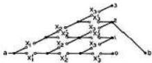
Figure 23. Circuit for realizing $S_{0}(X_{1},X_{2},X_{3})$

Before considering the synthesis of the general symmetric function $S_{a_1a_2\dots a_i}(X_1,X_2,\ldots ,X_n)$ a simple example will be given. Suppose the function $S_{2}(X_{1},X_{2},X_{3})$ is to be realized. This means that we must construct a circuit which will be closed when any two of the variables $X_{1},X_{2},X_{3}$ are zero, but open if none, or one or three are zero. A circuit for this purpose is shown in Figure 23. This circuit may be divided into three bays, one for each variable, and four levels marked 0, 1, 2 and 3 at the right. The terminal $b$ is connected to the levels corresponding to the $a$-numbers of the required function, in this case to the level marked 2. The line coming in at $a$ first encounters a pair of hindrances $X_{1}$ and $X_{1}'$. If $X_{1} = 0$, the line is switched up to the level marked 1, meaning that one of the variables is zero; if not it stays at the same level. Next we come to hindrances $X_{2}$ and $X_{2}'$. If $X_{2} = 0$, the line is switched up a level; if not, it stays at the same level. $X_{3}$ has a similar effect. Finally reaching the right-hand set of terminals, the line has been switched up to a level equal to the total number of variables which are zero. Since terminal $b$ is connected to the level marked 2, the circuit $a - b$ will be completed if and only if 2 of the variables are zero. If $S_{0,3}(X_1,X_2,X_3)$ had been desired, terminal $b$ would be connected to both levels 0 and 3. In Figure 23 certain of the elements are evidently superfluous. The circuit may be simplified to the form of Figure 24.

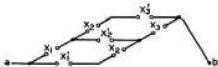
Figure 24. Simplification of figure 23

For the general function exactly the same method is followed. Using the general circuit for $n$ variables of Figure 25, the terminal $b$ is connected to the levels corresponding to the $a$

---

A Symbolic Analysis of Relay and Switching Circuits
489

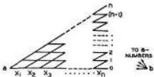
Figure 25. Circuit for realizing the general symmetric function $S_{0,3,6}(X_1, X_2, \ldots, X_n)$

numbers of the desired symmetric function. In Figure 25 the hindrances are respected merely by lines, and the letters are omitted from the circuit, but the hindrance of each line may easily be seen by generalizing Figure 23. After terminal $b$ is connected, all superfluous elements may be deleted.

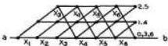
Figure 26. Circuit for $S_{0,3,6}(X_1 \ldots X_n)$ using the "shifting down" process

In certain cases it is possible to greatly simplify the circuit by shifting the levels down. Suppose the function $S_{0,3,6}(X_1 \ldots X_n)$ is desired. Instead of continuing the circuit up to the sixth level, we connect the second level back down to the zero level as shown in Figure 26. The zero level then also becomes the third level and the sixth level. With terminal $b$ connected to this level, we have realized the function with a great savings of elements. Eliminating unnecessary elements the circuit of Figure 27 is obtained. This device is especially useful if the $a$-numbers form an arithmetic progression, although it can sometimes be applied in other cases.

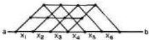
Figure 27. Simplification of figure 26

The functions $\sum_{1}^{n} X_k$ and $(\sum_{1}^{n} X_k)'$ which were shown to require the most elements for a series parallel realization have very simple circuits when developed in this manner. It can be easily shown that if $n$ is even, then $\sum_{1}^{n} X_k$ is the symmetric function with all the even numbers for $a$-numbers, if $n$ is odd it has all the odd numbers for $a$-numbers. The function $(\sum_{1}^{n} X_k)'$ is, of course, just the opposite. Using the shifting-down process the circuits are as shown in Figures 28 and 29. These circuits each require $4(n-1)$ elements. They will be recognized as the familiar circuit for controlling a light from $n$ points, using $(n-2)$ double-pole double-throw switches and two single-pole double-throw switches. If at any one of the points the position of the switch is changed, the total number of variables which equal zero is changed by one, so that if the light is on, it will be turned off and if already off, it will be turned on.

---

C.E. Shannon

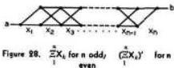

More than one symmetric function of a certain set of variables may be realized with just one circuit of the form of Figure 25, providing the different functions have no $a$-numbers in common. If there are common $a$-numbers the levels may be shifted down, or an extra relay may be added so that one circuit is still sufficient.

The general network of Figure 25 contains $n(n + 1)$ elements. We will show that for any given selection of $a$-numbers, at least $n$ of the elements will be superfluous. Each number from 1 to $n - 1$ inclusive which is not in the set of $a$-numbers produces two unnecessary elements; 0 or $n$ missing will produce one unnecessary element. However, if two of the $a$-numbers differ by only one, then two elements will be superfluous. If more than two of the $a$-numbers are adjacent, or if two or more adjacent numbers are missing, then more than one element apiece will be superfluous. It is evident then that the worst case will be that in which the $a$-numbers are all the odd numbers or all the even numbers from 0 to $n$. In each of these cases it is easily seen that $n$ of the elements will be superfluous. In these cases the shifting down process may be used if $n > 2$ so that the maximum of $n^2$ elements will be needed only for the four particular functions $X, X', X \oplus Y$, and $(X \oplus Y)'$.

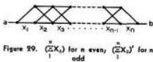

# Equations From Given Operating Characteristics

In general, there is a certain set of independent variables $A, B, C \ldots$ which may be switches, externally operated or protective relays. There is also a set of dependent variables $x, y, z \ldots$ which represent relays, motors or other devices to be controlled by the circuit. It is required to find a network which gives, for each possible combination of values of the independent variables, the correct values for all the dependent variables. The following principles give the general method of solution.

1. Additional dependent variables must be introduced for each added phase of operation of a sequential system. Thus if it is desired to construct a system which operates in three steps, two additional variables must be introduced to represent the beginning of the last two steps. These additional variables may represent contacts on a stepping switch or relays which lock in sequentially. Similarly each required time delay will require a new variable, representing a time delay relay of some sort. Other forms of relays which may be necessary will usually be obvious from the nature of the problem.

2. The hindrance equations for each of the dependent variables should now be written down. These functions may involve any of the variables, dependent or independent, including the variable whose function is being determined (as, for example, in a lock-in circuit). The

---

A Symbolic Analysis of Relay and Switching Circuits
491

Table II. Relation of Operating Characteristics and Equations

|  Symbol | In Terms of Operation | In Terms of Nonoperation  |
| --- | --- | --- |
|  X | The switch or relay X is operated | The switch or relay X is not operated  |
|  = | If | If  |
|  X' | The switch or relay X is not operated | The switch or relay X is operated  |
|  · | Or | And  |
|  + | And | Or  |
|  (−−)* | The circuit (−−) is not closed, or apply De Morgan’s theorem | The circuit (−−) is closed, or apply De Morgan’s theorem  |
|  X(t−p) | X has been operated for at least p seconds | X has been open for at least p seconds  |
|  If the dependent variable appears in its own defining function (as in a lock-in circuit) strict adherence to the above leads to confusing sentences. In such cases the following equivalents should be used.  |   |   |
|  X = RX + S | X is operated when R is closed (providing S is closed) and remains so independent of R until S opens |   |
|  X = (R' + X)S' |  | X is opened when R is closed (providing S is closed) and remains so independent of R until S opens  |

In using this table it is usually best to write the function under consideration either as a sum of pure products or as a product of pure sums. In the case of a sum of products the characteristics should be defined in terms of nonoperation; for a product of sums in terms of operation. If this is not done it is difficult to give implicit and explicit parentheses the proper significance.

conditions may be either conditions for operation or for nonoperation. Equations are written from operating characteristics according to Table II. To illustrate the use of this table suppose a relay U is to operate if x is operated and y or z is operated and v or w or z is not operated. The expression for A will be

$$
U = x + y z + v ^ {\prime} w ^ {\prime} z ^ {\prime}.
$$

Lock-in relay equations have already been discussed. It does not, of course, matter if the same conditions are put in the expression more than once — all superfluous material will disappear in the final simplification.

3. The expressions for the various dependent variables should next be simplified as much as possible by means of the theorems on manipulation of these quantities. Just how much this can be done depends somewhat on the ingenuity of the designer.

4. The resulting circuit should now be drawn. Any necessary additions dictated by practical considerations such as current-carrying ability, sequence of contact operation, etc., should be made.

## V. Illustrative Examples

In this section several problems will be solved with the methods which have been developed. The examples are intended more to illustrate the use of the calculus in actual problems and to show the versatility of relay and switching circuits than to describe practical devices.

---

C. E. Shannon

It is possible to perform complex mathematical operations by means of relay circuits. Numbers may be represented by the positions of relays or stepping switches, and interconnections between sets of relays can be made to represent various mathematical operations. In fact, any operation that can be completely described in a finite number of steps using the words "if," "or," "and," etc. (see Table II), can be done automatically with relays. The last example is an illustration of a mathematical operation accomplished with relays.

## A Selective Circuit

A relay $U$ is to operate when any one, any three or when all four of the relays $w, x, y$ and $z$ are operated but not when none or two are operated. The hindrance function for $U$ will evidently be:

$$
U = w x y z + w ^ {\prime} x ^ {\prime} y z + w ^ {\prime} x y ^ {\prime} z + w ^ {\prime} x y z ^ {\prime} + w x ^ {\prime} y ^ {\prime} z + w x ^ {\prime} y z ^ {\prime} + w x y ^ {\prime} z ^ {\prime}.
$$

Reducing to the simplest series-parallel form:

$$
U = w \left\{x \left(y z + y ^ {\prime} z ^ {\prime}\right) + x ^ {\prime} \left(y ^ {\prime} z + y z ^ {\prime}\right) \right\} + w ^ {\prime} \left[ x \left(y ^ {\prime} z + y z ^ {\prime}\right) + x ^ {\prime} y z \right].
$$

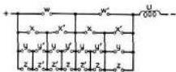
Figure 30. Series-parallel realization of selective circuit

This circuit is shown in Figure 30. It requires 20 elements. However, using the symmetric-function method, we may write for $U$:

$$
U = S _ {1, 3, 4} (w, x, y, z).
$$

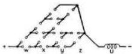
Figure 31. Selective circuit from symmetric-function method

This circuit (Figure 31) contains only 15 elements. A still further reduction may be made with the following device. First write

$$
U ^ {\prime} = S _ {0, 2} (w, x, y, z).
$$

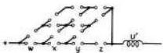
Figure 32. Negative of selective circuit from symmetric-function method

---

A Symbolic Analysis of Relay and Switching Circuits
493

This has the circuit of Figure 32. What is required is the negative of this function. This is a planar network and we may apply the theorem on the dual of a network, thus obtaining the circuit shown in Figure 33. This contains 14 elements and is probably the most economical circuit of any sort.

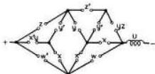
Figure 33. Dual of figure 32

## Design of an Electric Combination Lock

An electric lock is to be constructed with the following characteristics. There are to be five pushbutton switches available on the front of the lock. These will be labeled $a$, $b$, $c$, $d$, $e$. To operate the lock the buttons must be pressed in the following order: $c$, $h$, $a$ and $c$ simultaneously, $d$. When operated in this sequence the lock is to unlock, but if any button is pressed incorrectly an alarm $U$ is to operate. To relock the system a switch $g$ must be operated. To release the alarm once it has started a switch $h$ must be operated. This being a sequential system either a stepping switch or additional sequential relays are required. Using sequential relays let them be denoted by $w$, $x$, $y$ and $z$ corresponding respectively to the correct sequence of operating the push buttons. An additional time-delay relay is also required due to the third step in the operation. Obviously, even in correct operation $a$ and $c$ cannot be pressed at exactly the same time, but if only one is pressed and held down the alarm should operate. Therefore assume an auxiliary time delay relay $v$ which will operate if either $a$ or $c$ alone is pressed at the end of step 2 and held down longer than time $s$, the delay of the relay.

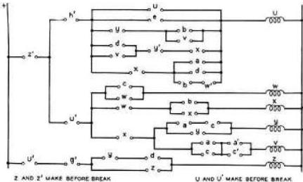
Figure 34. Combination-lock circuit

---

C. E. Shannon

When $z$ has operated the lock unlocks and at this point let all the other relays drop out of the circuit. The equations of the system may be written down immediately:

$$
\begin{array}{l}
w = c w + z ^ {\prime} + U ^ {\prime}, \\
x = b x + w + z ^ {\prime} + U ^ {\prime}, \\
y = (a + c) y + x + z ^ {\prime} + U ^ {\prime}, \\
z = z (d + y) + g ^ {\prime} + U ^ {\prime}, \\
v = x + a c + a ^ {\prime} c ^ {\prime} + z ^ {\prime} + U ^ {\prime}, \\
U = e \left(w ^ {\prime} + a b d\right) \left(w + x ^ {\prime} + a d\right) \left[ x + y ^ {\prime} + d v (t - s) \right] \left[ y + b v (t - s) \right] U + h ^ {\prime} + z ^ {\prime}.
\end{array}
$$

These expressions can be simplified considerably, first by combining the second and third factors in the first term of $U$, and then by factoring out the common terms of the several functions. The final simplified form is as below: This corresponds to the circuit of Figure 34.

$$
\begin{array}{c c c}
U = & & h ^ {\prime} + e [ a d (b + w ^ {\prime}) + x ^ {\prime} ] \cdot \\
& & (x + y ^ {\prime} + d v) (y + v b) U \\
w = & & c w \\
x = Z ^ {\prime} + & & b x + w \\
y = & U ^ {\prime} + & (a + c) y \\
& & x + \\
v = & & ac + a ^ {\prime} c ^ {\prime}
\end{array}
$$

$$
z = g ^ {\prime} + (y + d) z + U ^ {\prime}
$$

## Electric Adder to the Base Two

A circuit is to be designed that will automatically add two numbers, using only relays and switches. Although any numbering base could be used the circuit is greatly simplified by using the scale of two. Each digit is thus either 0 or 1; the number whose digits in order are $a_{k}, a_{k-1}, a_{k-2}, \ldots, a_{2}, a_{1}, a_{0}$ has the value $\sum_{j=0}^{k} a_{j} 2^{j}$.

Let the two numbers which are to be added be represented by a series of switches: $a_{k}, a_{k-1}, \ldots, a_{1}, a_{0}$ representing the various digits of one of the numbers and $b_{k}, b_{k-1}, \ldots, b_{1}, b_{0}$ the digits of the other number. The sum will be represented by the positions of a set of relays $s_{k+1}, s_{k}, s_{k-1} \ldots, s_{1}, s_{0}$. A number which is carried to the $j$th column from the $(j-1)$th column will be represented by a relay $c_{j}$. If the value of any digit is zero, the corresponding relay or switch will be taken to be in the position of zero hindrance; if one, in the position where the hindrance is one. The actual addition is shown below:

---

A Symbolic Analysis of Relay and Switching Circuits
495

|  c_{k+1} | c_{k} | c_{j+1}c_{j} | c_{2}c_{1} | Carried numbers  |
| --- | --- | --- | --- | --- |
|   |  a_{k} | a_{j+1}a_{j} | a_{2}a_{1}a_{0} | First number  |
|   |  b_{k} | b_{j+1}b_{j} | b_{2}b_{1}b_{0} | Second number  |
|  c_{k+1} | s_{k} | s_{j+1}s_{j} | s_{2},s_{1}s_{0} | Sum  |
|  or |  |  |  |   |
|  s_{k+1} |  |  |  |   |

Starting from the right, $s_0$ is one if $a_0$ is one and $b_0$ is zero or if $a_0$ is zero and $b_0$ one but not otherwise. Hence

$$
s_0 = a_0 b_0' + a_0' b_0 = a_0 \oplus b_0.
$$

$c_1$ is one if both $a_0$ and $b_0$ are one but not otherwise:

$$
c_1 = a_0 \cdot b_0.
$$

$s_j$ is one if just one of $a_j, b_j, c_j$ is one, or if all three are one:

$$
s_j = S_{1,3}(a_j, b_j, c_j), \quad j = 1, 2, \dots k.
$$

$c_{j+1}$ is one if two or if three of these variables are one:

$$
c_{j+1} = S_{2,3}(a_j, b_j, c_j), \quad j = 1, 2, \dots k.
$$

Using the method of symmetric functions, and shifting down for $s_j$ gives the circuits of Figure 35. Eliminating superfluous elements we arrive at Figure 36.

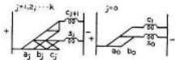
Figure 35. Circuits for electric adder

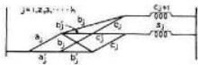
Figure 36. Simplification of figure 35

## References

1. A complete bibliography of the literature of symbolic logic is given in the *Journal of Symbolic Logic*, volume 1, number 4, December 1936. Those elementary parts of the theory that are useful in connection with relay circuits are well treated in the two following references.

2. The Algebra of Logic, Louis Cauturat. The Open Court Publishing Company.

3. Universal Algebra, A. N. Whitehead. Cambridge, at the University Press, volume I, book III, chapters I and II, pages 35-42.

4. E. V. Huntington, *Transactions of the American Mathematical Society*, volume 35, 1933, pages 274-304. The postulates referred to are the fourth set, given on page 280.

---

# Claude Elwood Shannon

## Collected Papers

Edited by

**N.J.A. Sloane**

**Aaron D. Wyner**

Mathematical Sciences Research Dept.
AT&T Bell Laboratories
Murray Hill, NJ 07974
USA

IEEE
PRESS

IEEE Information Theory Society, *Sponsor*
The Institute of Electrical and Electronics Engineers, Inc., New York

---

469

# Preface to Shannon's Collected Papers (Part B)

Besides creating the subject of information theory (see Preface to Part A), Shannon also started the whole subject of logical circuit design and wrote the seminal paper on computer chess, as well as several other fundamental papers on computers.

The papers in this section deal with switching circuits, analog and digital computers, automata theory, graph theory and game-playing machines.

The central theme in many of these papers is the problem of constructing an efficient switching circuit to perform a given task. The first paper, Shannon's Master's thesis at M.I.T., won the Alfred Noble Prize, and launched Shannon on his career. As mentioned in the Biography at the beginning of this collection, H. H. Goldstine called this "one of the most important master's theses ever written... a landmark in that it helped to change digital circuit design from an art to a science."

The knowledgeable reader may notice that there is no mention of Shannon's switching game in any of these papers. Apparently he did not publish an account of this game. However, it is described in [BeCG82], Chap. 22; [Brua74]; [Edmo65]; [HamV88]; [Lehm64]; and [Wels76], Chap. 19. The Pollak-Shannon strategy for drawing at the game of nine-in-a-row is described in [BeCG82], p. 676.