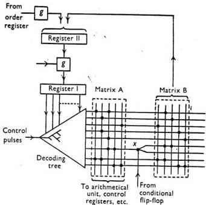

[ 230 ]

# MICRO-PROGRAMMING AND THE DESIGN OF THE CONTROL CIRCUITS IN AN ELECTRONIC DIGITAL COMPUTER

By M. V. WILKES AND J. B. STRINGER

Received 18 November 1952

1. Introduction. Experience has shown that the sections of an electronic digital computer which are easiest to maintain are those which have a simple logical structure. Not only can this structure be readily borne in mind by a maintenance engineer when looking for a fault, but it makes it possible to use fault-locating programmes and to test the equipment without the use of elaborate test gear. It is in the control section of electronic computers that the greatest degree of complexity generally arises. This is particularly so if the machine has a comprehensive order code designed to make it simple and fast in operation. In general, for each different order in the code some special equipment must be provided, and the more complicated the function of the order the more complex this equipment. In the past, fear of complicating unduly the control circuits of the machines has prevented the designers of electronic machines from providing such facilities as orders for floating-point operations, although experience with relay machines and with interpretive subroutines has shown how valuable such orders are. This paper describes a method of designing the control circuits of a machine which is wholly logical and which enables alterations or additions to the order code to be made without ad hoc alterations to the circuits. An outline of this method was given by one of us (M. V. W.) at the Conference (1) on Automatic Calculating Machines at the University of Manchester in July 1951.

The operation called for by a single machine order can be broken down into a sequence of more elementary operations; for example, shifting a number in the accumulator one place to the right may involve, first, a transfer of the number to an auxiliary shifting register, and secondly, the transfer of the number back to the accumulator along an oblique path. These elementary operations will be referred to as micro-operations. Basic machine operations, such as addition, subtraction, multiplication, etc., are thought of as being made up of a micro-programme of micro-operations, each micro-operation being called for by a micro-order. The process of writing a micro-programme for a machine order is very similar to that of writing a programme for the whole calculation in terms of machine orders.

For the method to be applicable it is necessary that the machine should contain a suitable permanent rapid-access storage device in which the micro-programme can be held—a diode matrix is proposed in the case of the machine discussed as an example below—and that means should be provided for executing the micro-orders one after the other. It is also necessary that provision should be made for conditional micro-orders which play a role in micro-programming similar to that played by conditional orders in ordinary programming.

---

Electronic digital computer 231
NTROL
CR

Since the only feature of the machine which has to be designed specially for any particular set of machine orders is the configuration of diodes in the matrix, or the corresponding configuration in whatever equivalent device is used, there is no difficulty in making changes to the order code of the machine if experience shows them to be desirable; in fact, the design of the machine in the first place can be carried out completely without a firm decision on the details of the order code being taken, as long as care is taken to provide accommodation for the greatest number of micro-orders that are likely to be required. It would even be possible to have a number of interchangeable matrices providing for different order codes, so that the user could choose the one most suited to his particular requirements.

2. Description of the proposed system. The system will be described in relation to a parallel machine having an arithmetical unit designed along conventional lines. This will contain a set of registers and an adder together with a switching system which enables the micro-operations in the various machine orders to be performed. Some of the micro-operations will be simple transfers of a number from one register to another with or without shifting of the number one place to the left or the right, while others will also involve the use of the adder. Any particular micro-operation can be performed by applying pulses simultaneously to the appropriate gates of the switching system. In certain cases it may be possible for two or more micro-operations to take place at the same time.

It will be convenient to regard the control system as consisting of two parts. A register is needed to hold the address of the next order due to be executed, and another to hold the current order while it is being executed, or at any rate during part of that time. Some means of counting the number of steps in a shifting operation or a multiplication must also be provided. One method of meeting these requirements is to provide a group of registers and an adder together with a switching system which enables transfers of numbers, with or without addition, to be made. This part of the control system will be called the control register unit. In any case the operations which need to be performed on the numbers standing in the control register unit during the execution of an order are, like the operations performed in the arithmetical unit, regarded as being made up of a sequence of micro-operations, each of which is performed by the application of pulses to appropriate gates.

The other part of the control system is concerned with control of the sequence of micro-orders required to carry out each machine order, and with the operation of the gates required for the execution of each micro-order. This will be called the micro-control unit; it consists of a decoding tree, two rectifier matrices and two registers (additional to those of the control register unit) connected as indicated in Fig. 1, which shows how the pulses used to operate the gates in the arithmetical unit and control register unit are generated. A series of control pulses from a pulse generator are applied to the input of the decoding tree. Each pulse is routed to one of the output lines of the tree, according to the number standing in register I. The output lines all pass into a rectifier matrix A and the outputs of this matrix are the pulses which operate the various gates associated with micro-operations. Thus one input line of the matrix corresponds to one micro-order. The address of the

---

232
M. V. WILKES AND J. B. STRINGER

micro-order is the number which must be placed in register I to cause the control pulse to be routed to the corresponding line. The output lines from the tree also pass into a second matrix B, which has its outputs connected to register II. This matrix B is wired on it the address of the micro-order to be performed next in time so that the address of this micro-order is placed in register II. Just before the next control pulse is applied to the input of the tree a connexion is established between register A and register I, and the address of the micro-order due to be executed next is transferred into register I. In this way the decoding tree is prepared to route the next incoming control pulse to the correct output line. Thus application of pulses alternated to the input of the tree and to the gate connecting registers I and II causes a pre-determined sequence of micro-orders to be executed.

Fig. 1. Micro-control unit.

It is necessary to have means whereby the course of the micro-programme can be made conditional on whether a given digit in one of the registers of the arithmetical unit or control register unit is a 1 or a 0. The means of doing this is shown at X in Fig. 1. A two-way switch, controlled by a special flip-flop called a conditional flip-flop, is inserted between matrix A and matrix B. The conditional flip-flop can be set by an earlier micro-order with any digit from any one of the registers. Two separate addresses are wired into matrix B, and the one which passes into register I, and thus becomes the address of the next micro-order, is determined by the setting of the conditional flip-flop.

Conditional micro-orders play the same part in the construction of micro-programmes as conditional orders play in the construction of ordinary programmes; apart from their obvious uses in micro-programmes for such operations as multiplication and division, they enable repetitive loops of micro-orders to be used.

---

Electronic digital computer 233

If desired, two branchings may be inserted in the connexions between matrix A and matrix B, so that any one of four alternative addresses for the next micro-order may be selected according to the settings of two conditional flip-flops. Another possibility is to make the output from the decoding tree branch before it enters matrix A so that the nature of the micro-operation that is performed depends on the setting of the conditional flip-flop.

The micro-programme wired on to the matrices contains sections for performing the operations required by each order in the basic order code of the machine. To initiate the operation it is only necessary that control in the micro-programme should be sent to the correct entry point. This is done by placing the function digits of the order in the least significant part of register II, the other digits in this register being made zero. The micro-programme is constructed so that when this number passes into register I, control in the micro-programme is sent to the correct entry point.

The switching system in the arithmetical unit may either be designed to permit a large variety of micro-operations to be performed, or it may be restricted so as to allow only a small number of such operations. In a machine with a comprehensive order code there is much to be said for having the more flexible switching system since this will enable an economy to be made in the number of micro-orders needed in the micro-programme.

A similar remark applies in connexion with the degree of flexibility to be provided when designing the switching system for the control register unit. If the specification of the machine allows the same number of registers to be used in the arithmetical and control sections, the construction of these two sections may be identical except as far as the number of digits is concerned. In a new machine under construction in the Mathematical Laboratory, Cambridge, the registers are being constructed in basic units each containing five registers and an adder-subtractor together with the associated switching system. It is hoped that it will be possible to use identical units in the arithmetical unit and in the control register unit.

3. Example. An example will now be given to show the way in which a micro-programme can be drawn up for a machine with a single-address order code covering the usual operations. It is supposed that the arithmetical unit contains the following registers:

- A multiplicand register,
- B accumulator (least significant half),
- C accumulator (most significant half),
- D shift register.

The registers in the control register unit are as follows:

- E register connected to the access circuits of the store; the address of a storage location to which access is required is placed here,
- F sequence control register; contains address of next order due to be executed,
- G register used for counting.

---

234
M. V. WILKES AND J. B. STRINGER

It was assumed when drawing up the micro-programme that there was an adder-subtractor in the arithmetical unit with one input permanently connected to register $D$, and a similar adder-subtractor in the control register unit with one input permanently connected to register $G$. For convenience it was assumed that the switching systems in each case were comprehensive enough to provide any micro-operation required. It was further supposed that the arithmetical unit provided for 20 digits and that the numbers 0, 1 and 18 could be introduced at will into one of the registers or the adder of the control register unit. Two conditional flip-flops are used. All micro-operations including those involving access to the store are supposed to take the same amount of time. Reference will be made to this point in §4.

### Table 1

Notation: $Acc =$ accumulator
$Acc_1 =$ most significant half of accumulator
$Acc_2 =$ least significant half of accumulator
$n =$ storage location $n$
$C(X) =$ contents of $X$ ($X =$ register or storage location)

|  Order | Effect of order  |
| --- | --- |
|  A $n$ | $C(Acc) + C(n)$ to $Acc$  |
|  $S$ $n$ | $C(Acc) - C(n)$ to $Acc$  |
|  $H$ $n$ | $C(n)$ to $Acc_2$  |
|  $V$ $n$ | $C(Acc_2) \cdot C(n)$ to $Acc$, where $C(n) \geqslant 0$  |
|  $T$ $n$ | $C(Acc_1)$ to $n$, 0 to $Acc$  |
|  $U$ $n$ | $C(Acc_1)$ to $n$  |
|  $R$ $n$ | $C(Acc) \cdot 2^{-(n+1)}$ to $Acc$  |
|  $L$ $n$ | $C(Acc) \cdot 2^{n+1}$ to $Acc$  |
|  $G$ $n$ | If $C(Acc) < 0$, transfer control to $n$; if $C(Acc) \geqslant 0$, ignore (i.e. proceed serially)  |
|  $I$ $n$ | Read next character on input mechanism into $n$  |
|  $O$ $n$ | Send $C(n)$ to output mechanism  |

Table 1 gives the order code of the machine, and Table 2 the micro-programme. Each line of Table 2 refers to one micro-order; the first column gives the address of the micro-order, the second column specifies the micro-operations called for in the arithmetical unit of the machine, and the third column specifies the micro-operations called for in the control register unit. The fourth column shows which conditional flip-flop, if any, is to be set and the digit which is to be used to set it; for example, $(1)C_s$ means that flip-flop number 1 is set by the sign digit of the number in register $C$, while $(2)G_I$ means that flip-flop number 2 is set by the least significant digit of the number in register $G$. In the case of unconditional micro-orders columns 5 and 7 are blank and column 6 contains the address of the next micro-order to be executed. In the case of conditional micro-orders column 5 shows which flip-flop is used to operate the conditional switch and columns 6 and 7 give the alternative addresses to which control is to be sent when the conditional flip-flop contains a 0 or a 1 respectively.

Micro-orders 0 to 4 are concerned with the extraction of orders from the store. They serve to bring about the transfer of the order from the store to register $E$ and then cause the five most significant digits of the order to be placed in register.

---

Electronic digital computer
235

Table 2

Notation: $A, B, C, \ldots$ stand for the various registers in the arithmetical and control register units (see §3 of the text). 'C to D' indicates that the switching circuits connect the output of register C to the input of register D; $(D + A)$ to C' indicates that the output of register A is connected to the one input of the adding unit (the output of D is permanently connected to the other input), and the output of the adder to register C.

A numerical symbol $n$ in quotes (e.g. 'n') stands for the source whose output is the number $n$ in units of the least significant digit.

|  Arithmetical unit | Control register unit | Conditional flip-flop |   | Next micro-order  |   |
| --- | --- | --- | --- | --- | --- |
|   |   |  Set | Use | 0 | 1  |
|  0 | $F$ to $G$ and $E$ |  |  | 1 |   |
|  1 | $(G + '1')$ to $F$ |  |  | 2 |   |
|  2 | Store to $G$ |  |  | 3 |   |
|  3 | $G$ to $E$ |  |  | 4 |   |
|  4 | $E$ to decoder |  |  | — |   |
|  A 5 | $C$ to $D$ |  |  | 16 |   |
|  S 6 | $C$ to $D$ |  |  | 17 |   |
|  H 7 | Store to $B$ |  |  | 0 |   |
|  V 8 | Store to $A$ |  |  | 27 |   |
|  T 9 | $C$ to Store |  |  | 25 |   |
|  U 10 | $C$ to Store |  |  | 0 |   |
|  R 11 | $B$ to $D$ | $E$ to $G$ |  | 19 |   |
|  L 12 | $C$ to $D$ | $E$ to $G$ |  | 22 |   |
|  G 13 |  | $E$ to $G$ | (1) $C_s$ | 18 |   |
|  I 14 | Input to Store |  |  | 0 |   |
|  O 15 | Store to Output |  |  | 0 |   |
|  16 | $(D + \text{Store})$ to $C$ |  |  | 0 |   |
|  17 | $(D - \text{Store})$ to $C$ |  |  | 0 |   |
|  18 |  |  | 1 | 0 | 1  |
|  19 | $D$ to $B$ ($R$)* | $(G - '1')$ to $E$ |  | 20 |   |
|  20 | $C$ to $D$ |  | (1) $E_s$ | 21 |   |
|  21 | $D$ to $C$ ($R$) |  |  | 11 | 0  |
|  22 | $D$ to $C$ ($L$)† | $(G - '1')$ to $E$ |  | 23 |   |
|  23 | $B$ to $D$ |  | (1) $E_s$ | 24 |   |
|  24 | $D$ to $B$ ($L$) |  |  | 12 | 0  |
|  25 | '0' to $B$ |  |  | 26 |   |
|  26 | $B$ to $C$ |  |  | 0 |   |
|  27 | '0' to $C$ | '18' to $E$ |  | 28 |   |
|  28 | $B$ to $D$ | $E$ to $G$ | (1) $B_1$ | 29 |   |
|  29 | $D$ to $B$ ($R$) | $(G - '1')$ to $E$ |  | 30 |   |
|  30 | $C$ to $D$ ($R$) |  | (2) $E_s$ | 1 | 31  |
|  31 | $D$ to $C$ |  |  | 2 | 28  |
|  32 | $(D + A)$ to $C$ |  |  | 2 | 28  |
|  33 | $B$ to $D$ |  | (1) $B_1$ | 34 |   |
|  34 | $D$ to $B$ ($R$) |  |  | 35 |   |
|  35 | $C$ to $D$ ($R$) |  |  | 1 | 36  |
|  36 | $D$ to $C$ |  |  | 0 | 37  |
|  37 | $(D - A)$ to $C$ |  |  | 0 |   |

* Right shift. The switching circuits in the arithmetic unit are arranged so that the least significant digit of register $C$ is placed in the most significant place of register $B$ during right shift micro-operations, and the most significant digit of register $C$ (sign digit) is repeated (thus making the correction for negative numbers).

† Left shift. The switching circuits are similarly arranged to pass the most significant digit of register $B$ to the least significant place of register $C$ during left shift micro-operations.

---

236
M. V. WILKES AND J. B. STRINGER

with the result that control is transferred to one of the micro-orders 5 to 15, each of which corresponds to a distinct order in the machine order code. In this way the sequence of micro-orders needed to perform the particular operation called for is begun.

The way in which the various operations are performed can be followed from Table 2. In the section dealing with multiplication, it is assumed that numbers lie in the range $-1 \leq x &lt; 1$ and that negative numbers are represented in the machine by their complements with respect to 2. It will be noted that the process of drawing up a micro-programme is very similar to that of drawing up an ordinary programme for an automatic computing machine and the problems involved are very much alike.

4. The timing of micro-operations. The assumption that all micro-operations take the same length of time to perform is not likely to be borne out in practice. In particular in a parallel machine it may not be possible to design an adder in which the carry propagation time is sufficiently short to enable an addition to be performed in substantially the same length of time as that taken for a simple transfer. It will be necessary, therefore, to arrange that the wave-form generator feeding the decoding tree should, when suitably stimulated by a pulse from one of the outputs from matrix A, supply a somewhat longer pulse than that normally required. Other operations may take many times as long to perform as an ordinary micro-order; for example, access to and from the store (particularly if a delay store is used) and operation of the input and output devices of the machine. The sequence of operations in the micro-programme must therefore be interrupted. One way of doing this is to prevent pulses from the wave-form generator reaching the decoding tree during the waiting period. This method, although quite feasible, appears to involve just the kind of complication which the present system is designed to avoid. A more attractive system is to make the machine wait on a conditional micro-order which transfers control back to itself unless the associated conditional flip-flop is set. Setting of this flip-flop takes place when the operation is completed, and control then goes to the next micro-order in the sequence. The machine is thus in a condition of 'dynamic stop' while waiting for the operation to be completed. This system has the advantage that no complication is introduced into the units supplying the wave-forms to the decoding tree and that the control equipment required is similar to that already provided for other purposes.

5. Discussion. It will be seen that the equipment needed to execute a complicated order in the machine order code is of the same form as that required for a simple one, namely outlets from the decoding tree and diodes in the matrices. Quite complicated orders can, therefore, be built into the machine without difficulty. In particular, arithmetical operations on numbers expressed in floating binary form and other similar operations can be micro-programmed and it is found that they do not involve very large numbers of micro-orders. For example, a micro-programme providing for the floating-point operations of addition, subtraction, and multiplication needs about 70 micro-orders. The switching system in the arithmetical unit must, of course, be designed with these operations in view. The decoding tree and matrices of a parallel

---

Electronic digital computer 237
15, each is way to alled for

machine with 40 digits in the arithmetical unit and provision for 256 micro-orders would only amount to about 15% of the total equipment in the machine, so that it appears that such a machine can well be provided with built-in facilities of considerable complexity.

The number of micro-orders needed in a complicated micro-programme can sometimes be reduced by making use of what might be called micro-subroutines. For example, when two numbers have to be added together in a floating binary machine, some shifting of one of them is usually necessary before the addition can take place. By making the micro-orders for this shifting operation serve also when a multiplication is called for, considerable saving is effected.

Four registers is the bare minimum needed in the arithmetical unit in order to enable the basic arithmetical operations to be performed. If any extension or refinement of the facilities provided is required, it may be necessary to increase the number of registers. For example, four registers are not sufficient to enable a succession of products to be accumulated without the transfer of intermediate results to the store, since the accumulator must be clear at the beginning of a multiplication. The addition of one register enables the accumulation of products to be provided for in the micro-programme. If this register is associated with the outlet from the store, it also enables some of the waiting time for storage access to be eliminated. To do this the micro-programme is arranged to call for a number from the store as soon as it is known that the number will be required and to continue with other necessary micro-operations before finally proceeding to use the number. The ‘dynamic stop’ would occur just before the number is required for use. Another way of saving time is to arrange, in the case of those orders which permit it, for the next order to be extracted from the store before the operation currently being performed has been completed.

The minimum number of registers required in the control register unit of the machine for the simplest mode of operation is three. If extra registers are provided facilities similar to those provided by the B-lines in the machine at Manchester University could be included in the micro-programme.

6. Micro-programming applied to serial machines. All the discussion so far has been with reference to parallel machines because the technique described in this paper is most adapted to that type of machine. It is, however, possible to design a serial machine along the same lines. In a parallel computer with an asynchronous arithmetical unit every gate requires only one kind of wave-form to operate it and the timing of that wave-form is not critical. In a serial machine, on the other hand, different gates require different wave-forms and the same gate may require different wave-forms at different times; further, all these wave-forms must be critically timed. These complications may be handled by including in the micro-control unit a third matrix, C, for selecting the appropriate wave-form for each micro-order. The main wave-form, routed by the decoding tree and matrix A, opens a gate which is fed by a wave-form selected by matrix C. This enables a wave-form of correct duration to be applied to any selected gate in the arithmetical or control sections of the machine.

---

238

M. V. WILKES AND J. B. STRINGER

The authors wish to express their thanks to Mr A. L. Freedman and Mr W. Renwick for assisting them in clarifying a number of points, and to Prof. D. R. Hartree, F.R.S., for his generous help with the preparation of the paper.

## REFERENCE

(1) WILKES, M. V. *Report of Manchester University computer inaugural conference, July 1951* (Manchester, 1953).

UNIVERSITY MATHEMATICAL LABORATORY
CAMBRIDGE