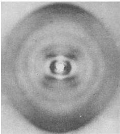
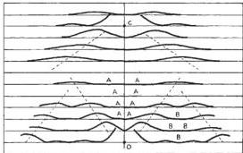
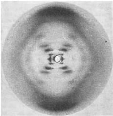

NATURE

April 25, 1953

VOL. 171

King's College, London. One of us (J.D.W.) has been aided by a fellowship from the National Foundation for Infantile Paralysis.

J. D. WATSON

F. H. C. CRICK

Medical Research Council Unit for the

Study of the Molecular Structure of

Biological Systems,

Cavendish Laboratory, Cambridge.

April 2.

1 Pauling, L., and Corey, R. B., Nature, 171, 346 (1953); Proc. U.S. Nat. Acad. Sci., 29, 84 (1953).
2 Furberg, S., Acta Chem. Scand., 6, 634 (1952).
3 Chargaff, E., for references see Zamenhof, S., Brawerman, G., and Chargaff, E., Biochim. et Biophys. Acta, 9, 402 (1952).
4 Wyatt, G. R., J. Gen. Physiol., 36, 201 (1952).
5 Astbury, W. T., Symp. Soc. Exp. Biol. 1, Nucleic Acid, 66 (Camb. Univ. Press, 1947).
6 Wilkins, M. H. F., and Randall, J. T., Biochim. et Biophys. Acta, 10, 192 (1953).

# Molecular Structure of Deoxypentose Nucleic Acids

WHILE the biological properties of deoxypentose nucleic acid suggest a molecular structure containing great complexity, X-ray diffraction studies described here (cf. Astbury) show the basic molecular configuration has great simplicity. The purpose of this communication is to describe, in a preliminary way, some of the experimental evidence for the polynucleotide chain configuration being helical, and existing in this form when in the natural state. A fuller account of the work will be published shortly.

The structure of deoxypentose nucleic acid is the same in all species (although the nitrogen base ratios alter considerably) in nucleoprotein, extracted or in cells, and in purified nucleate. The same linear group of polynucleotide chains may pack together parallel in different ways to give crystalline[1-3], semi-crystalline or paracrystalline material. In all cases the X-ray diffraction photograph consists of two regions, one determined largely by the regular spacing of nucleotides along the chain, and the other by the longer spacings of the chain configuration. The sequence of different nitrogen bases along the chain is not made visible.

Oriented paracrystalline deoxypentose nucleic acid ('structure  $B$  in the following communication by Franklin and Gosling) gives a fibre diagram as shown in Fig. 1 (cf. ref. 4). Astbury suggested that the strong 3-4-A. reflexion corresponded to the internucleotide repeat along the fibre axis. The  $\sim 34$  A. layer lines, however, are not due to a repeat of a polynucleotide composition, but to the chain configuration repeat, which causes strong diffraction as the nucleotide chains have higher density than the interstitial water. The absence of reflexions on or near the meridian immediately suggests a helical structure with axis parallel to fibre length.

# Diffraction by Helices

It may be shown (also Stokes, unpublished) that the intensity distribution in the diffraction pattern of a series of points equally spaced along a helix is given by the squares of Bessel functions. A uniform continuous helix gives a series of layer lines of spacing corresponding to the helix pitch, the intensity distribution along the nth layer line being proportional to the square of  $J_{\mathrm{n}}$ , the nth order Bessel function. A straight line may be drawn approximately through

Fig. 1. Fibre diagram of deoxypentose nucleic acid from B. coli. Fibre axis vertical

the innermost maxima of each Bessel function and the origin. The angle this line makes with the equator is roughly equal to the angle between an element of the helix and the helix axis. If a unit repeats  $n$  times along the helix there will be a meridional reflexion  $(J_{n}^{2})$  on the nth layer line. The helical configuration produces side-bands on this fundamental frequency, the effect being to reproduce the intensity distribution about the origin around the new origin, on the nth layer line, corresponding to  $C$  in Fig. 2.

We will now briefly analyse in physical terms some of the effects of the shape and size of the repeat unit or nucleotide on the diffraction pattern. First, if the nucleotide consists of a unit having circular symmetry about an axis parallel to the helix axis, the whole diffraction pattern is modified by the form factor of the nucleotide. Second, if the nucleotide consists of a series of points on a radius at right-angles to the helix axis, the phases of radiation scattered by the helices of different diameter passing through each point are the same. Summation of the corresponding Bessel functions gives reinforcement for the inner

Fig. 2. Diffraction pattern of system of helices corresponding to structure of deoxypentose nucleic acid. The squares of Bessel functions are plotted about 0 on the equator and on the first, second, third and fifth layer lines for half of the nucleotide mass at  $20\mathrm{A}$ . diameter and remainder distributed along a radius, the mass at a given radius being proportional to the radius. About  $C$  on the tenth layer line similar functions are plotted for an outer diameter of  $12\mathrm{A}$ .

© 1953 Nature Publishing Group

---

No. 4356 April 25, 1953 NATURE 739

most maxima and, in general, owing to phase difference, cancellation of all other maxima. Such a system of helices (corresponding to a spiral staircase with the core removed) diffracts mainly over a limited angular range, behaving, in fact, like a periodic arrangement of flat plates inclined at a fixed angle to the axis. Third, if the nucleotide is extended as an arc of a circle in a plane at right-angles to the helix axis, and with centre at the axis, the intensity of the system of Bessel function layer-line streaks emanating from the origin is modified owing to the phase differences of radiation from the helices drawn through each point on the nucleotide. The form factor is that of the series of points in which the helices intersect a plane drawn through the helix axis. This part of the diffraction pattern is then repeated as a whole with origin at $C$ (Fig. 2). Hence this aspect of nucleotide shape affects the central and peripheral regions of each layer line differently.

## Interpretation of the X-Ray Photograph

It must first be decided whether the structure consists of essentially one helix giving an intensity distribution along the layer lines corresponding to $J_{1}, J_{2}, J_{3}, \ldots$, or two similar co-axial helices of twice the above size and relatively displaced along the axis a distance equal to half the pitch giving $J_{3}, J_{4}, J_{5}, \ldots$, or three helices, etc. Examination of the width of the layer-line streaks suggests the intensities correspond more closely to $J_{1}^{2}, J_{2}^{2}, J_{3}^{2}$ than to $J_{2}^{3}, J_{4}^{3}, J_{5}^{3}, \ldots$. Hence the dominant helix has a pitch of $\sim 34$ A., and, from the angle of the helix, its diameter is found to be $\sim 20$ A. The strong equatorial reflexion at $\sim 17$ A. suggests that the helices have a maximum diameter of $\sim 20$ A. and are hexagonally packed with little interpenetration. Apart from the width of the Bessel function streaks, the possibility of the helices having twice the above dimensions is also made unlikely by the absence of an equatorial reflexion at $\sim 34$ A. To obtain a reasonable number of nucleotides per unit volume in the fibre, two or three intertwined coaxial helices are required, there being ten nucleotides on one turn of each helix.

The absence of reflexions on or near the meridian (an empty region AAA on Fig. 2) is a direct consequence of the helical structure. On the photograph there is also a relatively empty region on and near the equator, corresponding to region BBB on Fig. 2. As discussed above, this absence of secondary Bessel function maxima can be produced by a radial distribution of the nucleotide shape. To make the layer-line streaks sufficiently narrow, it is necessary to place a large fraction of the nucleotide mass at $\sim 20$ A. diameter. In Fig. 2 the squares of Bessel functions are plotted for half the mass at $20$ A. diameter, and the rest distributed along a radius, the mass at a given radius being proportional to the radius.

On the zero layer line there appears to be a marked $J_{12}^{3}$, and on the first, second and third layer lines, $J_{2}^{2} + J_{11}^{2}, J_{3}^{2} + J_{12}^{3}$, etc., respectively. This means that, in projection on a plane at right-angles to the fibre axis, the outer part of the nucleotide is relatively concentrated, giving rise to high-density regions spaced c. 6 A. apart around the circumference of a circle of 20 A. diameter. On the fifth layer line two $J_{5}$ functions overlap and produce a strong reflexion. On the sixth, seventh and eighth layer lines the maxima correspond to a helix of diameter $\sim 12$ A. Apparently it is only the central region of the helix structure which is well divided by the 3·4-A. spacing, the outer parts of the nucleotide overlapping to form a continuous helix. This suggests the presence of nitrogen bases arranged like a pile of pennies¹ in the central regions of the helical system.

There is a marked absence of reflexions on layer lines beyond the tenth. Disorientation in the specimen will cause more extension along the layer lines of the Bessel function streaks on the eleventh, twelfth and thirteenth layer lines than on the ninth, eighth and seventh. For this reason the reflexions on the higher-order layer lines will be less readily visible. The form factor of the nucleotide is also probably causing diminution of intensity in this region. Tilting of the nitrogen bases could have such an effect.

Reflexions on the equator are rather inadequate for determination of the radial distribution of density in the helical system. There are, however, indications that a high-density shell, as suggested above, occurs at diameter $\sim 20$ A.

The material is apparently not completely paracrystalline, as sharp spots appear in the central region of the second layer line, indicating a partial degree of order of the helical units relative to one another in the direction of the helix axis. Photographs similar to Fig. 1 have been obtained from sodium nucleate from calf and pig thymus, wheat germ, herring sperm, human tissue and $T_{2}$ bacteriophage. The most marked correspondence with Fig. 2 is shown by the exceptional photograph obtained by our colleagues, R. E. Franklin and R. G. Gosling, from calf thymus deoxypentose nucleate (see following communication).

It must be stressed that some of the above discussion is not without ambiguity, but in general there appears to be reasonable agreement between the experimental data and the kind of model described by Watson and Crick (see also preceding communication).

It is interesting to note that if there are ten phosphate groups arranged on each helix of diameter 20 A. and pitch 34 A., the phosphate ester backbone chain is in an almost fully extended state. Hence, when sodium nucleate fibres are stretched², the helix is evidently extended in length like a spiral spring in tension.

## Structure in vivo

The biological significance of a two-chain nucleic acid unit has been noted (see preceding communication). The evidence that the helical structure discussed above does, in fact, exist in intact biological systems is briefly as follows:

**Sperm heads.** It may be shown that the intensity of the X-ray spectra from crystalline sperm heads is determined by the helical form-function in Fig. 2. Centrifuged trout semen give the same pattern as the dried and rehydrated or washed sperm heads used previously⁴. The sperm head fibre diagram is also given by extracted or synthetic¹ nucleoprotamine or extracted calf thymus nucleohistone.

**Bacteriophage.** Centrifuged wet pellets of $T_{2}$ phage photographed with X-rays while sealed in a cell with mica windows give a diffraction pattern containing the main features of paracrystalline sodium nucleate as distinct from that of crystalline nucleoprotein. This confirms current ideas of phage structure.

**Transforming principle (in collaboration with H. Ephrussi-Taylor).** Active deoxypentose nucleate allowed to dry at $\sim 60$ per cent humidity has the same crystalline structure as certain samples⁵ of sodium thymonucleate.

© 1953 Nature Publishing Group

---

740
NATURE
April 25, 1953
VOL. 171

We wish to thank Prof. J. T. Randall for encouragement; Profs. E. Chargaff, R. Signer, J. A. V. Butler and Drs. J. D. Watson, J. D. Smith, L. Hamilton, J. C. White and G. R. Wyatt for supplying material without which this work would have been impossible; also Drs. J. D. Watson and Mr. F. H. C. Crick for stimulation, and our colleagues R. E. Franklin, R. G. Gosling, G. L. Brown and W. E. Seeds for discussion. One of us (H. R. W.) wishes to acknowledge the award of a University of Wales Fellowship.

M. H. F. WILKINS
Medical Research Council Biophysics Research Unit,
A. R. STOKES
H. R. WILSON
Wheatstone Physics Laboratory,
King's College, London.
April 2.

¹ Astbury, W. T., Symp. Soc. Exp. Biol., 1, Nucleic Acid (Cambridge Univ. Press, 1947).
² Riley, D. P., and Oster, G., Biochim. et Biophys. Acta, 7, 526 (1951).
³ Wilkins, M. H. F., Gosling, R. G., and Seeds, W. E., Nature, 167, 759 (1951).
⁴ Astbury, W. T., and Bell, F. O., Cold Spring Harb. Symp. Quant. Biol., 6, 109 (1958).
⁵ Cochran, W., Crick, F. H. C., and Vand, V., Acta Cryst., 5, 581 (1952).
⁶ Wilkins, M. H. F., and Randall, J. T., Biochim. et Biophys. Acta, 10, 192 (1953).

## Molecular Configuration in Sodium Thymonucleate

Sodium thymonucleate fibres give two distinct types of X-ray diagram. The first corresponds to a crystalline form, structure $A$, obtained at about 75 per cent relative humidity; a study of this is described in detail elsewhere¹. At higher humidities a different structure, structure $B$, showing a lower degree of order, appears and persists over a wide range of ambient humidity. The change from $A$ to $B$ is reversible. The water content of structure $B$ fibres which undergo this reversible change may vary from 40–50 per cent to several hundred per cent of the dry weight. Moreover, some fibres never show structure $A$, and in these structure $B$ can be obtained with an even lower water content.

The X-ray diagram of structure $B$ (see photograph) shows in striking manner the features characteristic of helical structures, first worked out in this laboratory by Stokes (unpublished) and by Crick, Cochran and Vand². Stokes and Wilkins were the first to propose such structures for nucleic acid as a result of direct studies of nucleic acid fibres, although a helical structure had been previously suggested by Furberg (thesis, London, 1949) on the basis of X-ray studies of nucleosides and nucleotides.

While the X-ray evidence cannot, at present, be taken as direct proof that the structure is helical, other considerations discussed below make the existence of a helical structure highly probable.

Structure $B$ is derived from the crystalline structure $A$ when the sodium thymonucleate fibres take up quantities of water in excess of about 40 per cent of their weight. The change is accompanied by an increase of about 30 per cent in the length of the fibre, and by a substantial re-arrangement of the molecule. It therefore seems reasonable to suppose that in structure $B$ the structural units of sodium thymonucleate (molecules on groups of molecules) are relatively free from the influence of neighbouring molecules, each unit being shielded by a sheath of water. Each unit is then free to take up its least-energy configuration independently of its neighbours and, in view of the nature of the long-chain molecules involved, it is highly likely that the general form will be helical³. If we adopt the hypothesis of a helical structure, it is immediately possible, from the X-ray diagram of structure $B$, to make certain deductions as to the nature and dimensions of the helix.

The innermost maxima on the first, second, third and fifth layer lines lie approximately on straight lines radiating from the origin. For a smooth single-strand helix the structure factor on the $n$th layer line is given by:

$$
F_n = J_n(2\pi r R) \exp \left( n(\psi + \frac{1}{2}\pi) \right),
$$

where $J_n(u)$ is the $n$th-order Bessel function of $u$, $r$ is the radius of the helix, and $R$ and $\psi$ are the radial and azimuthal co-ordinates in reciprocal space⁴; this expression leads to an approximately linear array of intensity maxima of the type observed, corresponding to the first maxima in the functions $J_1$, $J_2$, $J_3$ etc.

If, instead of a smooth helix, we consider a series of residues equally spaced along the helix, the transform in the general case treated by Crick, Cochran and Vand is more complicated. But if there is a whole number, $m$, of residues per turn, the form of the transform is as for a smooth helix with the addition, only, of the same pattern repeated with its origin at heights $mc^*$, $2mc^*$ . . . etc. (c is the fibre-axis period).

In the present case the fibre-axis period is 34 A, and the very strong reflexion at 3·4 A. lies on the tenth layer line. Moreover, lines of maxima radiating from the 3·4-A. reflexion as from the origin are visible on the fifth and lower layer lines, having a $J_3$ maximum coincident with that of the origin series on the fifth layer line. (The strong outer streaks which apparently radiate from the 3·4-A. maximum are not, however, so easily explained.) This suggests strongly that there are exactly 10 residues per turn of the helix. If this is so, then from a measurement of $R_0$ the position of the first maximum on the $n$th layer line (for $n = 5 \cdot 6$), the radius of the helix, can be obtained. In the present instance, measurements of $R_1$, $R_2$, $R_3$ and $R_4$ all lead to values of $r$ of about 10 A.

Sodium deoxyribose nucleate from calf thymus. Structure $B$

© 1953 Nature Publishing Group